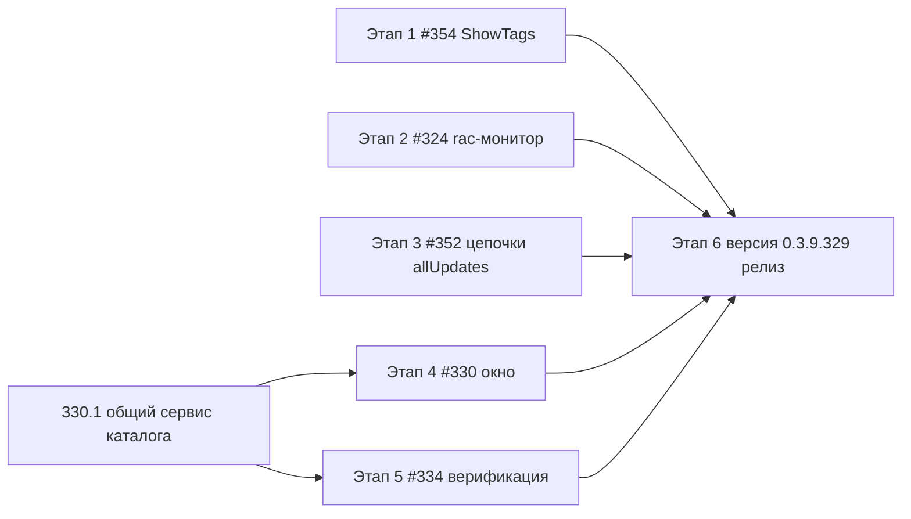

# План исправлений 0.3.9.328 → 0.3.9.329 (issues #354, #352, #334, #330, #324)

Целевая версия: **0.3.9.329** (инкремент сборки от 0.3.9.328 по правилам проекта).

## Статус выполнения (код-сессия 2026-10-08)

- [x] **Этап 1 (#354)** — `MainViewModel.Display.cs`: убран сброс тег-фильтров
  при выключении показа тегов; паритет с Avalonia подтверждён (WPF-чипы скрываются
  декларативно через XAML-конвертер, пересборка списка не нужна).
- [x] **Этап 2 (#324)** —
  (1) имя кластера: `ToClusterInfo` снимает кавычки (корень «ключа вместо значения»
  в панели «Информация о кластере»), `ToClusters` заполняет `Host`, `RacClusterRow`
  показывает «ALF (27541)» при пустом `name`; в журнал пишутся распознанные имена;
  (2) статус автообновления: `AutoRefreshText` различает «вкл/выкл/остановлено
  (ошибка)» — новый ключ `ServerMonitor.AutoRefreshStopped` (ru/en);
  (3) производительность: `ConnectAsync` назначает кластер ПОСЛЕ освобождения busy
  (первичная загрузка данных больше не пропускается — не ждём таймер ~5 с),
  `GetClusterInfoAsync` переиспользует кэш `cluster list` (−1 rac-вызов за цикл),
  `OneCPlatformLocator.FindRacExecutable` кэширует путь (TTL 5 мин).
- [x] **Этап 3 (#352)** — `OneCUpdatesService.BuildAllUpdatesCatalogUrl` (идемпотентный
  `?allUpdates=true#updates`); оба `BuildChainsAsync` (WPF+Avalonia) используют его;
  `UpdateChainSet.IsCurrentVersionMissing` + `UpdateChainBuilder.IsCurrentVersionMissing`;
  красное «Версии нет на сайте» под текущей версией в обоих окнах F9
  (ключ `Updates.Chain.VersionMissing`, ru/en).
- [x] **Этап 4 (#330)** — частично: `PlatformVersionTreeBuilder` — трёхсегментные
  версии («8.5.42») сразу лист линии (группа только для 4 сегментов);
  `PlatformDownloadViewModel.RepickFile` — явный тип дистрибутива реально меняет
  файл (тест ThinClientType_PicksThinZip); раскладка WPF-окна: список ~25% ширины
  (`2*/8*`), реальное имя файла под комбобоксом, кнопка «Выбрать…» без обрезания;
  Avalonia-окно — строка реального имени файла.
  Доделать приёмочно: реальная проверка окна пользователем.
- [x] **Ремонт незавершённого цикла #330/#334** — фейки тестов получили
  `GetAllAvailableReleasesAsync` (проект тестов не компилировался); тесты
  `PlatformUpdateServiceTests` обновлены на allUpdates-URL; тесты
  `PlatformInstallerWindowsTests` создают zip-файл с magic-байтами (ранняя
  проверка #334 отсекала фейковые входы).
- [x] Прогон: `dotnet test` — 1966/1966 зелёный; кросс-сборка
  `dotnet build -p:BuildLinux=true` — без ошибок.
  (Примечание: при параллельных сборках obj может конфликтовать в `_wpftmp` —
  лечится удалением `obj` и повторным запуском.)
- [ ] **Этап 5 (#334/#330/#352)** — верификация на реальном портале releases.1c.ru
  с учётной записью ИТС (после релиза, силами владельца/репортера).
- [ ] **Этап 6** — бамп версии в `Configuration Management.csproj:62-65`,
  README, релиз v0.3.9.329, комментарии в issues (issues не закрывать).

Итог исследования кода: часть правок по #330/#334/#324 уже есть в рабочей копии
(диалог выбора дистрибутива, allUpdates=true для каталога платформы, параллельные
rac-вызовы, кэш формата job list), но последними комментариями 7OH от 07.10 всё ещё
воспроизводятся проблемы. План разделён на «точно сломано» (найдены корни в коде)
и «верифицировать + дочинить» (правки в коде есть, поведение на реальных данных
не подтверждено).

---

## Этап 1. #354 «Сброс отбора по тегу» — точно найдена причина

**Корень:** WPF-версия [`MainViewModel.Display.cs:100-114`](Configuration%20Management/ViewModels/MainViewModel.Display.cs) —
сеттер `ShowTags` при выключении явно вызывает `ClearTagFilters(null)`
(комментарий «иначе отбор по тегу продолжает скрывать базы без тегов»).
Avalonia-версия (`MainViewModel.Avalonia.Display.cs:682-696`) фильтр не сбрасывает —
поведение версий расходится, и именно WPF-сброс видит пользователь.

Задачи:
1. **354.1** Убрать из `MainViewModel.Display.ShowTags` сброс `_activeTagFilters`
   (`MainViewModel.Display.cs:108-112`). Пересборка списка (`ApplyFilter`) фильтр
   сохраняет — как в Avalonia (`MatchesFilter` читает `TagFilterItems`/`_activeTagFilterSet`).
2. **354.2** Проверить, что панель быстрого отбора (`ShowTagFilterPanel`) остаётся
   видимой при выключенных тегах в строках — чипы отбора остаются доступными.
3. **354.3** Тест: включён отбор по тегу → `ShowTags = false` → отбор активен,
   список отфильтрован; обратно `ShowTags = true` — то же. (Тесты VM без UI.)

## Этап 2. #324 «Серверы 1С»

Правки, которые уже есть в рабочей копии: параллельные 7 rac-вызовов в
`LoadClusterDataAsync` (`ServerMonitorViewModel.cs:425-496`), кэш формата
`job list` (`RacClient.cs:44-60`), плейсхолдер имени кластера
(`RacClusterRow.cs:35-59`). Остаётся:

1. **324.1 (имя кластера)** Проблема «ключ вместо имени» — в парсере
   `RacOutputParser`/`RacClusterRow`: rac отдаёт строки `cluster=list`-подобные
   пары, и в некоторых локалях/версиях имя не распознаётся (в строку попадает
   служебный текст). Задача:
   - собрать вывод `rac cluster list` из приложенного лога app-20261007.log;
   - в `RacOutputParser` починить сопоставление key=value (учёт локали, порядок
     полей, GUID-имя); юнит-тест на реальный вывод из лога;
   - если rac реально не отдаёт `name` — показывать `«Кластер <host>:<port>»`
     вместо голого GUID.
2. **324.2 (статус автообновления)** Низ окна показывает «включено» по переключателю
   `IsAutoRefreshEnabled`, а не по факту работы таймера `AutoRefreshActive`
   (`ServerMonitorViewModel.cs:331-334`). После ошибки `StopAutoRefresh()` таймер
   остановлен, а подпись остаётся «включено». Задача: статусная строка/подсказка
   должна строиться от `AutoRefreshActive` (таймер) + отдельно показывать
   переключатель; после ошибки — «остановлено (ошибка)».
3. **324.3 (долгое подключение ~5 с)** Верифицировать: в логе 8 последовательных
   вызовов — значит, релиз 328 ещё с последовательным кодом, либо rac сам ~1 с на
   вызов и параллель не помогает (ПЗ: Windows процесс rac стартует медленно).
   Задача:
   - добавить timing-лог каждого rac-вызова (длительность, команда) — в `RacClient`;
   - убедиться, что `ConnectAsync` (clusters list) и `LoadClusterDataAsync` не
     дублируют вызовы (кэш формата уже подключён);
   - при подтверждении, что узкое место — старт процесса rac, рассмотреть
     объединение: `rac session list`/`connection list` и т.д. выполняются одним
     процессом rac session (rac не поддерживает мультикоманды — тогда только
     документируем ограничение и кэшируем infobase summary между обновлениями).
4. **324.4** Тесты: парсер имени кластера (реальный вывод), статус автообновления
   после ошибки (AutoRefreshActive=false, подпись «остановлено»).

## Этап 3. #352 «Цепочки обновлений для базы»

**Корень п.1:** `BuildChainsAsync(url, …)` (`UpdateCheckWindow.xaml.cs:395-428`,
`UpdateCheckWindow.Avalonia.cs:489+`) берёт тот же `url`, что и обычная проверка
обновления (страница конкретного релиза/редакции) — таблица версий там неполная,
цепочка не строится. Полный список даёт `?allUpdates=true#updates`.

1. **352.1** В `OneCUpdatesService` добавить хелпер
   `BuildAllUpdatesCatalogUrl(string url)` — добавляет `?allUpdates=true#updates`
   (или `&…`), идемпотентно (не дублировать параметр). Юнит-тест
   (продлить `OneCUpdatesUrlTests`).
2. **352.2** В обоих `BuildChainsAsync` (WPF + Avalonia) передавать в
   `GetUpdateCatalogAsync` URL с `allUpdates=true`; сам `url` для проверки
   обновлений не менять.
3. **352.3 (версии нет на сайте)** В `UpdateChainBuilder.Build`
   (`UpdateChainBuilder.cs:26+`) — когда `catalog` получен, но текущая версия в
   нём не найдена, добавить в `UpdateChainSet` флаг
   `IsCurrentVersionMissing = true` (название согласовать при реализации).
   Обновить `UpdateChainBuilderTests`.
4. **352.4** UI (оба окна F9): под текущей версией в строке показывать красным
   «Версии нет на сайте» (новые ключи локализации `Updates.Chain.VersionMissing*`
   в `Localization/`), когда флаг установлен; таблица цепочки при этом скрыта.
   Правки: `UpdateCheckRowViewModel` (`SetChains`), `UpdateCheckWindow.xaml.cs`
   (`UpdateChainDisplay`), `UpdateCheckWindow.Avalonia.cs`.
5. **352.5** Верификация на реальном портале (вручную, с учёткой ИТС): цепочка
   для типовой конфигурации строится; для отозванной версии — красная надпись.

## Этап 4. #330 «Скачивание и установка версии платформы» + общий сервис каталога

Инфраструктура уже есть: `OneCPlatformCatalogParser` (allUpdates=true,
Platform83+Platform85), `PlatformVersionTreeBuilder` (дерево 8.x → 8.x.yy),
`PlatformDistributionPicker`, дерево в `PlatformDownloadWindow.xaml:98-120`.
Остаётся:

1. **330.1 Единый сервис каталога релизов** — вынести получение и объединение
   каталогов Platform83+Platform85 (сейчас `PlatformUpdateService.GetAllAvailableReleasesAsync`)
   в общий сервис (например, `IPlatformCatalogService`), который переиспользуют:
   окно скачивания (`PlatformDownloadViewModel.LoadCatalogAsync:378-443`),
   окно обновления платформы (`PlatformUpdateViewModel.CheckUpdatesAsync:271-334`)
   и построение цепочек из Этапа 3 (для конфигураций — тот же парсер
   `OneCPlatformCatalogParser.ParseVersions`, отдельный ник).
   Это фиксирует «общий корень» #330/#334/#352 в одном месте.
2. **330.2 Неполный список версий** — верифицировать парсинг на реальном ответе
   `releases.1c.ru/project/Platform83?allUpdates=true#updates` (HTML страницы,
   вернуть сервером таблица с id=versionsTable; если 1С отдаёт список только
   через JS-подгрузку — допарсить вторичный JSON/endpoint). Зафиксировать
   результат в тесте на сохранённый HTML-образец. Сортировка дерева по убыванию
   (`PlatformVersionTreeBuilder`) — проверить и покрыть тестом.
3. **330.3 Раскладка окна** (`PlatformDownloadWindow.xaml`, 271 строк; аналог
   Avalonia-версии, если есть): по предложению 7OH:
   - список версий: узкая колонка ~25% ширины (сейчас фиксированная 340 —
     заменить на `2*/8*`-звёзды или `Width="Auto"` с MinWidth), минимум 8 строк
     видимых;
   - справа сверху вниз: разрядность → тип дистрибутива → инфо об учётной
     записи → файл → папка загрузки (с кнопкой) → «Открыть папку» и
     «Запустить установщик»;
   - кнопка «Выбрать» напротив «Папка загрузки» — обрезана по вертикали:
     выровнять высоту строки (Height кнопки, Padding, без жёсткого Height у Border);
   - окно: проверить MinHeight/размеры, чтобы список был виден (Height="700" уже
     задано, но при маленьком экране масштаб DPI режет список — задать
     MinHeight списку и/или уменьшить верхний блок).
4. **330.4 Поле «Файл»** — показывает только подсказку: привязать к
   `PickedFile.FileName` (реальное имя) + подсказка с размером; когда файл не
   определён — «не определён (выберите разрядность/тип)» вместо пустоты.
5. **330.5 Неактивные кнопки** — `CanDownload` требует `PickedFile is not null`
   (`PlatformDownloadViewModel.cs:330-331`): убедиться, что `LoadReleaseFilesAsync`
   вызывается при выборе версии в дереве (сейчас — привязка к `SelectedRelease`,
   проверить обработчик `OnVersionsTree_SelectedItemChanged`), и что при ошибке
   загрузки файлов журнал объясняет причину. Кнопки «Запустить установщик»/«Скачать»
   становятся активны после выбора файла.
6. **330.6** Тесты: `PlatformVersionTreeBuilderTests` (сортировка/полнота),
   `PlatformDownloadViewModelTests` (кнопки активны после выбора файла).

## Этап 5. #334 «Автообновление платформы»

Диалог выбора дистрибутива уже реализован: `PlatformUpdateViewModel.ResolvePickedFileAsync`
(`PlatformUpdateViewModel.cs:794-808`) + `chooseDistribution` в
`PlatformUpdateWindow.xaml.cs:86-88` и `PlatformUpdateWindow.Avalonia.cs:121-143`.
Проверка «HTML вместо zip» тоже есть (`PlatformInstaller.Windows.cs:501+`).

1. **334.1** Верифицировать с реальным порталом: «получено 0 версий каталога» —
   в релизе 328 лог писался до применения результата; в рабочей копии исправлено
   (`PlatformUpdateViewModel.cs:312-316`). Убедиться на реальном каталоге, что
   версии приходят (включая 8.5), а скачивание находит setup.exe.
2. **334.2** Если в реальном ответе каталога меньше версий, чем на сайте —
   тот же парсер, что и в 330.2; исправление общее.
3. **334.3** Логирование: добавить в журнал окна итоговое имя файла и его тип
   при скачивании (уже частично есть `Progress.SelectedDistribution` —
   проверить текст ключа локализации и полноту).
4. **334.4** Регресс-тест: `_chooseDistribution = null` → берётся рекомендуемый
   файл, не падает; `PlatformUpdateViewModelTests` дополнить.

## Этап 6. Версия, CHANGELOG/README, релиз

1. **6.1** Бамп версии в `Configuration Management.csproj:62-65` → `0.3.9.329`
   (4 места).
2. **6.2** README.md: секция изменений 0.3.9.329 (по правилам проекта — см.
   формат предыдущих релизов).
3. **6.3** Прогнать полный тестовый прогон (`dotnet test`).
4. **6.4** Сборка релиза (publish-скрипт — по образцу
   `publish/build_deb_win_0.3.9.328.py`), создание GitHub Release v0.3.9.329.
5. **6.5** Финальный шаг (после релиза): комментарии в issues #354/#352/#334/#330/#324
   с описанием исправлений и вопросами к 7OH (например, для #324 — приложить
   новый лог с timing rac-вызовов). Сами issues не закрывать до подтверждения.

---

## Порядок выполнения и приоритеты

| Приоритет | Этап | Обоснование |
|---|---|---|
| 1 | Этап 1 (#354) | Малая изолированная правка, точно найденный корень |
| 2 | Этап 2 (#324) | Локальные правки VM/парсера + диагностика |
| 3 | Этап 3 (#352) | Точная правка URL + флаг отсутствия версии |
| 4 | Этап 4 (#330) | Общий сервис каталога + переработка окна |
| 5 | Этап 5 (#334) | Верификация поверх общего сервиса |
| 6 | Этап 6 | Версия/CHANGELOG/сборка/релиз — в самом конце |

Зависимости: 330.1 (общий сервис) — до 330.2/334.2; 352.1/352.2 — до 352.5.
Каждый пункт — отдельная задача для Code-режима с юнит-тестом, где применимо.

