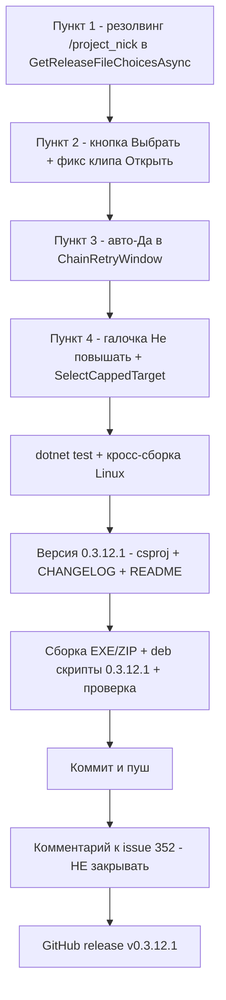

# План исправлений 0.3.12.1 — issue #352 «Цепочки обновлений для базы»

- **Дата составления:** 2026-10-10 (Europe/Moscow)
- **Базовая версия:** 0.3.12.0 → **новая версия: 0.3.12.1** (увеличивается ТОЛЬКО последнее число)
- **Источник:** [`plans/issues-report-0.3.12.1.md`](issues-report-0.3.12.1.md) — issue [#352](https://github.com/sivatorov/ConfigurationManagement/issues/352), последний комментарий 7OH от 2026-10-10T08:49:33Z (4 пункта: 3 регрессии после 0.3.11.0 + 1 новое предложение)
- **Платформы:** Windows/WPF и Linux/Avalonia — все исправления делаются в обоих UI
- **Ограничения:** issue #352 НЕ закрывать (ждать подтверждения 7OH); публиковать только после явного шага релиза

---

## 1. Затрагиваемые файлы и классы (сводка)

| Область | Файлы |
|---|---|
| Сервис обновлений 1С | [`Configuration Management/Services/OneCUpdatesService.cs`](../Configuration%20Management/Services/OneCUpdatesService.cs) — `GetReleaseFileChoicesAsync` (~962), `ExtractNickAndVersion` (~1014), `SelectNextDistributionUrl` (~697, WARN «В ответе не найдена ссылка на дистрибутив»), `BuildAllUpdatesCatalogUrl` (~243), `ParseLatestVersionFromProjectHtml` (~436), `VersionFilesHrefRegex` (~1333) |
| Построитель цепочек | [`Configuration Management/Services/UpdateChainBuilder.cs`](../Configuration%20Management/Services/UpdateChainBuilder.cs) — `Build`, `BuildBottomUp`, `BuildOptimal`, `CanJump` |
| Модели цепочек | [`Configuration Management/Models/UpdateChainVariant.cs`](../Configuration%20Management/Models/UpdateChainVariant.cs), `UpdateChainSet`, `UpdateChainStep` (Models) |
| VM строки проверки | [`Configuration Management/ViewModels/UpdateCheckRowViewModel.cs`](../Configuration%20Management/ViewModels/UpdateCheckRowViewModel.cs) — `LatestVersion`, `CurrentVersion`, `HasNewer`, `SetChains`, `ResetChains` |
| Окно проверки (WPF) | [`Configuration Management/Views/UpdateCheckWindow.xaml`](../Configuration%20Management/Views/UpdateCheckWindow.xaml) (панель цепочки ~220–240) + [`Configuration Management/Views/UpdateCheckWindow.xaml.cs`](../Configuration%20Management/Views/UpdateCheckWindow.xaml.cs) — `OnDownloadRow` (~343), `BuildChainsAsync` (~464), `DownloadChainAsync` (~546), `UpdateChainDisplay` (~504), `EnsureWindowHeightForChain` (~526) |
| Окно проверки (Avalonia) | [`Configuration Management/Views/UpdateCheckWindow.Avalonia.cs`](../Configuration%20Management/Views/UpdateCheckWindow.Avalonia.cs) — те же методы + кодовая компоновка UI (~988–1110: summary-строка, `_chainOpenFolderButton`) |
| Диалог повтора | [`Configuration Management/Views/ChainRetryWindow.xaml.cs`](../Configuration%20Management/Views/ChainRetryWindow.xaml.cs) + `.Avalonia.cs` + [`Configuration Management/Views/ChainRetryWindow.xaml`](../Configuration%20Management/Views/ChainRetryWindow.xaml) + `.Avalonia.xaml`; логика отсчёта — [`Configuration Management/Services/ChainRetryCountdown.cs`](../Configuration%20Management/Services/ChainRetryCountdown.cs) |
| Докачка цепочки | [`Configuration Management/Services/UpdateChainDownloadPlanner.cs`](../Configuration%20Management/Services/UpdateChainDownloadPlanner.cs) (без изменений, используется повтором) |
| Локализация | [`Configuration Management/Localization/Languages/ru.json`](../Configuration%20Management/Localization/Languages/ru.json) и [`Configuration Management/Localization/Languages/en.json`](../Configuration%20Management/Localization/Languages/en.json) — блок `Updates.Chain.*` (~2637) |
| Настройки | [`Configuration Management/Models/AppSettings.cs`](../Configuration%20Management/Models/AppSettings.cs) — `UpdateChainFolder` (~677) уже есть; НЕ расширяем |
| Версия | [`Configuration Management/Configuration Management.csproj`](../Configuration%20Management/Configuration%20Management.csproj) (~62–65) |
| Документация | [`CHANGELOG.md`](../CHANGELOG.md), [`README.md`](../README.md) |
| Сборка/публикация | новые `publish/build_deb_win_0.3.12.1.py`, `publish/check_deb_win_0.3.12.1.py`, `publish/build_result_0.3.12.1.md`, `publish/comment-352-0.3.12.1.md`, `publish/release_body_0.3.12.1.md`; шаблон — `package/linux/deb/DEBIAN/control` (плейсхолдер `@VERSION@` — правок не требует) |
| Тесты | `ConfigurationManagement.Tests/UpdateChainBuilderTests.cs`, `OneCUpdatesUrlTests.cs`, `OneCUpdatesDistributionResolutionTests.cs`, `UpdateChainDownloadPlannerTests.cs`, `ChainRetryCountdownTests.cs` (если есть; иначе новый файл), новый `UpdateChainVersionCapTests.cs` |

---

## 2. Пункт 1 — «Скачать»: выбор дистрибутива не работает для URL каталога `/project/<nick>`

### Суть проблемы
Лог 7OH: `Файлы релиза не запрошены: в ссылке нет nick/ver (https://releases.1c.ru/project/Trade110)`, далее WARN `В ответе не найдена ссылка на дистрибутив: …additional_file?…RasshirenieGISMTsRPT.cf`.

Цепочка отказа:
1. Кнопка «Скачать» ([`UpdateCheckWindow.xaml.cs:343`](../Configuration%20Management/Views/UpdateCheckWindow.xaml.cs) `OnDownloadRow`) вызывает `GetReleaseFileChoicesAsync(row.Url)`.
2. [`OneCUpdatesService.cs:971`](../Configuration%20Management/Services/OneCUpdatesService.cs) `ExtractNickAndVersion` извлекает `nick`/`ver` ТОЛЬКО из query-параметров (`additional_file?`/`version_file?`/`version_files?`). Для URL каталога проекта `/project/Trade110` ver отсутствует → метод возвращает пустой список (строка 974) → диалог «Дистрибутив обновления / Полный дистрибутив» не появляется.
3. Срабатывает fallback (строка 379–386 окна): `DownloadUpdateAsync(row.Url)` → резолвинг по странице каталога → заходит в `additional_file?…RasshirenieGISMTsRPT.cf` (расширение конфигурации, не дистрибутив) → WARN из [`OneCUpdatesService.cs:698`](../Configuration%20Management/Services/OneCUpdatesService.cs) — скачивание падает.

### Решение
В `OneCUpdatesService.GetReleaseFileChoicesAsync`:
1. **Резолвинг последней версии из каталога проекта.** Если `ver` пуст, а `nick` определён (или URL вида `/project/<nick>`):
   - запросить каталог `BuildAllUpdatesCatalogUrl(url)` (с `allUpdates=true#updates`);
   - из HTML каталога извлечь ссылку `version_files?nick=…&ver=…` для ПОСЛЕДНЕЙ версии — переиспользовать существующие `VersionFilesHrefRegex` (~1333) и `ParseLatestVersionFromProjectHtml` (~436); выделить internal-хелпер (например, `FindLatestVersionFilesUrl(html, baseUrl)`) — без сети, покрыть тестами;
   - дальше существующий поток без изменений: `versionFilesUrl` → `ParseReleaseFileLinks` → `ResolveDistributionUrlAsync` → варианты «Дистрибутив обновления» / «Полный дистрибутив» → диалог выбора появляется.
2. **Дополнительный приоритет из ссылки проверки.** Если в результате проверки у строки уже известна последняя версия (`row.LatestVersion`), можно передать её в `GetReleaseFileChoicesAsync(url, latestVersion)` и строить `version_files?nick&ver` сразу без повторного запроса каталога (оптимизация; каталог — запасной путь).
3. **additional_file с `.cf`** — убедиться, что `additional_file?…path=…RasshirenieGISMTsRPT.cf` распознаётся файловым эндпоинтом (`IsFileEndpointUrl`, механика 0.3.10.2) и НЕ выбирается как дистрибутив, когда на странице файлов версии есть «Дистрибутив обновления»; WARN в `SelectNextDistributionUrl` (~697) не должен возникать для корректного `.cf`-ответа. Проверить приоритет выбора в `ParseReleaseFileLinks`: «Дистрибутив обновления» (updsetup) выше «Полного дистрибутива» и любых additional_file.

### Тесты (добавить/обновить)
- `OneCUpdatesUrlTests`: `ExtractNickAndVersion` для `/project/Trade110` (nick из пути — если расширяем extraction), для `additional_file?nick=…` без ver.
- Новый/расширенный `OneCUpdatesDistributionResolutionTests`:
  - HTML каталога проекта (фикстура с `versionsTable`) → `FindLatestVersionFilesUrl` возвращает `version_files?nick=Trade110&ver=11.5.27.98`;
  - страница файлов версии с двумя ссылками («Дистрибутив обновления» + «Полный дистрибутив») → 2 кандидата в правильном порядке, имена/расширения корректны;
  - `additional_file?…RasshirenieGISMTsRPT.cf` (точный URL из лога) → распознаётся файловым эндпоинтом, расширение `.cf`, не даёт WARN-путь.

---

## 3. Пункт 2 — выбор папки скачивания цепочки: нет кнопки выбора, «Открыть» обрезана и не нажимается

### Суть проблемы
- В [`UpdateCheckWindow.xaml:220–240`](../Configuration%20Management/Views/UpdateCheckWindow.xaml) панель `ChainFolderPanel` содержит только текст пути и кнопку «Открыть» (`ChainOpenFolderButton`). Кнопки «Выбрать папку» нет — папка запрашивается диалогом только внутри `DownloadChainAsync` ([`UpdateCheckWindow.xaml.cs:555–567`](../Configuration%20Management/Views/UpdateCheckWindow.xaml.cs)), т.е. при каждом нажатии «Скачать цепочку».
- Кнопка «Открыть» обрезана снизу и не нажимается: панель добавлена в 0.3.11.0 ПОД таблицей цепочки, а расчёт высоты окна `EnsureWindowHeightForChain` ([`UpdateCheckWindow.xaml.cs:526`](../Configuration%20Management/Views/UpdateCheckWindow.xaml.cs), цель 760, `MinHeight`) не учитывает новую панель → она оказывается за нижней границей окна (клип). Аналогично в Avalonia (`_chainOpenFolderButton`, [`UpdateCheckWindow.Avalonia.cs:1100`](../Configuration%20Management/Views/UpdateCheckWindow.Avalonia.cs)).

### Решение
1. **Кнопка «Выбрать…»** рядом с «Открыть» (WPF XAML + Avalonia-компоновка):
   - обработчик — выделить из `DownloadChainAsync` общий метод `ChooseChainFolderAsync()` (диалог `OpenFolderDialog` → `SaveChainFolder` → `UpdateChainFolderDisplay`); по завершении показа подсказки «выберите папку при скачивании» (`Updates.Chain.FolderHint`) подсказку убрать/обновить;
   - локализация: ключ `Updates.Chain.ChooseFolder` уже используется в `DownloadChainAsync` — проверить его подпись («Выбрать…») в ru/en.
2. **«Скачать цепочку» не переспрашивает папку:** в `DownloadChainAsync` использовать сохранённую `AppSettings.UpdateChainFolder`, если она существует; диалог показывать только когда папка пуста/не существует (снимает и раздражение пользователя из п.3 — повтор больше не переспрашивает).
3. **Компоновка:** в `EnsureWindowHeightForChain` учитывать высоту `ChainFolderPanel` (цель 760 → скорректировать, либо поднять максимум), убедиться, что панель внутри видимой области и `ChainOpenFolderButton` кликабельна; в Avalonia — та же проверка для кодовой компоновки (строки summary/chain, ~988–1110). Проверить вручную на обоих UI при высоте окна 660 (без цепочки) и ~760 (с цепочкой).

### Тесты
- UI-логика тестируется вручную (чек-лист в п.8). Чистая логика — вынести выбор начальной папки в хелпер (`GetChainInitialFolder(settingsFolder)` → saved | UserProfile), покрыть юнит-тестом в новом `UpdateChainFolderHelperTests` или в существующем файле тестов сервисов.

---

## 4. Пункт 3 — диалог «Попробовать ещё раз?»: таймер дошёл до нуля, повтор не начался

### Суть проблемы
В [`ChainRetryWindow.xaml.cs:59–69`](../Configuration%20Management/Views/ChainRetryWindow.xaml.cs) (и в Avalonia-версии) `OnTimerTick` при достижении нуля делает `_timer.Stop(); Close();` — это автоматический **«Нет»** (`RetryRequested` остаётся `false`). Но по замыслу 7OH (комментарий 11 от 2026-10-09): «минутным ожиданием на кнопке “ДА” … оно возможно докачает при следующих попытках» — по истечении 60 с должен срабатывать автоповтор (**авто-«Да»**). Пользователь в комментарии 13 подтвердил: «Таймер дошёл до нуля … и ничего не произошло. Заново не качает».

Дополнительно: `OnNoClick` не выставляет `DialogResult=false` (только останавливает таймер) — закрытие зависит от `IsCancel`; сделать явным.

### Решение
1. В обоих `ChainRetryWindow` (`xaml.cs` + `.Avalonia.cs`) в `OnTimerTick` при `ChainRetryCountdown.IsFinished(_secondsLeft)`:
   ```csharp
   _timer.Stop();
   RetryRequested = true;   // авто-«Да» по таймауту (issue #352.3)
   Close();
   ```
   Для WPF перед `Close()` выставить `DialogResult = true` (безопасно: окно ещё открыто).
2. `OnNoClick`: явно `DialogResult = false;` (WPF) / `Close()` (Avalonia) после `RetryRequested = false`.
3. Обновить doc-комментарии: «по нуле — автоматический „Да“ (повтор)».
4. `ChainRetryCountdown` (`IsFinished`, `ButtonText`, `DefaultSeconds`) не меняется.
5. Связка с п.2: повтор (`DownloadChainAsync`) больше не переспрашивает папку — автоповтор действительно начинается скачивание недостающих файлов через `UpdateChainDownloadPlanner.SelectPendingSteps`.

### Тесты
- `ChainRetryCountdownTests` (если файла нет — создать): `IsFinished(0)=true`, `IsFinished(1)=false`, `ButtonText` содержит базовый текст и остаток секунд. Логика авто-«Да» — в code-behind (UI), проверяется чек-листом вручную.

---

## 5. Пункт 4 (новая функция) — галочка «Не повышать» под «Последней версией»

### Суть предложения 7OH
Галочка ограничивает максимальную версию первыми двумя числами версии: для текущей 3.1.2.345 можно обновиться на 3.1.3.456, но НЕ на 3.2.3.456. При изменении галочки — заново определить последнюю версию и цепочки с учётом правила.

### Решение
1. **Чистая логика — [`UpdateChainBuilder.cs`](../Configuration%20Management/Services/UpdateChainBuilder.cs):**
   - добавить internal static хелпер `SelectCappedTarget(string currentVersion, IReadOnlyList<PlatformRelease> releases)`:
     - если текущая версия непарсимая → `null` (галочка не влияет);
     - целевая версия = максимум (сравнение версий как в `SameVersion`/`CanJump` — переиспользовать их парсер) среди релизов каталога с теми же первыми двумя числами (major.minor), что у текущей;
     - если подходящих нет → `null` (цепочка не строится, показать прежнюю последнюю либо пометку «Нет версий 3.1.x» — решить по чек-листу, по умолчанию: цепочка пустая, `LatestVersion` остаётся прежней).
   - не менять сигнатуру `Build` (обратная совместимость тестов): вызыватель передаёт уже «обрезанную» целевую версию. Альтернатива — необязательный параметр `Build(..., bool restrictToSameMajorMinor = false)`; выбрать один вариант при реализации и зафиксировать в тестах.
2. **VM — [`UpdateCheckRowViewModel.cs`](../Configuration%20Management/ViewModels/UpdateCheckRowViewModel.cs):**
   - свойство `bool NoVersionBump` (уведомляющее, состояние на строку, session-only — в `AppSettings` НЕ сохраняем);
   - кэш последнего каталога (`PlatformReleasesResult`/список `Releases`) — чтобы переключение галочки не дёргало сеть: `BuildChainsAsync` сохраняет каталог после успешного запроса, при переключении пересборка из кэша (если кэша нет — повторный запрос как сейчас).
3. **UI (оба окна):**
   - WPF: CheckBox «Не повышать» в summary-блоке окна проверки (под/рядом с «Последняя версия», [`UpdateCheckWindow.xaml`](../Configuration%20Management/Views/UpdateCheckWindow.xaml) — район строки «Текущая версия | Последняя версия | Статус» ~150–240);
   - Avalonia: тот же чекбокс в кодовой компоновке summary ([`UpdateCheckWindow.Avalonia.cs:988–1006`](../Configuration%20Management/Views/UpdateCheckWindow.Avalonia.cs));
   - при переключении: пересчитать целевую версию (кап) → обновить `LatestVersionText` («Последняя версия» показывает ограниченную) → `UpdateChainBuilder.Build(current, cappedTarget, catalog.Releases)` → `_row.SetChains(set)` → `UpdateChainDisplay()`;
   - при снятии галочки — обратно к `row.LatestVersion` из результата проверки и пересборка цепочек;
   - поведение «скачивания последней версии» (кнопка «Скачать», не цепочка) при включённой галочке: качать ограниченную последнюю (3.1.x-максимум), а не глобальную последнюю — единообразно с цепочками.
4. **Локализация:** новые ключи в [`ru.json`](../Configuration%20Management/Localization/Languages/ru.json) / [`en.json`](../Configuration%20Management/Localization/Languages/en.json):
   - `Updates.NoBump` = «Не повышать» / "No major upgrades" (подпись чекбокса; формулировку уточнить при реализации);
   - при необходимости тултип `Updates.NoBump.Hint` = «Ограничить обновления той же версией 3.1.x» / "Limit updates to the same 3.1.x line".

### Тесты — новый `UpdateChainVersionCapTests` (или блок в `UpdateChainBuilderTests`)
- 3.1.2.345 в каталоге с 3.1.3.456 и 3.2.3.456 → кап = 3.1.3.456 (3.2.3.456 исключён);
- кап-цель достижима напрямую → `IsDirectUpdate=true`;
- кап-цель требует цепочку → варианты строятся только внутри 3.1.x;
- текущей версии нет в каталоге (`IsCurrentVersionMissing`) + кап → берётся максимум 3.1.x среди доступных;
- в каталоге нет версий с теми же первыми двумя числами → `null`;
- текущая версия пустая/непарсимая → `null` (без исключений);
- снятая галочка (cap off) — поведение `Build` без изменений (регрессионные тесты `UpdateChainBuilderTests` зелёные).

---

## 6. Версия: все места с 0.3.12.0 → 0.3.12.1

| # | Файл | Что менять |
|---|---|---|
| 1 | [`Configuration Management/Configuration Management.csproj`](../Configuration%20Management/Configuration%20Management.csproj) (строки 62–65) | 4 свойства: `Version`, `AssemblyVersion`, `FileVersion`, `InformationalVersion` → `0.3.12.1` |
| 2 | [`CHANGELOG.md`](../CHANGELOG.md) | новый раздел `## [0.3.12.1] — 2026-10-…` над `[0.3.12.0]` (см. п.7) |
| 3 | [`README.md`](../README.md) (строка 3) | бейдж `Версия-0.3.12.0` → `0.3.12.1`; при необходимости — строка «Выпуск 0.3.12.1» в списке фич (см. п.7) |
| 4 | `package/linux/deb/DEBIAN/control` | ПРАВОК НЕ ТРЕБУЕТ: версия подставляется скриптом из `InformationalVersion` csproj в плейсхолдер `@VERSION@` |
| 5 | `publish/build_deb_win_0.3.12.1.py` | НОВЫЙ файл — копия [`publish/build_deb_win_0.3.12.0.py`](../publish/build_deb_win_0.3.12.0.py): версия в docstring, пути `out-0.3.12.1`, имя deb `configuration-management_0.3.12.1_amd64.deb` (бинарную версию скрипт читает из csproj) |
| 6 | `publish/check_deb_win_0.3.12.1.py` | НОВЫЙ файл — копия [`publish/check_deb_win_0.3.12.0.py`](../publish/check_deb_win_0.3.12.0.py): `DEB`-путь и `EXPECTED_VERSION = "0.3.12.1"` (строки 10–11) |
| 7 | `publish/build_result_0.3.12.1.md`, `publish/release_body_0.3.12.1.md`, `publish/comment-352-0.3.12.1.md` | НОВЫЕ файлы (по образцу аналогов 0.3.12.0) |
| 8 | Не трогать | `plans/issues-report-0.3.12.1.md` (отчёт), прочие `PLAN-*.md` |

Проверка после сборки: `FileVersion`/`ProductVersion` exe = `0.3.12.0+<commit>` → должно стать `0.3.12.1+…`; `control Version: 0.3.12.1` в deb.

---

## 7. CHANGELOG.md и README.md

**CHANGELOG.md** — новый раздел (стиль существующих):

```markdown
## [0.3.12.1] — 2026-10-…

### Исправлено (issue #352)
- **Окно проверки обновлений, кнопка «Скачать»** — для URL каталога проекта
  (`releases.1c.ru/project/<ник>` без nick/ver) теперь запрашивается страница файлов
  последней версии: появляется выбор «Дистрибутив обновления» / «Полный дистрибутив»;
  скачивание больше не падает на `additional_file?…RasshirenieGISMTsRPT.cf`.
- **Панель папки цепочки** — добавлена кнопка «Выбрать…» рядом с «Открыть»;
  «Скачать цепочку» не переспрашивает папку, если сохранённая существует;
  кнопка «Открыть» больше не обрезается снизу и кликабельна (Windows и Linux).
- **Диалог «Попробовать ещё раз?»** — по истечении 60-секундного отсчёта автоматически
  срабатывает «Да»: докачка недостающих файлов цепочки начинается без участия
  пользователя.
### Добавлено (issue #352)
- **Галочка «Не повышать»** под «Последней версией» в окне проверки обновлений:
  ограничивает целевую версию первыми двумя числами (3.1.2.345 → можно 3.1.3.456,
  нельзя 3.2.3.456); при переключении заново определяются последняя версия и цепочки.
  Windows/WPF и Linux/Avalonia.
- Тесты: полный набор `dotnet test` зелёный (**NNNN**), кросс-сборка Linux без ошибок.
```

**README.md** — бейдж версии (строка 3) → `0.3.12.1`; в разделе фич добавить краткий пункт «Выпуск 0.3.12.1 (issue #352)» со ссылкой на CHANGELOG (по образцу пунктов «Выпуск 0.3.12.0» / «Выпуск 0.3.11.0»).

---

## 8. Порядок выполнения (последующие задачи — в режиме Code/Debug)

1. **П.1** — `OneCUpdatesService`: резолвинг последней версии из каталога `/project/<nick>` в `GetReleaseFileChoicesAsync`; проверка additional_file-эндпоинта. Тесты `OneCUpdatesUrlTests` / `OneCUpdatesDistributionResolutionTests`.
2. **П.2** — `UpdateCheckWindow.xaml`/`.Avalonia.cs`: кнопка «Выбрать…», использование сохранённой папки в `DownloadChainAsync`, фикс клипа панели/высоты окна.
3. **П.3** — `ChainRetryWindow` (WPF + Avalonia): авто-«Да» по нулю таймера, явный `DialogResult` в `OnNoClick`.
4. **П.4** — `UpdateChainBuilder.SelectCappedTarget` + чекбокс «Не повышать» (оба UI) + локализация ru/en. Тесты кап-логики.
5. **Прогон тестов:** `dotnet test` (полный набор, ожидание ≥ 2239 + новые), `dotnet build -p:BuildLinux=true` — кросс-сборка Linux без ошибок.
6. **Версия и документация:** csproj (4 свойства) → 0.3.12.1; CHANGELOG.md; README.md (бейдж + пункт фичи).
7. **Сборка и проверка артефактов:**
   - Windows single-file EXE + ZIP (по образцу 0.3.12.0, см. `publish/build_result_0.3.12.0.md`);
   - Linux single-file + `.deb`: создать `publish/build_deb_win_0.3.12.1.py` и `publish/check_deb_win_0.3.12.1.py` (копии 0.3.12.0-скриптов с заменой версии/путей), прогнать оба; `build_result_0.3.12.1.md` с SHA256.
8. **Коммит и пуш** (артефакты `dist/`, `package/linux/deb/out/`, `publish/out-*/` в git НЕ добавлять).
9. **Комментарий к issue #352** — `publish/comment-352-0.3.12.1.md` (стиль `comment-334-0.3.12.0.md`: «Исправлено в версии 0.3.12.1», как проверить, счётчик тестов, ссылка на коммит/релиз, просьба проверить). **Issue НЕ закрывать.**
10. **GitHub release v0.3.12.1** — ассеты: `ConfigurationManagement.exe`, ZIP, `configuration-management_0.3.12.1_amd64.deb`, `SHA256SUMS.txt`; тело релиза — `publish/release_body_0.3.12.1.md`.



---

## 9. Чек-лист ручной проверки (перед коммитом)

- [ ] F9, конфиг с URL `releases.1c.ru/project/Trade110`: «Скачать» → появляется диалог «Дистрибутив обновления» / «Полный дистрибутив»; оба варианта скачиваются как бинарники (не HTML).
- [ ] Скачивание не падает с WARN на `additional_file?…RasshirenieGISMTsRPT.cf`, когда на странице файлов есть «Дистрибутив обновления».
- [ ] Панель папки цепочки: кнопка «Выбрать…» есть, работает; «Открыть» не обрезана и нажимается (проверить при высоте окна 660 и с таблицей цепочки) — WPF и Avalonia.
- [ ] Повторное «Скачать цепочку» не переспрашивает папку при существующей сохранённой.
- [ ] Диалог «Попробовать ещё раз?» с ошибками: по нуле таймера скачивание недостающих файлов начинается автоматически; кнопка «Нет» отменяет.
- [ ] Галочка «Не повышать»: включение → «Последняя версия» и таблица цепочки пересчитаны в пределах 3.1.x; выключение → возврат к глобальной последней; Windows и Avalonia.
- [ ] Linux: `dotnet build -p:BuildLinux=true` без ошибок; deb собирается и проходит `check_deb_win_0.3.12.1.py`.
- [ ] Версии: exe `FileVersion=0.3.12.1`, deb `control Version: 0.3.12.1`.
