# План исправлений 0.3.12.2 — issues #334 «Автообновление платформы» и #352 «Цепочки обновлений»

- **Дата составления:** 2026-10-10 (Europe/Moscow)
- **Базовая версия:** 0.3.12.1 → **новая версия: 0.3.12.2** (увеличивается ТОЛЬКО последнее число)
- **Источники:**
  - issue [#334](https://github.com/sivatorov/ConfigurationManagement/issues/334), последний комментарий 7OH от 2026-10-10T15:24:30Z (2 пункта);
  - issue [#352](https://github.com/sivatorov/ConfigurationManagement/issues/352), последний комментарий 7OH от 2026-10-10T15:20:26Z (3 пункта);
  - issue [#330](https://github.com/sivatorov/ConfigurationManagement/issues/330) — только комментарий-благодарность и закрытие (7OH от 2026-10-10T15:27:21Z: «Можно закрывать тикет»), код не меняется.
- **Платформы:** Windows/WPF и Linux/Avalonia — все исправления делаются в обоих UI.
- **Ограничения:** issue #334 и #352 НЕ закрывать (ждать подтверждения 7OH); issue #330 — закрыть после публикации; публиковать только после явного шага релиза. Все фиксы CAS-авторизации portal.1c.ru (0.3.9.248→0.3.9.303→0.3.12.x) не трогать.

---

## 1. Затрагиваемые файлы и классы (сводка)

| Область | Файлы |
|---|---|
| Окно проверки (WPF) | [`Configuration Management/Views/UpdateCheckWindow.xaml.cs`](../Configuration%20Management/Views/UpdateCheckWindow.xaml.cs) — `OnDownloadRow` (~351), `DownloadUpdateChoiceAsync` (~428), `AskSavePath` (~437), `ResolveDownloadUrl` (~629), `DownloadChainAsync` (~662) |
| Окно проверки (Avalonia) | [`Configuration Management/Views/UpdateCheckWindow.Avalonia.cs`](../Configuration%20Management/Views/UpdateCheckWindow.Avalonia.cs) — те же методы (~449 `ResolveDownloadUrl`, ~519 SaveFileDialog, ~901 `DownloadChainAsync`, ~999 retry) |
| Сервис обновлений 1С | [`Configuration Management/Services/OneCUpdatesService.cs`](../Configuration%20Management/Services/OneCUpdatesService.cs) — `GetReleaseFileChoicesAsync` (~964, необязательный параметр известной целевой версии) |
| VM обновления платформы | [`Configuration Management/ViewModels/PlatformUpdateViewModel.cs`](../Configuration%20Management/ViewModels/PlatformUpdateViewModel.cs) — `ResolvePickedFileAsync` (~883, отмена выбора), `DownloadOnlyAsync` (~479), `DownloadAndInstallAsync` (~345), регистрация в `BackgroundDownloadManager` |
| Окна платформы | [`Configuration Management/Views/PlatformUpdateWindow.xaml.cs`](../Configuration%20Management/Views/PlatformUpdateWindow.xaml.cs) (~51 колбэк `_saveFileDialog`, передача менеджера загрузок) + [`Configuration Management/Views/PlatformUpdateWindow.Avalonia.cs`](../Configuration%20Management/Views/PlatformUpdateWindow.Avalonia.cs) (~69) |
| Менеджер фоновых загрузок | [`Configuration Management/Services/BackgroundDownloadManager.cs`](../Configuration%20Management/Services/BackgroundDownloadManager.cs) — без изменений (API уже готов); индикатор: [`Configuration Management/ViewModels/MainViewModel.Downloads.cs`](../Configuration%20Management/ViewModels/MainViewModel.Downloads.cs), [`Configuration Management/Views/MainWindow.xaml`](../Configuration%20Management/Views/MainWindow.xaml) (~3402), [`Configuration Management/Views/MainWindow.Avalonia.cs`](../Configuration%20Management/Views/MainWindow.Avalonia.cs) (~2042) — без изменений |
| Планировщик цепочки | [`Configuration Management/Services/UpdateChainDownloadPlanner.cs`](../Configuration%20Management/Services/UpdateChainDownloadPlanner.cs) — без изменений |
| Модели/настройки | [`Configuration Management/Models/UpdateChainVariant.cs`](../Configuration%20Management/Models/UpdateChainVariant.cs) — без изменений; [`Configuration Management/Models/AppSettings.cs`](../Configuration%20Management/Models/AppSettings.cs) — `UpdateChainFolder` (~677) переиспользуется, НЕ расширяем |
| Версия | [`Configuration Management/Configuration Management.csproj`](../Configuration%20Management/Configuration%20Management.csproj) (~62–65) |
| Документация | [`CHANGELOG.md`](../CHANGELOG.md), [`README.md`](../README.md) |
| Сборка/публикация | новые `publish/build_deb_win_0.3.12.2.py`, `publish/check_deb_win_0.3.12.2.py`, `publish/build_result_0.3.12.2.md`, `publish/release_body_0.3.12.2.md`, `publish/comment-330-0.3.12.2.md`, `publish/comment-334-0.3.12.2.md`, `publish/comment-352-0.3.12.2.md` |
| Тесты | `ConfigurationManagement.Tests/UpdateChainVersionCapTests.cs`, `UpdateChainDownloadPlannerTests.cs`, `BackgroundDownloadManagerTests.cs`, `PlatformUpdateViewModelTests.cs`, `OneCUpdatesUrlTests.cs` |

---

## 2. Issue #352 п.1 — диалог выбора файла версии не учёл галку «Не повышать»

### Первопричина (найдена в коде)
7OH: «Диалог выбора не учел установленную галку "не повышать" и не смотря на данные в основном окне — предложил скачать НОВУЮ версию».

1. При включённой галочке `ApplyNoVersionBump` ([`UpdateCheckWindow.xaml.cs:598`](../Configuration%20Management/Views/UpdateCheckWindow.xaml.cs), Avalonia ~729) записывает кап-версию в `_row.LatestVersion`.
2. Кнопка «Скачать» → `OnDownloadRow` → `ResolveDownloadUrl(row)` ([`UpdateCheckWindow.xaml.cs:629–649`](../Configuration%20Management/Views/UpdateCheckWindow.xaml.cs), Avalonia ~760): если `capped` (результат `UpdateChainBuilder.SelectCappedTarget`) **равен** `row.LatestVersion` — а после шага 1 он всегда равен — метод по раннему `return` отдаёт сырой `row.Url` (`releases.1c.ru/project/<ник>`).
3. [`OneCUpdatesService.GetReleaseFileChoicesAsync`](../Configuration%20Management/Services/OneCUpdatesService.cs) (~984–1007) для адреса каталога проекта без `ver` резолвит страницу файлов **глобальной** последней версии (`FindLatestVersionFilesUrl`) → диалог «Дистрибутив обновления / Полный дистрибутив» предлагает версию ВЫШЕ текущей, игнорируя кап.

### Решение
1. **[`ResolveDownloadUrl`](../Configuration%20Management/Views/UpdateCheckWindow.xaml.cs) (WPF) и аналог (Avalonia ~760):**
   - убрать ранний `return url` при `capped == row.LatestVersion` — при включённой галочке и найденном капе ВСЕГДА строить `version_files?nick=<ник>&ver=<capped>` (как сейчас в ветке ~641–648);
   - вынести построение в чистый статический хелпер (например, `UpdateChainBuilder.ResolveSingleDownloadUrl(currentVersion, latestVersion, noBump, releases, url)` — переиспользует `SelectCappedTarget` и `ToAbsoluteVersionFilesUrl`), чтобы покрыть юнит-тестами без UI;
   - дополнительно (рекомендуется): при выключенной галочке, но известной `row.LatestVersion` и URL-каталоге — тоже строить `version_files` по известной версии (убирает лишний запрос каталога).
2. **[`GetReleaseFileChoicesAsync`](../Configuration%20Management/Services/OneCUpdatesService.cs):** добавить необязательный параметр `string? knownLatestVersion = null`; если `ver` пуст, а `knownLatestVersion` задана — строить `version_files?nick&ver=<knownLatestVersion>` без запроса полной таблицы каталога (каталог — запасной путь). Вызов в обоих окнах передаёт `row.LatestVersion`. CAS-механику (`GetPageTextAsync`, авторизация) не трогать.
3. **Диалог** [`UpdateFileChoiceWindow`](../Configuration%20Management/Views/UpdateFileChoiceWindow.xaml.cs) не меняется — он показывает файлы запрошенной версии.

### Тесты
- Новый/расширенный `UpdateChainVersionCapTests` (или `UpdateChainBuilderTests`): хелпер `ResolveSingleDownloadUrl` — галочка включена → URL содержит `ver=<кап>`; кап == LatestVersion → всё равно кап; галочка выключена → LatestVersion; каталог пуст/версия непарсимая → исходный URL без исключений.
- `OneCUpdatesUrlTests`: `GetReleaseFileChoicesAsync` с `knownLatestVersion` (fake-транспорт) — версия из параметра, каталог не запрашивается; без параметра — прежнее поведение (регрессия).

---

## 3. Issue #352 п.2 — «куда скачать» при уже выбранной папке

### Первопричина
7OH: «При наличии выбранной папки — можно уже не спрашивать — куда скачивать». Одиночное скачивание (`OnDownloadRow` → `DownloadUpdateChoiceAsync` ~428 → [`AskSavePath`](../Configuration%20Management/Views/UpdateCheckWindow.xaml.cs:437), Avalonia ~519) всегда показывает `SaveFileDialog` с начальным каталогом `UserProfile` и игнорирует сохранённую `AppSettings.UpdateChainFolder` (папка цепочки выбрана пользователем в окне, но не используется).

### Решение (оба окна: WPF + Avalonia)
1. **Начальный каталог диалога:** в `AskSavePath` использовать `UpdateChainDownloadPlanner.GetChainInitialFolder(settings.UpdateChainFolder)` вместо `UserProfile`.
2. **Не спрашивать при известной папке (пожелание 7OH):** если сохранённая папка существует — скачивать БЕЗ диалога в `Path.Combine(folder, fileName)`; имя — существующий `BuildDownloadFileName(row, choice)`; итог — существующее уведомление `Updates.Loaded` с полным путём. Диалог показывается только когда папка не задана/не существует. Применить и к ветке выбора (`DownloadUpdateChoiceAsync`), и к fallback-ветке (`choices.Count == 0`, ~392).
3. Папку после успешного скачивания НЕ перезаписывать (она общая с цепочкой).

### Тесты
- Чистая логика выбора пути — вынести хелпер (например, `UpdateChainDownloadPlanner.ResolveSaveTarget(settingsFolder, fileName)` → путь без диалога | null → показать диалог) в `UpdateChainDownloadPlannerTests`: папка существует → путь; пустая/несуществующая → null; partial-суффикс не участвует.

---

## 4. Issue #352 п.3 — докачка цепочки не работает

### Первопричина (найдена в коде)
7OH: «На ответ про докачать — что мышкой нажимаешь, что оно само — просто окно закрывается и заново не качает».

1. [`DownloadChainAsync`](../Configuration%20Management/Views/UpdateCheckWindow.xaml.cs:662) (Avalonia ~901) на входе проверяет `if (!_row.CanDownloadChain ...) return;`.
2. `CanDownloadChain` ([`UpdateCheckRowViewModel.cs:238`](../Configuration%20Management/ViewModels/UpdateCheckRowViewModel.cs)) требует `!_isChainDownloading`.
3. Повтор (`if (ChainRetryWindow.Ask(this, message)) await DownloadChainAsync();` — WPF ~761–764, Avalonia ~999–1002) вызывается ВНУТРИ `try` внешнего вызова, а `_row.IsChainDownloading` сбрасывается только в `finally` внешнего вызова (после возврата рекурсии). → рекурсивный вызов мгновенно выходит по guards: диалог закрылся, повтор не начался. Работает и для ручного «Да», и для авто-«Да» по таймауту (механика [`ChainRetryWindow.xaml.cs:60–72`](../Configuration%20Management/Views/ChainRetryWindow.xaml.cs) корректна — фикс 0.3.12.1 не сломан, сломан сам повтор).

### Решение (оба окна)
Заменить рекурсию циклом: извлечь тело загрузки в `DownloadChainAttemptAsync(folder, variant)` (внутри — расчёт `targetPaths`/`SelectPendingSteps`, цикл скачивания, итоговые сообщения), а в `DownloadChainAsync` оставить guards, установку `_row.IsChainDownloading`, регистрацию фоновой записи и цикл:

```csharp
var retry = true;
while (retry)
{
    retry = false;
    var failed = await DownloadChainAttemptAsync(folder, variant, chainId, backgroundEntry);
    if (failed > 0 && ChainRetryWindow.Ask(this, message))
        retry = true;   // повтор: планировщик сам пропустит скачанное
}
```

- `IsChainDownloading` выставляется/сбрасывается ОДИН раз вокруг цикла; `CanDownloadChain`-guards не мешают повтору.
- Фоновая запись (`BackgroundDownloadManager.Default.Start/ReportProgress/Complete/Fail`) — одна на весь цикл; прогресс пересчитывается от общего числа оставшихся шагов каждой попытки.
- Проверить Avalonia-аналог (`ChainRetryWindow.Avalonia.cs` + `Ask` через `ShowDialogSync`) — та же схема.
- Отмена (`OperationCanceledException`) и `Fail` — семантика без изменений (фикс #334 п.1 из 0.3.12.0 не ломать).

### Тесты
- `UpdateChainDownloadPlannerTests` — регрессия (планировщик без изменений).
- Логика цикла — в code-behind; вручную по чек-листву п.11. Опционально: если извлечь решение «повторять ли» в чистый хелпер (`ChainRetryDecision.AskAgain(failed, retryAnswer)`), покрыть юнит-тестом.

---

## 5. Issue #334 п.1 — индикация фонового скачивания платформы

### Первопричина
7OH: «Файл и раньше качался в фоне дальше. Только в программе этого до сих пор нигде не видно». При этом в #330 (15:27) он подтверждает, что индикатор главного окна работает для окна «Скачивание версии платформы 1С». Расхождение объясняется кодом: регистрация в [`BackgroundDownloadManager.Default.Start`](../Configuration%20Management/Services/BackgroundDownloadManager.cs) есть ТОЛЬКО в:
- [`PlatformDownloadWindow.xaml.cs:80`](../Configuration%20Management/Views/PlatformDownloadWindow.xaml.cs) / `.Avalonia.cs:80` (окно «Скачивание версии платформы 1С»);
- цепочках обновлений ([`UpdateCheckWindow.xaml.cs:688`](../Configuration%20Management/Views/UpdateCheckWindow.xaml.cs) / Avalonia ~927).

Скачивания из окна «Обновление платформы 1С» (Ctrl+F9) — [`PlatformUpdateViewModel.DownloadOnlyAsync`](../Configuration%20Management/ViewModels/PlatformUpdateViewModel.cs) (~527 `_downloadDistribution`) и `DownloadAndInstallAsync` — в менеджер НЕ регистрируются: скачивание продолжается в фоне после закрытия окна, но индикатор в главном окне ([`MainWindow.xaml:3402–3418`](../Configuration%20Management/Views/MainWindow.xaml), [`MainWindow.Avalonia.cs:2042–2072`](../Configuration%20Management/Views/MainWindow.Avalonia.cs)) его не показывает.

### Решение
1. **[`PlatformUpdateViewModel`](../Configuration%20Management/ViewModels/PlatformUpdateViewModel.cs):** добавить необязательный параметр конструктора `Services.BackgroundDownloadManager? backgroundDownloads = null`; в `DownloadOnlyAsync` (и в скачивании `DownloadAndInstallAsync` — уточнить при реализации, качает ли он тот же приватный метод) по образцу [`PlatformDownloadViewModel.DownloadAsync`](../Configuration%20Management/ViewModels/PlatformDownloadViewModel.cs:651–756):
   - `Start($"platform-update:{row.Version}:{fileName}", fileName)` до запуска загрузки;
   - `ReportProgress(id, v)` в колбэке прогресса;
   - `Complete(id)` при успехе; `Fail(id, "Main.Downloads.Cancelled")` при отмене / `Fail(id, "PlatformUpdate.Error.NetworkError")` при ошибке;
   - `CancellationToken` из `entry.Cancellation.Token` (сейчас `CancellationToken.None` — заодно появится работающая отмена из индикатора).
2. **Окна-потребители:** передать `Services.BackgroundDownloadManager.Default` в конструктор VM в [`PlatformUpdateWindow.xaml.cs`](../Configuration%20Management/Views/PlatformUpdateWindow.xaml.cs) и [`PlatformUpdateWindow.Avalonia.cs`](../Configuration%20Management/Views/PlatformUpdateWindow.Avalonia.cs).
3. **Индикатор** (`MainViewModel.Downloads.cs`, MainWindow XAML/Avalonia) — без изменений: он уже подписан на менеджер.
4. Опционально (вне объёма): регистрация скачивания самообновления приложения ([`Services/UpdateAvailableWindow.xaml.cs`](../Configuration%20Management/Services/UpdateAvailableWindow.xaml.cs)) — отдельно, если всплывёт в проверке.

### Тесты
- `PlatformUpdateViewModelTests`: сценарии «фоновый менеджер передан → загрузка регистрируется (Start), прогресс репортится, успех → Complete»; «отмена токена → Fail с ключом Main.Downloads.Cancelled»; «без менеджера — прежнее поведение» (регрессия).
- `BackgroundDownloadManagerTests` — регрессия.

---

## 6. Issue #334 п.2 — при отмене не должно быть вопроса «куда скачать»

### Первопричина
7OH: «Жмём скачать, нажимаем отмена — зачем-то спрашивает КУДА скачать». В окне «Обновление платформы 1С» «Скачать и установить»/«Только скачать» → [`ResolvePickedFileAsync`](../Configuration%20Management/ViewModels/PlatformUpdateViewModel.cs:883–920): при ОТМЕНЕ пользователем диалога выбора дистрибутива (`chosen == null`) отмена игнорируется —
`var file = chosen?.File ?? options.FirstOrDefault(o => o.IsRecommended)?.File ?? options[0].File;` (~919–920) — берётся «рекомендуемый» файл, поток продолжается и в `DownloadOnlyAsync` доходит до `_saveFileDialog(defaultName)` — диалог «куда скачать» появляется после нажатия «Отмена».

### Решение
1. В `ResolvePickedFileAsync` (VM общая для WPF/Avalonia): `chosen == null` → вернуть `null` (отмена) с записью в журнал окна «Выбор дистрибутива отменён» (ключ локализации, см. п.8). Вызовы (`DownloadOnlyAsync` ~493, `DownloadAndInstallAsync` ~363) уже корректно завершаются при `picked is null`.
2. Дополнительно (мелочь, по той же теме): `_saveFileDialog` в [`PlatformUpdateWindow.xaml.cs:51–55`](../Configuration%20Management/Views/PlatformUpdateWindow.xaml.cs) / Avalonia ~70 — начальный каталог `UserProfile` заменить на сохранённый `PlatformDownloadDirectory` (уже хранится настройками окна скачивания) — диалог «куда скачать» открывается в привычной папке.
3. Единственный вариант дистрибутива (`options.Count == 1`) по-прежнему качается без вопросов — не ломать.

### Тесты
- `PlatformUpdateViewModelTests`: `_chooseDistribution` возвращает null → `picked == null`, `_saveFileDialog` НЕ вызывается, скачивание не начинается, в журнале сообщение об отмене; существующие тесты «один вариант — качается сразу» зелёные.

---

## 7. Версия: все места с 0.3.12.1 → 0.3.12.2

| # | Файл | Что менять |
|---|---|---|
| 1 | [`Configuration Management/Configuration Management.csproj`](../Configuration%20Management/Configuration%20Management.csproj) (строки 62–65) | 4 свойства: `Version`, `AssemblyVersion`, `FileVersion`, `InformationalVersion` → `0.3.12.2` |
| 2 | [`CHANGELOG.md`](../CHANGELOG.md) | новый раздел `## [0.3.12.2] — 2026-10-…` над `[0.3.12.1]` (см. п.8) |
| 3 | [`README.md`](../README.md) (строка 3) | бейдж `Версия-0.3.12.1` → `0.3.12.2`; пункт «Выпуск 0.3.12.2» в списке фич (см. п.8) |
| 4 | `package/linux/deb/DEBIAN/control` | ПРАВОК НЕ ТРЕБУЕТ: версия подставляется скриптом из `InformationalVersion` в плейсхолдер `@VERSION@` |
| 5 | `publish/build_deb_win_0.3.12.2.py` | НОВЫЙ файл — копия [`publish/build_deb_win_0.3.12.1.py`](../publish/build_deb_win_0.3.12.1.py): версия в docstring; пути/имена — из csproj, замен не требует кроме docstring |
| 6 | `publish/check_deb_win_0.3.12.2.py` | НОВЫЙ файл — копия [`publish/check_deb_win_0.3.12.1.py`](../publish/check_deb_win_0.3.12.1.py): `DEB`-путь и `EXPECTED_VERSION = "0.3.12.2"` (строки 10–11) |
| 7 | `publish/build_result_0.3.12.2.md`, `publish/release_body_0.3.12.2.md`, `publish/comment-330-0.3.12.2.md`, `publish/comment-334-0.3.12.2.md`, `publish/comment-352-0.3.12.2.md` | НОВЫЕ файлы (по образцу `comment-352-0.3.12.1.md`, `release_body_0.3.12.1.md`) |
| 8 | Не трогать | `plans/PLAN-0.3.12.1.md`, `plans/issues-report-0.3.12.1.md`, прочие `PLAN-*.md`; doc-комментарии в `UpdateCheckWindow*.cs` с упоминанием «0.3.12.1» (исторические); `.git/COMMIT_EDITMSG` |

Проверка после сборки: exe `FileVersion`/`ProductVersion` = `0.3.12.2+<commit>`; `control Version: 0.3.12.2` в deb.

---

## 8. CHANGELOG.md и README.md (черновики)

**CHANGELOG.md** — новый раздел (стиль существующих):

```markdown
## [0.3.12.2] — 2026-10-…

### Исправлено (issues #334, #352)
- **Докачка цепочки обновлений работает** — «Да» в диалоге «Попробовать ещё раз?»
  (и ручное, и автоматическое по истечении отсчёта) теперь действительно перезапускает
  загрузку: повтор больше не блокировался собственным статусом «идёт загрузка», окно
  не закрывается «в никуда», недостающие файлы цепочки докачиваются (Windows и Linux).
- **Диалог выбора файла релиза учитывает галочку «Не повышать»** — при включённой
  галочке «Скачать» запрашивает страницу файлов ограниченной версии (3.1.x-максимум),
  а не глобальной последней; предложение версии выше текущей невозможно.
- **Окно проверки обновлений не спрашивает «куда скачать», если папка уже выбрана** —
  одиночное скачивание сохраняется в выбранную папку цепочки без диалога; диалог
  открывается только когда папка не задана.
- **Отмена выбора дистрибутива в «Обновлении платформы 1С» больше не приводит к
  вопросу «куда скачать»** — «Отмена» в диалоге выбора варианта дистрибутива честно
  прерывает операцию вместо подстановки «рекомендуемого» файла.
- **Индикация фонового скачивания платформы** — загрузки из окна «Обновление платформы
  1С» («Только скачать» / «Скачать и установить») теперь видны в индикаторе главного
  окна и отменяются из него, как и загрузки из окна «Скачивание версии платформы 1С».
- Тесты: полный набор `dotnet test` зелёный (**NNNN**), кросс-сборка Linux без ошибок.
```

**README.md** — бейдж версии (строка 3) → `0.3.12.2`; в списке фич над пунктом «Выпуск 0.3.12.1» добавить:

```markdown
- **Выпуск 0.3.12.2 (issues #334, #352)** — докачка цепочки обновлений по «Попробовать
  ещё раз?» работает; выбор файла релиса учитывает «Не повышать»; одиночное скачивание
  не спрашивает «куда скачать» при выбранной папке; фоновые загрузки из «Обновления
  платформы 1С» видны в индикаторе главного окна; отмена выбора дистрибутива не
  приводит к диалогу сохранения ([#334](CHANGELOG.md), [#352](CHANGELOG.md)).
```

Новые ключи локализации (ru/en, [`Localization/Languages/ru.json`](../Configuration%20Management/Localization/Languages/ru.json) / `en.json`): `Updates.Distribution.Cancelled` («Выбор дистрибутива отменён» / "Distribution selection cancelled"); проверить используемые ключи `Main.Downloads.*`, `Updates.Chain.*` — уже существуют.

---

## 9. Комментарии к issues (черновики, сохранять как `publish/comment-*-0.3.12.2.md`)

### Issue #330 (только благодарность/информация, код не менялся; issue ЗАКРЫТЬ)
> Спасибо за обратную связь и подтверждение! Рад, что скачивание платформы, группировка
> файлов и индикатор прогресса в главном окне работают как ожидалось.
>
> По вашей просьбе закрываю тикет. Если после обновления до **0.3.12.2** что-то в
> сценарии «скачать версию платформы» будет работать не так — откройте, пожалуйста,
> новый issue с журналом приложения.
>
> Файлы для установки — на странице релиза [v0.3.12.2](…). Полный список изменений — в
> [CHANGELOG](https://github.com/sivatorov/ConfigurationManagement/blob/main/CHANGELOG.md).

### Issue #334 (исправлено в 0.3.12.2)
> Спасибо за логи! Исправлено в версии **0.3.12.2** (Windows/WPF и Linux/Avalonia) — по обоим пунктам:
>
> 1. **Индикация фонового скачивания.** Скачивания из окна «Обновление платформы 1С»
>    («Только скачать» / «Скачать и установить») теперь регистрируются в общем менеджере
>    фоновых загрузок: продолжаются после закрытия окна, в главном окне виден индикатор
>    «Скачивается: файл (45 %)…» с прогрессом и кнопкой отмены — так же, как для окна
>    «Скачивание версии платформы 1С» и цепочек обновлений.
> 2. **Отмена без «куда скачать».** Нажатие «Отмена» в диалоге выбора дистрибутива
>    («Скачать и установить» / «Только скачать») теперь прерывает операцию; вопрос
>    «куда скачать» после отмены больше не появляется (раньше отмена подменялась
>    «рекомендуемым» вариантом, и поток доходил до диалога сохранения).
>
> **Как проверить:** 1) Ctrl+F9 → «Только скачать», закройте окно — в главном окне
> индикатор с прогрессом, отмена работает; 2) «Скачать и установить» → в диалоге выбора
> дистрибутива нажмите «Отмена» — никаких вопросов о пути сохранения.
>
> Тесты: полный набор `dotnet test` зелёный (**NNNN**), кросс-сборка Linux без ошибок.
> Подробности — в [CHANGELOG (0.3.12.2)](…). Issue пока не закрываю — просьба проверить.

### Issue #352 (исправлено в 0.3.12.2)
> Спасибо, воспроизвёл по коду! Исправлено в версии **0.3.12.2** (Windows/WPF и Linux/Avalonia):
>
> 1. **Диалог выбора файла релиза учитывает «Не повышать»** — при включённой галочке
>    «Скачать» запрашивает страницу файлов ограниченной версии (максимум той же линии
>    3.1.x), а не глобальной последней; предложение версии выше текущей исключено
>    (причина: при кап-версии, равной отображаемой «Последней версии», программа
>    откатывалась к сырому URL каталога и резолвила глобальную последнюю).
> 2. **«Куда скачать» не спрашивается при выбранной папке** — одиночное скачивание
>    («Скачать») сохраняется в выбранную папку цепочки без диалога; диалог остаётся
>    только если папка не задана.
> 3. **Докачка цепочки работает** — «Да» в «Попробовать ещё раз?» (кнопкой или
>    автоматически по истечении отсчёта) реально перезапускает загрузку: повтор не
>    блокировался статусом «идёт загрузка» самой строки; докачиваются только недостающие
>    файлы (планировщик пропускает скачанное).
>
> **Как проверить:** 1) галочка «Не повышать» + «Скачать» — в диалоге файлы версии 3.1.x;
> 2) выберите папку цепочки → «Скачать» — сохранение без вопроса о пути; 3) оборвите
> сеть при скачивании цепочки → в диалоге нажмите «Да» (или дождитесь авто-«Да») —
> докачка начинается сама.
>
> Тесты: полный набор `dotnet test` зелёный (**NNNN**), кросс-сборка Linux без ошибок.
> Подробности — в [CHANGELOG (0.3.12.2)](…). **Issue НЕ закрывать** — просьба проверить.

---

## 10. Порядок сборки и публикации (по образцу 0.3.12.1)

1. **Реализация** п.2–6 (оба UI) → `dotnet test` (полный набор ≥ 2259 + новые), `dotnet build -p:BuildLinux=true` — без ошибок.
2. **Версия и документация:** csproj (4 свойства) → 0.3.12.2; CHANGELOG.md; README.md (бейдж + пункт фичи); локализация ru/en.
3. **Windows-артефакты** (по `publish/build_result_0.3.12.1.md`):
   - `dotnet publish "Configuration Management/Configuration Management.csproj" -c Release -r win-x64 --self-contained true -p:PublishSingleFile=true` → `ConfigurationManagement.exe`;
   - ZIP `ConfigurationManagement-0.3.12.2-win-x64.zip` (одна запись — exe).
4. **Linux-бинарь:** кросс-публикация `linux-x64` → `Configuration Management/dist/linux-x64/ConfigurationManagement`.
5. **.deb:** создать `publish/build_deb_win_0.3.12.2.py` и `publish/check_deb_win_0.3.12.2.py` (копии 0.3.12.1-скриптов, версия читается из csproj); выполнить:
   - `python publish/build_deb_win_0.3.12.2.py` → `package/linux/deb/out/configuration-management_0.3.12.2_amd64.deb`;
   - `python publish/check_deb_win_0.3.12.2.py` → контроль ar-членов, `control Version: 0.3.12.2`, md5sums, ELF-magic.
6. **`publish/build_result_0.3.12.2.md`** — размеры, SHA256 всех артефактов, версия exe/deb, HEAD-коммит (образец — `build_result_0.3.12.1.md`); копии ассетов в `publish/out-0.3.12.2/`.
7. **Коммит и пуш** (артефакты `dist/`, `package/linux/deb/out/`, `publish/out-*/` в git НЕ добавлять).
8. **Комментарии к issues:** `comment-330-0.3.12.2.md` (закрыть #330), `comment-334-0.3.12.2.md` и `comment-352-0.3.12.2.md` (#334/#352 НЕ закрывать до подтверждения 7OH).
9. **GitHub release v0.3.12.2:** ассеты `ConfigurationManagement.exe`, ZIP, `configuration-management_0.3.12.2_amd64.deb`, `SHA256SUMS.txt`; тело — `publish/release_body_0.3.12.2.md`.

### Схема работ

```mermaid
flowchart LR
    A[Анализ issues 334 и 352] --> B[Фикс 352.3 - цикл повтора цепочки]
    B --> C[Фикс 352.1 - кап в ResolveDownloadUrl и GetReleaseFileChoicesAsync]
    C --> D[Фикс 352.2 - сохранение в выбранную папку без диалога]
    D --> E[Фикс 334.1 - регистрация загрузок PlatformUpdateViewModel]
    E --> F[Фикс 334.2 - отмена выбора дистрибутива]
    F --> G[Тесты + кросс-сборка Linux]
    G --> H[Версия 0.3.12.2 - csproj + CHANGELOG + README]
    H --> I[Сборка EXE ZIP deb + проверка скриптами 0.3.12.2]
    I --> J[Коммит и пуш]
    J --> K[Комментарии 330 закрыть - 334 и 352 не закрывать]
    K --> L[GitHub release v0.3.12.2]
```



---

## 11. Чек-лист ручной проверки (после реализации)

- [ ] #352.3: оборвать сеть при скачивании цепочки → «Попробовать ещё раз?» → «Да» — докачка началась (счётчик «Скачивается X из Y» корректен); дождаться авто-«Да» по таймауту — то же; Windows и Avalonia.
- [ ] #352.1: галочка «Не повышать» включена (3.1.2.345) → «Скачать» → диалог предлагает файлы 3.1.x, не 3.2.x; снятая галочка — прежнее поведение.
- [ ] #352.2: папка цепочки выбрана → «Скачать» — файл сохранён без диалога; папка не задана — диалог открывается в сохранённой/пользовательской папке.
- [ ] #334.1: Ctrl+F9 → «Только скачать», закрыть окно — индикатор в главном окне с прогрессом; «Отменить загрузки» останавливает; Windows и Avalonia.
- [ ] #334.2: «Скачать и установить» → «Отмена» в выборе дистрибутива — нет диалога «куда скачать», в журнале «отменено»; единственный вариант — качается сразу без диалогов.
- [ ] Регрессия: докачка `.download`-файлов цепочки, CAS-вход portal.1c.ru, фоновая загрузка из «Скачивания версии платформы», окно проверки обновлений.
- [ ] Версии: exe `FileVersion=0.3.12.2`, deb `control Version: 0.3.12.2`; `dotnet build -p:BuildLinux=true` без ошибок.
