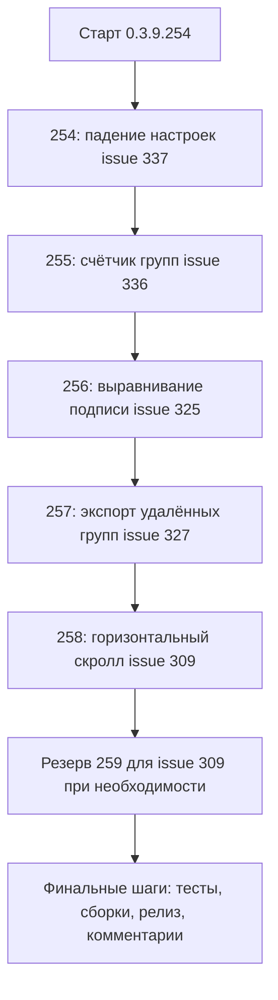

# PLAN — цикл 0.3.9.254–0.3.9.258 — открытые issues: падение настроек, счётчики групп, синхронизация, скролл

Репозиторий [`sivatorov/ConfigurationManagement`](https://github.com/sivatorov/ConfigurationManagement),
локальная копия `f:\Yandex.Disk\h\Configuration_Management`, ветка `main`.
HEAD на момент плана — **0.3.9.253** ([`Configuration Management.csproj`](../Configuration%20Management/Configuration%20Management.csproj:62),
строки 62–65). Новый цикл стартует сразу после 0.3.9.253; нумерация условна — перед стартом
каждого этапа исполнитель сверяет фактическую версию в csproj.

Режим: Архитектор (план) → **по одному пункту в отдельной задаче** в режиме **code** (`new_task`
на каждый этап, по требованию пользователя). **Один issue = одна версия = один коммит.**
Issues **НЕ закрываются**; комментарий «Исправлено в версии X» — только после релиза версии,
без ключевых слов автозакрытия («fixes», «closes»).

---

## 1. Сводка цикла

| № | Версия | Issue | Тема |
|---|--------|-------|------|
| 1 | 0.3.9.254 | #337 | Падает при открытии «Настроек» 3.9.253 — диагностика и фикс |
| 2 | 0.3.9.255 | #336 | Количество групп в заголовке группы: «(N / M)» |
| 3 | 0.3.9.256 | #325 | Подпись «Конфигурация» напротив верхнего поля ввода |
| 4 | 0.3.9.257 | #327 | Полная синхронизация: удаление удалённых групп из ibases.v8i |
| 5 | 0.3.9.258 | #309 | Горизонтальный скролл: последние 2 колонки недостижимы (седьмая попытка) |
| — | резерв 0.3.9.259 | #309 | Второй раунд #309, если 0.3.9.258 не решит (смещение нумерации не требуется — резерв) |
| — | без версии | #328 | Запуск базы по Enter — подтверждено пользователем, доработка НЕ нужна |

> #328 (последний комментарий 7OH «Навигация работает, с тегами не конфликтует») —
> ПОЛОЖИТЕЛЬНОЕ подтверждение фикса 0.3.9.241. В цикле **только финальный комментарий**-подтверждение
> (не «Исправлено в версии», а благодарность + пометка, что issue остаётся открытым для отслеживания
> регрессий) и строка в релиз-тело. Никаких изменений кода и версии.

Зависимости и порядок:

- **#337 первым** — пользователь не может открыть «Настройки» и проверить все прошлые доработки;
  пока падение живо, остальные фиксы не верифицируемы.
- **#336, #325** — небольшие независимые правки, низкий риск; выполняются между сложными (#337, #327, #309).
- **#327** — чистый сервисный слой (экспортёр/синхронизация), не пересекается с UI-правками.
- **#309 — последним**: требует инструментального разбора (рантайм-лог фактических ширин) и,
  вероятно, нескольких раундов; резерв 0.3.9.259.

---

## 2. Общие требования к КАЖДОМУ этапу (обязательно)

1. Обе платформы (Windows/WPF + Linux/Avalonia), где применимо. Чистая логика — в сервисах/
   моделях/хелперах без платформенных зависимостей; UI-ветки — только `Views/*.xaml(.cs)` /
   `Views/*.Avalonia.cs`.
2. Инкремент версии в [`Configuration Management.csproj`](../Configuration%20Management/Configuration%20Management.csproj:62)
   (строки 62–65: Version/AssemblyVersion/FileVersion/InformationalVersion) на 1 патч.
3. Запись в [`CHANGELOG.md`](../CHANGELOG.md:12) (сверху, раздел «Исправлено», номер issue + версия +
   перечень файлов) и обновление бейджа версии в [`README.md`](../README.md:3).
4. Комментарий на issue через `gh api repos/sivatorov/ConfigurationManagement/issues/<N>/comments`
   — шаблон в `publish/comment-<N>-<version>.md` (по образцу `publish/comment-309-0.3.9.253.md`).
   **Issue не закрывать**, ключевые слова автозакрытия не использовать.
5. Тесты: `dotnet test` зелёный; `dotnet build -p:BuildLinux=true` без ошибок. Юнит-тесты — xUnit
   (`[Fact]`/`[Theory]`), стиль существующих файлов в `ConfigurationManagement.Tests/`.
6. Один коммит на версию (без пуша). Сообщение: `0.3.9.<N>: #<issue> — <тема>`.
7. Перед реализацией сверять фактические сигнатуры и адреса строк: этапы цикла меняют общие файлы.
8. Локализация: новые тексты через `LocalizationManager.T`, ключи парами в
   [`ru.json`](../Configuration%20Management/Localization/Languages/ru.json:1)/`en.json`.

---

## 3. Этап 1 — 0.3.9.254 — #337 «Падает при открытии настроек 3.9.253»

### 3.1. Факты (из исследования)

- Issue создан 2026-10-01, **0 комментариев**. Текст: «Печально, но факт — ждём исправления для
  проверки многих прошлых доработок» + скриншот
  (`https://github.com/user-attachments/assets/486afb44-5ab6-4e34-94d1-af5775263757`).
- Изменения 0.3.9.253 касались только `MainWindow.Columns.cs` / `MainWindow.Avalonia.Columns.cs` /
  `ListMinWidthCalculator.cs` (+ тесты) — прямого отношения к окну настроек нет. Падение, скорее
  всего, вызвано данными/настройками пользователя или более ранними добавлениями в окно настроек
  (цикл 0.3.9.234–252: ИТС-учётки 0.3.9.247, профили, шрифты 0.3.9.236, синхронизация 0.3.9.237,
  колонки 0.3.9.140/152).
- Скриншот при попытке автоматической загрузки отдаёт 403/404 — **первым шагом скачать вручную**
  (curl с заголовком `Referer: https://github.com/sivatorov/ConfigurationManagement/` или открыть
  страницу issue в браузере) и сверить с текстом исключения из журнала.

### 3.2. Точки инициализации окна (кандидаты падения)

Конструктор [`Views/SettingsWindow.xaml.cs`](../Configuration%20Management/Views/SettingsWindow.xaml.cs:74):

- `InitializeComponent()` (XAML-ошибка, отсутствующий ресурс/стиль);
- `InitializeFunctionalModeUi()`, `UpdateComConnectorPreview()` (COM-шаблон, issue #175/#174);
- `ReloadItsAccountsCombo()` — справочник ИТС (0.3.9.247): битый `its_accounts.json` или пустой
  справочник;
- `UpdatePlatformsDisplay()` / `InitializeDefaultArchitecture()` — `viewModel.InstalledPlatformVersions`;
- `InitializeSyncSettings()` — `DeletedGroupPathsStore.Load()` (битый `deleted_groups.json` уже
  защищён try/catch);
- `InitializeDisplaySettings()` / `InitializeColumnOrder()` — `_viewModel.ColumnOrderKeys`,
  `ColumnOrderLabel/Icon/Visible` (неизвестный ключ порядка колонок — дефолт, не падает);
- `InitializeFontSettings()` — шрифты (0.3.9.236);
- `InitializeColorSchemes()`, `InitializeLanguage()`, `InitializeProfileBackupTab()`;
- `InitializeAccountsTab()` → `AppServices.GetRequiredService<ProfilesViewModel>()` — DI-регистрация;
- глобальные механизмы: `ToolTipCloser.Register()`, `WindowChromeHelper.RegisterGlobalWindowStyling()`.

Фатальные обработчики: [`App.xaml.cs`](../Configuration%20Management/App.xaml.cs:35)
(`DispatcherUnhandledException`/`AppDomain` — `LogFatal` + `ShowFatalError`) и
[`App.axaml.cs`](../Configuration%20Management/App.axaml.cs:69) — журнал пишет
`FileAppLogger` в каталог данных приложения; диалог фатальной ошибки показывает текст + стек.

### 3.3. Диагностика (выполняется в рамках этапа, ДО правок)

1. Скачать скриншот из issue; выписать заголовок/текст ошибки.
2. Воспроизвести на Windows (WPF): запустить 0.3.9.253 с настройками пользователя → «Настройки».
   Снять: диалог фатальной ошибки (`ShowFatalError`), журнал приложения (файл лога рядом с
   настройками/в `%APPDATA%`), Windows Event Log Application (если процесс падал).
3. Определить точку по стеку: конструктор `SettingsWindow` vs обработчик вкладки vs фоновая задача.
4. Проверить чувствительность к данным: открыть настройки с чистыми настройками (переименовать
   `settings.json`/каталог профиля); затем восстановить данные пользователя и точечно менять
   файлы (`its_accounts.json`, порядок колонок в настройках, `deleted_groups.json`) до воспроизведения.
5. Сверить миграции профилей/ИТС: переход со старых версий на 0.3.9.247+.

### 3.4. Решение (по результатам диагностики)

Приоритеты:

- **Если найдена конкретная точка** (например, NRE в `ReloadItsAccountsCombo` на битом файле,
  неизвестный ключ колонки, отсутствующий компонент XAML) — точечный фикс + защита от повторного
  падения на тех же данных.
- **Если стек недоступен/не воспроизводится локально** — защитный фикс устойчивости:
  инициализация каждой вкладки/блока настроек оборачивается в try/catch с записью в журнал
  (`FileAppLogger`) и показом понятного сообщения «Не удалось загрузить блок N» вместо падения
  всего окна; окно настроек продолжает работать с остальными вкладками. Это же закрывает будущие
  регрессии от отдельных блоков.

Файлы (зависят от найденной точки; по умолчанию):
- [`Views/SettingsWindow.xaml.cs`](../Configuration%20Management/Views/SettingsWindow.xaml.cs:1)
  (конструктор, инициализации вкладок),
- partial-блоки: `SettingsWindow.Accounts.cs`, `SettingsWindow.Fonts.cs`, `SettingsWindow.Display.cs`,
  `SettingsWindow.Sync.cs`, `SettingsWindow.Schemes.cs`;
- зеркала Avalonia: `Views/SettingsWindow.Avalonia.cs` и `SettingsWindow.Avalonia.*.cs`;
- при дефекте хранилища — `Services/ItsAccountsStore.cs`, `Services/DeletedGroupPathsStore.cs`.

### 3.5. Тесты

- Юнит-тест на найденный дефект, если логика выносится в чистый хелпер/хранилище (например:
  «битый its_accounts.json → пустой список, без исключения», «неизвестный ключ порядка колонок →
  дефолтная подпись», «обработчик блока возвращает статус ошибки, а не бросает»).
- Регрессия `dotnet test`, кросс-сборка Linux.
- Ручная проверка: открытие «Настроек» с реальными настройками пользователя и с чистыми; все
  вкладки доступны.

### 3.6. Риски

- Без текста исключения фикс может не попасть в корень → обязательный шаг «получить стек»
  (журнал/скриншот/воспроизведение); при недоступности — защитный фикс как минимальная гарантия.
- Диагностика с данными пользователя требует его участия → в комментарии к issue дать инструкцию,
  где лежит журнал.

---

## 4. Этап 2 — 0.3.9.255 — #336 «Количество групп»

### 4.1. Факты

- Сейчас в заголовке группы показывается только рекурсивное количество баз:
  - WPF: [`Views/MainWindow.xaml`](../Configuration%20Management/Views/MainWindow.xaml:1638) —
    `<TextBlock Text="{Binding TotalInfobaseCount, StringFormat=' ({0})'}"/>`;
  - Avalonia: [`Views/MainWindow.Avalonia.Tree.cs`](../Configuration%20Management/Views/MainWindow.Avalonia.Tree.cs:152) —
    `Binding("TotalInfobaseCount") { StringFormat = "({0})" }`.
- Источник: `GroupNodeViewModel.TotalInfobaseCount` (рекурсивно по `Children` + `Infobases`):
  [`ViewModels/GroupNodeViewModel.cs`](../Configuration%20Management/ViewModels/GroupNodeViewModel.cs:278)
  и [`GroupNodeViewModel.Avalonia.cs`](../Configuration%20Management/ViewModels/GroupNodeViewModel.Avalonia.cs:249);
  уведомления `NotifyCountChanged()` и `PopulateItems(...)`.
- Требование: «Группа с базами (4 / 28)», где 4 — количество подгрупп (рекурсивно), 28 — баз
  (рекурсивно). Закреплённые/избранные/недавние/найденные — не трогать.

### 4.2. Решение

1. **VM (обе платформы)**: добавить рекурсивное свойство
   `public int TotalSubgroupCount => Children.Count + Children.Sum(c => c.TotalSubgroupCount);`
   и вычисляемое строковое свойство суффикса счётчика, например `GroupCountSuffix`:
   - если `TotalSubgroupCount > 0`: `"(<N> / <M>)"`;
   - иначе: `"(<M>)"` (прежний вид — без регрессии внешнего вида для групп без подгрупп).
   Формат чисел — через локализацию (ключ-шаблон `Main.GroupCountWithSubgroups` = «{0} / {1}»),
   чтобы при необходимости изменить текст без правок VM. Скобки — часть суффикса или `StringFormat`
   в разметке (выбрать единообразно для обеих платформ; предложение: скобки в суффиксе, тогда
   разметка просто привязывается к `GroupCountSuffix`).
2. **Уведомления**: в `NotifyCountChanged()` и после `PopulateItems()` добавить
   `OnPropertyChanged(nameof(TotalSubgroupCount))` и `OnPropertyChanged(nameof(GroupCountSuffix))`
   (в обеих реализациях VM, включая цепочку по родителям).
3. **Разметка**: WPF `MainWindow.xaml:1638` — привязка на `GroupCountSuffix` (убрать StringFormat);
   Avalonia `MainWindow.Avalonia.Tree.cs:152-153` — аналогично.

Файлы:
- общее: нет (VM платформозависимые);
- WPF: [`ViewModels/GroupNodeViewModel.cs`](../Configuration%20Management/ViewModels/GroupNodeViewModel.cs:278),
  [`Views/MainWindow.xaml`](../Configuration%20Management/Views/MainWindow.xaml:1638);
- Avalonia: [`ViewModels/GroupNodeViewModel.Avalonia.cs`](../Configuration%20Management/ViewModels/GroupNodeViewModel.Avalonia.cs:249),
  [`Views/MainWindow.Avalonia.Tree.cs`](../Configuration%20Management/Views/MainWindow.Avalonia.Tree.cs:152);
- локализация: [`ru.json`](../Configuration%20Management/Localization/Languages/ru.json:1634)/`en.json`
  (новый ключ `Main.GroupCountWithSubgroups`, рядом с `Main.SubgroupsCount`).

### 4.3. Тесты

- [`GroupNodeViewModelTests`](../ConfigurationManagement.Tests/GroupNodeViewModelTests.cs):
  - рекурсивный подсчёт подгрупп (дерево глубины 3: ожидаемые N);
  - рекурсивный подсчёт баз (существующий инвариант, дополнить проверкой вместе с группами);
  - форматирование суффикса: группа с подгруппами → «(N / M)», без подгрупп → «(M)»;
  - `NotifyCountChanged` поднимает уведомления по родителям для обоих счётчиков.
- Регрессия `dotnet test`; ручная проверка дерева на обеих платформах.

### 4.4. Риски

- Дублирование логики WPF/Avalonia → держать свойства в двух зеркальных VM идентичными;
- изменение формата затрагивает компактный режим и шрифты счётчика — проверить отображение в
  компактном режиме;
- «Закреплённые» и «Без группы» — служебные узлы (маркеры) — не должны получить счётчик подгрупп
  (у них нет `Children`; при нулевых значениях суффикс «(0)» — убедиться, что такие узлы не
  показывают лишний счётчик, как сейчас).

---

## 5. Этап 3 — 0.3.9.256 — #325 «Конфигурация ИБ»

### 5.1. Факты

- Вкладка «Платформа» окна «Параметры подключения»: подпись «Конфигурация» стоит напротив блока
  из **двух полей ввода (имя/№ релиза) + кнопки «Определить» + подсказки** и прижата к **верху**
  всей группы (0.3.9.235 добавил `VerticalAlignment=Top`):
  - WPF: [`Views/ConnectionSettingsWindow.xaml`](../Configuration%20Management/Views/ConnectionSettingsWindow.xaml:1148) —
    подпись `Grid.Row=1, Grid.Column=0, VerticalAlignment="Top"`, справа `StackPanel` с полями+кнопкой+hint;
  - Avalonia: [`Views/ConnectionSettingsWindow.Avalonia.cs`](../Configuration%20Management/Views/ConnectionSettingsWindow.Avalonia.cs:1089) —
    `Place(fields, 1, "Connection.ConfigurationLabel", configStack, labelAlignment: VerticalAlignment.Top)`
    (комментарий: «Place центрирует по всей высоте блока, и „Конфигурация“ оказывалась посередине»).
- Требование пользователя: подпись должна стоять **напротив (по вертикальному центру) верхнего
  поля ввода** (имя конфигурации), как у остальных подписей полей (`VerticalAlignment=Center` у
  строк с одним полем: «Версия платформы», «Параметры запуска»).

### 5.2. Решение

Корень проблемы: подпись выравнивается по всей высоте ячейки `Auto`, которая охватывает поля +
кнопку + подсказку. Правильное выравнивание «напротив верхнего поля» достигается **разбиением
строки на две**:

- WPF ([`ConnectionSettingsWindow.xaml`](../Configuration%20Management/Views/ConnectionSettingsWindow.xaml:1118)):
  в сетке вкладки добавить строку:
  - Row 1: подпись (`VerticalAlignment="Center"`) + Grid полей «Имя / № релиза» (текущий вложенный
    Grid с ConfigurationName/ConfigurationVersion) — подпись окажется по центру верхнего поля;
  - Row 2: пустая ячейка подписи + `StackPanel` с кнопкой «Определить» и текстом-подсказкой
    (`Connection.ConfigurationManualHint`), сдвиг вверх до прежних отступов согласовать с
    соседними строками.
- Avalonia ([`ConnectionSettingsWindow.Avalonia.cs`](../Configuration%20Management/Views/ConnectionSettingsWindow.Avalonia.cs:1054)):
  `configStack` сейчас собирает поля + кнопку + hint. Разделить: в строке 1 остаётся только сетка
  полей (`Place(..., labelAlignment: VerticalAlignment.Center)`), кнопка и hint переезжают в новую
  строку 2 (добавить `RowDefinition`), где подписи нет (пустая колонка) или она не нужна.
- Убедиться, что вертикальные отступы не «прыгают» у соседних строк («Версия платформы»,
  «Параметры запуска»).

### 5.3. Тесты

- Регрессия `dotnet test`; ручная проверка компоновки вкладки «Платформа» на обеих платформах
  (обычная и тёмная тема, компактные высоты окна); скриншот до/после в комментарии к issue.

### 5.4. Риски

- Чисто визуальная правка — легко разъехаться по отступам; сравнивать со скриншотом из issue;
- окно используется обеими платформами — править обе ветки в одном коммите.

---

## 6. Этап 4 — 0.3.9.257 — #327 «Удаление пустых групп» (направление экспорта)

### 6.1. Факты

- 0.3.9.237 добавил tombstone-хранилище [`Services/DeletedGroupPathsStore.cs`](../Configuration%20Management/Services/DeletedGroupPathsStore.cs:38)
  (`deleted_groups.json`) и передачу `_deletedGroupPaths.Load()` во ВСЕ вызовы импорта
  (WPF: `MainViewModel.Sync.cs:247`, `MainViewModel.cs:1464`, `MainViewModel.Tools.cs:264,363`;
  Avalonia: `MainViewModel.Avalonia.Sync.cs:255,683`) — импорт не пересоздаёт удалённые пустые группы.
- Экспорт (`IbasesV8iExporter.Export`) удаляет из файла **базы**, которых нет в приложении, но
  секции-группы «не трогает»:
  [`Services/IbasesV8iExporter.cs`](../Configuration%20Management/Services/IbasesV8iExporter.cs:90)
  (комментарий: «Секции-группы в файле не трогаем — их удаление может ломать иерархию 1С»).
- Сигнатура: `IIbasesSyncService.Export(filePath, infobases, groups)` →
  `IbasesSyncService.Export` → `IbasesV8iExporter.Export` (группы приложения передаются, но для
  разрешения путей баз и нормализации секций).
- Требование пользователя (последний комментарий 7OH): «При полной синхронизации — мы должны
  удалить в файле ibases то, что было удалено у нас. Сейчас группы в файле не удаляются.»
  → речь о **режиме «Оба» (Both, полная двусторонняя синхронизация)** и ручной полной синхронизации.

### 6.2. Решение

1. **Интерфейс/сервис**:
   - `IIbasesSyncService.Export(..., bool removeMissingGroups = false)` и
     `IbasesSyncService.Export(...)` — прокинуть флаг в `IbasesV8iExporter.Export(...)`.
   - В `IbasesV8iExporter.Export` добавить опциональный параметр `bool removeMissingGroups = false`.
     **По умолчанию false** — прежнее поведение (режимы Import/Export и ручные операции не меняются).
2. **Логика в `IbasesV8iExporter.Export`** (после шага удаления лишних баз и
   `NormalizeAndDedupeGroupSections`):
   - собрать полные пути групп приложения (из `groupList` с учётом `ParentId`, канонический формат
     «Родитель / Дочерняя» — как `BuildGroupPath`);
   - для каждой секции-группы файла (`entry.IsGroup`) построить её полный путь
     (`BuildGroupPath` — уже используется для лога, строки 150–156);
   - если путь отсутствует в группах приложения **и** в группе не осталось записей баз, чей
     `Folder` ссылается внутрь этого пути (после удаления лишних баз группа пуста) — удалить
     секцию, `result.GroupsRemoved++`. Вложенные группы: дочерняя пустая удаляется своей проверкой;
     родительская остаётся пустой и тоже удаляется (или удаляется в том же проходе — предусмотреть
     повторный проход/рекурсивную проверку «нет ни одной записи внутри пути»).
   - Защита: секцию-группу с **непустым содержимым** (внутри пути остались записи, которые мы не
     удаляли — например, чужие базы при ручном режиме) НЕ удалять, чтобы не ломать иерархию 1С.
   - Добавить поле `GroupsRemoved` в [`IbasesExportResult`](../Configuration%20Management/Services/IbasesV8iExporter.cs:10)
     и строчку в лог экспорта (как для `Removed`).
3. **Точки вызова** — включать флаг только для полной (двусторонней) синхронизации:
   - WPF: автосинхронизация `MainViewModel.Sync.cs`/`MainViewModel.cs` — ветка
     `IbasesSyncMode.Both` (см. `SynchronizeWithIbases`, `MainViewModel.cs:1490-1510`);
   - Avalonia: `MainViewModel.Avalonia.Sync.cs` — та же ветка `Both` (строки 596–615);
   - ручной «Экспорт» (`ExportToIbases`) и режим `Export` — флаг `false`.
4. **Сводка изменений**: [`ViewModels/MainViewModel.Sync.cs`](../Configuration%20Management/ViewModels/MainViewModel.Sync.cs:27)
   (`BuildSyncMessage`) — при `GroupsRemoved > 0` добавить локализованную фразу
   (новый ключ `Sync.RemovedGroups`).

### 6.3. Тесты

- [`IbasesV8iExporterTests`](../ConfigurationManagement.Tests/IbasesV8iExporterTests.cs):
  - `removeMissingGroups=true`: пустая секция-группа файла, которой нет в приложении, удаляется;
    группы приложения остаются;
  - вложенные группы: удаляются обе (пустые), базы в файле не задеты;
  - непустая секция-группа (внутри остались записи) НЕ удаляется даже при `true`;
  - `false` (по умолчанию): секции-группы сохраняются — прежнее поведение (регресс-тест);
  - `GroupsRemoved` считается корректно.
- [`IbasesSyncOrderResolverTests`](../ConfigurationManagement.Tests/IbasesSyncOrderResolverTests.cs) —
  регрессия (порядок импорт/экспорт не меняется).
- [`DeletedGroupPathsStoreTests`](../ConfigurationManagement.Tests/DeletedGroupPathsStoreTests.cs) —
  регрессия.
- Регрессия `dotnet test`; кросс-сборка Linux; ручная проверка: полная синхронизация после удаления
  группы удаляет её из ibases.v8i, повторный импорт не возвращает.

### 6.4. Риски

- Удаление чужих групп файла может «сломать иерархию 1С» (то, чего опасался комментарий в коде):
  митигация — удалять только **пустые** группы и только в режиме Both;
- семантика «полная синхронизация»: сначала импорт, потом экспорт (или наоборот по
  `IbasesSyncOrderResolver`) — флаг должен действовать на том же проходе, что и удаление лишних баз;
- обратная совместимость сигнатуры `Export` — необязательный параметр, существующие вызовы
  (включая тесты) не ломаются.

---

## 7. Этап 5 — 0.3.9.258 — #309 «Пропал горизонтальный скрол» (седьмая попытка)

### 7.1. Факты и история

Шесть попыток (CHANGELOG): 0.3.9.102, 0.3.9.111, 0.3.9.140, 0.3.9.152, 0.3.9.156, 0.3.9.253.
Последний комментарий 7OH: **«2 колонки за краем, скрол не увеличился, колонки не доступны»**.

Что уже есть:

- Общий расчёт [`Views/ListMinWidthCalculator.cs`](../Configuration%20Management/Views/ListMinWidthCalculator.cs:60):
  `max(сумма видимых колонок, фактическая желаемая ширина строк)`.
- WPF [`Views/MainWindow.Columns.cs`](../Configuration%20Management/Views/MainWindow.Columns.cs:727):
  `UpdateTreeMinWidth` считает сумму по **номинальным** ширинам `HeaderGrid.ColumnDefinitions`
  (`HeaderColumnSpec`: для абсолютной — `Width.Value`, для звёздной — `MinWidth`) и ставит
  `presenter.MinWidth = total` на внутренний `ScrollContentPresenter` дерева; дорогой замер
  `_treeMinWidthContent` — **до 3 видимых строк** (`UpdateTreeMinWidthContent`, строки 788–819);
  живой дебаунс при перетаскивании (`QueueTreeMinWidthRefresh`, строки 832–843).
- WPF-разметка: заголовок [`HeaderGrid`](../Configuration%20Management/Views/MainWindow.xaml:908)
  (MinWidth привязан к `ActualWidth` дерева), колонки «Конфигурация»/«№ релиза» — последние в
  порядке (строки 1005–1025); строки групп/баз строят свою сетку колонок (1496–1598, 1766+);
  имя группы — `StackPanel` с `Grid.ColumnSpan="7"` (1601).
- Avalonia [`Views/MainWindow.Avalonia.Columns.cs`](../Configuration%20Management/Views/MainWindow.Avalonia.Columns.cs:125):
  список колонок строится из настроек **только для видимых** (`ListColumns`, `Add(visible, ...)`);
  минимум области — `UpdateListMinWidth`; горизонталь ведёт **внешний** ScrollViewer (`listArea`),
  внутренний скроллер дерева скрыт, ширина контента синхронизируется с внешним extent
  ([`MainWindow.Avalonia.Scroll.cs`](../Configuration%20Management/Views/MainWindow.Avalonia.Scroll.cs:52)).

### 7.2. Гипотезы (нужно проверить инструментально)

- **H1. Номинал ≠ факт**: сумма считается по `Width.Value`/`MinWidth`, а реальная ширина колонки
  может быть больше (содержимое, MinWidth внутри ячеек, границы/отступы, DPI-масштаб). Если
  фактические колонки шире суммы — полоса короче, правые колонки «за краем».
- **H2. Рассинхрон набора колонок**: порядок/состав колонок в `HeaderGrid`, сетке строки группы и
  сетке строки базы мог разойтись (последние две колонки «Конфигурация»/«№ релиза» — кандидаты
  «2 колонок за краем»). Скрытая колонка в заголовке (ширина 0 через `ColumnVis`) может остаться
  видимой в строках (или наоборот) — контент строки шире суммы видимых колонок.
- **H3. Замер контента недостаточен**: `_treeMinWidthContent` ограничен 3 строками и обновляется
  только при смене верхней видимой строки; если широкие строки ниже и дерево не прокручивается
  вертикально — событие не наступает, полоса не дотягивает до контента.
- **H4. Не тот ScrollViewer (WPF)**: горизонтальная полоса принадлежит внешнему ScrollViewer,
  а `MinWidth` задаётся внутреннему `ScrollContentPresenter` дерева (CanContentScroll) — влияние
  на внешнюю полосу не гарантировано; либо `GetTreeScrollContentPresenter()` возвращает null
  (кэш сброшен), и минимум вообще не применяется.
- **H5. Окружение**: DPI > 100% (масштаб Windows), маленькое окно, `HeaderGrid.MinWidth`-привязка
  создаёт замкнутый круг измерения.

### 7.3. Диагностика в рамках этапа (обязательный первый шаг)

1. Воспроизвести сценарий пользователя на WPF: включить колонки «Конфигурация» и «№ релиза»
   (или проверить сохранённые настройки видимости), уменьшить окно так, чтобы колонки не
   помещались.
2. В рантайме залогировать (в `FileAppLogger`): для каждой колонки `HeaderGrid` — `Width.Value`,
   `MinWidth`, `ActualWidth`, видимость; `presenter.MinWidth`; у внешнего ScrollViewer —
   `ExtentWidth`, `ViewportWidth`, `HorizontalOffset`; `_treeMinWidthContent`; DPI окна
   (`VisualTreeHelper.GetDpi`). Сравнить `сумма ActualWidth` vs `presenter.MinWidth` vs `ExtentWidth`.
3. Сверить наборы колонок: `HeaderGrid` ↔ сетка строки группы ↔ сетка строки базы (порядок и
   видимость) — найти расхождение.
4. Проверить H4: какой ScrollViewer реально отдаёт горизонтальную полосу в WPF (внешний или
   внутренний) и доходит ли `MinWidth` до нужного контейнера.
5. Проверить H3: временно поднять лимит замера строк и вызвать `UpdateTreeMinWidthContent` после
   полной загрузки дерева — влияет ли на полосу.
6. Повторить сценарий на Avalonia/Linux (зеркальная логика) — понять, платформенно-специфична ли
   проблема или общая.

### 7.4. Направления фикса (по результатам диагностики; допускается комбинация)

- **F1**: считать минимум по фактическим `ActualWidth` видимых колонок (после раскладки), а не по
  номиналу; добавить небольшой запас на округления/границы (анти-регресс #255 — не создавать
  ложную полосу, если всё помещается).
- **F2**: единый источник набора/порядка колонок для заголовка и строк (как `ListColumns` в
  Avalonia) или явная проверка соответствия трёх сеток; скрытые колонки — нулевая ширина везде.
- **F3**: расширить замер контента строк (больше строк, повторный замер после материализации и
  при изменении ItemsSource/ширин, а не только при прокрутке).
- **F4** (WPF): установить/согласовать минимум на тот контейнер, который реально формирует
  горизонтальную полосу (внешний vs внутренний ScrollViewer); проверить кэш
  `_treeScrollContentPresenter`.
- **F5**: учесть DPI-масштаб при сравнении ширин (логировать фактические пиксели).
- Итоговая правка сопровождается **инструментальным логом** (опциональный `--diagnose-columns`
  или временный `Trace`-уровень), чтобы при следующем отзыве пользователя видеть фактические
  значения, а не гадать.

### 7.5. Тесты

- [`ListMinWidthCalculatorTests`](../ConfigurationManagement.Tests/ListMinWidthCalculatorTests.cs):
  - сценарии «последние колонки достижимы» при разной сумме фактических ширин;
  - скрытые колонки не раздувают минимум (регресс #255);
  - запас на округление не создаёт ложную полосу при помещающихся колонках.
- Новые юнит-тесты хелперов, если логика выносится (порядок колонок, маппинг «ключ → ширина»).
- Регрессия `dotnet test`, кросс-сборка Linux.
- Ручная проверка: сценарий «2 колонки за краем» на Windows (обычный и масштаб 125/150%) и Linux;
  перетаскивание колонок; включение/выключение колонок в настройках.

### 7.6. Риски

- Проблема может быть специфична для окружения пользователя (DPI, набор колонок, сохранённые
  ширины) — инструментальный лог обязателен, иначе седьмая попытка повторит судьбу шести;
- риск регрессий #255/#214 (ложная полоса / рассинхрон заголовка) — покрыть тестами и ручной
  проверкой;
- если после 0.3.9.258 отзыв пользователя покажет, что проблема осталась — резерв **0.3.9.259**
  с правкой по логу (этап выполняется отдельной задачей по тому же issue).

---

## 8. Этап 6 — #328 «Запуск базы по Enter» (без изменений)

- Фикс 0.3.9.241 подтверждён пользователем (последний комментарий 7OH «Навигация работает,
  с тегами не конфликтует»).
- Работы нет. Опционально: короткий комментарий-подтверждение (благодарность; issue остаётся
  открытым для контроля регрессий) — публикуется в любое время, версия не поднимается,
  CHANGELOG/README не меняются.
- В релиз-тело текущего цикла добавить строку «#328 подтверждено пользователем».

---

## 9. Финальные шаги цикла

1. Полный прогон `dotnet test` (весь набор `ConfigurationManagement.Tests` зелёный).
2. Кросс-сборка Linux: `dotnet build -p:BuildLinux=true` без ошибок.
3. Сборки для релиза: Windows — `dotnet publish -c Release`
   (скрипт [`Configuration Management/build-windows-single-file.ps1`](../Configuration%20Management/build-windows-single-file.ps1:1));
   Linux — `build-linux-single-file.*` + AppImage/deb (скрипты [`package/linux`](../package/linux/appimage.sh:1));
   артефакты в `publish/out-0.3.9.258/`.
4. Контроль документации: CHANGELOG (все записи цикла), README (бейдж), ARCHITECTURE.md —
   при изменении архитектуры (#327: флаг экспорта; #336: счётчики групп).
5. Коммиты: по одному на версию (`0.3.9.<N>: #<issue> — <тема>`); рабочее дерево чистое кроме
   plan-файла.
6. Комментарии на issues по шаблонам `publish/comment-<N>-<version>.md` через
   `gh api repos/sivatorov/ConfigurationManagement/issues/<N>/comments --field body=@file`.
   Issues НЕ закрывать.
7. Релиз на GitHub: тело — [`publish/release_body_0.3.9.258.md`](../publish/release_body_0.3.9.258.md:1)
   (создать по образцу `release_body_0.3.9.253.md`); `gh release create v0.3.9.258` с артефактами.
   **Важно**: `GH_TOKEN` в env невалиден — использовать keyring (дефолт gh CLI).
8. Итоговый контроль: 5 коммитов цикла поверх 0.3.9.253; все 5 issues прокомментированы, ни один
   не закрыт; #328 отмечен в релиз-теле.

---

## 10. Таблица декомпозиции задач (для передачи в code-режим по одной)

| № | Версия | Issue | Ключевые файлы | Тесты | Главные риски |
|---|--------|-------|----------------|-------|---------------|
| 1 | 0.3.9.254 | #337 | `SettingsWindow.xaml.cs` + partial-блоки (`Accounts/Fonts/Display/Sync/Schemes`), зеркала `SettingsWindow.Avalonia.*.cs`, при дефекте хранилища — `ItsAccountsStore.cs`/`DeletedGroupPathsStore.cs` | Юнит на найденный дефект; регрессия | Без стека — защитный фикс; обязательна диагностика (журнал, скриншот, чистые настройки) |
| 2 | 0.3.9.255 | #336 | `GroupNodeViewModel.cs` + `.Avalonia.cs` (`TotalSubgroupCount`, `GroupCountSuffix`), `MainWindow.xaml:1638`, `MainWindow.Avalonia.Tree.cs:152`, ru/en.json | `GroupNodeViewModelTests`: рекурсивный подсчёт и формат суффикса | Зеркальность VM; компактный режим; служебные узлы без счётчика |
| 3 | 0.3.9.256 | #325 | `ConnectionSettingsWindow.xaml` (2 строки вкладки), `ConnectionSettingsWindow.Avalonia.cs` (configStack → 2 Place) | Регрессия; ручная проверка компоновки | Разъезд отступов; обе платформы в одном коммите |
| 4 | 0.3.9.257 | #327 | `IbasesV8iExporter.cs` (`Export` + `GroupsRemoved`), `IIbasesSyncService.cs`, `IbasesSyncService`, точки `Both` в `MainViewModel.Sync.cs`/`MainViewModel.cs`/`MainViewModel.Avalonia.Sync.cs`, `BuildSyncMessage`, ru/en.json | `IbasesV8iExporterTests` (удаление пустых/непустых/вложенных групп, default-false); регрессия order resolver | Не удалить непустые группы; обратная совместимость сигнатуры |
| 5 | 0.3.9.258 | #309 | `MainWindow.Columns.cs`, `MainWindow.Scroll.cs`, `ListMinWidthCalculator.cs`, `MainWindow.xaml`, зеркала `MainWindow.Avalonia.Columns/Scroll.cs` | `ListMinWidthCalculatorTests` (факт vs номинал, скрытые колонки, запас) | Окружение пользователя (DPI/сохранённые ширины) — инструментальный лог; регрессии #255/#214; резерв 0.3.9.259 |
| — | — | #328 | — | — | Комментарий-подтверждение без изменений кода |

---

## 11. Риски цикла (сводно) и митигации

| Риск | Митигация |
|------|-----------|
| #337: причина в данных пользователя, не воспроизводится локально | Получить стек (журнал/скриншот), защитный фикс устойчивости вкладок, инструкция в комментарии |
| #309: седьмая попытка без результата | Инструментальный лог фактических ширин в 0.3.9.258; резерв 0.3.9.259 для правки по логу |
| #327: удаление чужих групп ломает иерархию 1С | Удалять только пустые группы и только в режиме Both; default=false |
| Смещение фактического HEAD/строк | Перед каждым этапом сверять сигнатуры (п. 2.7) |
| Дублирование WPF/Avalonia | Чистая логика в хелперах/сервисах; зеркальные файлы правятся парой |
| Issues случайно закроются | Без ключевых слов автозакрытия; финальный чек |
| Локализация ru/en рассинхронизирована | Все тексты через `LocalizationManager.T`; ключи парами |

---

## 12. Вопросы, требующие решения до старта

1. **#337**: если после диагностики конкретная точка не найдена — допустим ли защитный фикс
   (try/catch по блокам вкладок) как единственная правка версии? — *предложение: да, он закрывает
   и будущие регрессии.*
2. **#336**: показывать «(N / M)» только когда N>0 или всегда? — *предложение: только когда N>0
   (меньше шума, нет регрессии вида для групп без подгрупп).*
3. **#327**: при полной синхронизации удалять группы, которых нет в приложении и которые не были
   удалены пользователем (созданы стартером 1С)? — *предложение: да, но только пустые после
   удаления лишних баз; непустые группы не трогать.*
4. **#309**: приемлемо ли выпустить 0.3.9.258 с временным диагностическим логом (Trace-уровень),
   если фикс по гипотезам H1–H5 окажется недостаточным? — *предложение: да, лог остаётся
   выключенным по умолчанию.*