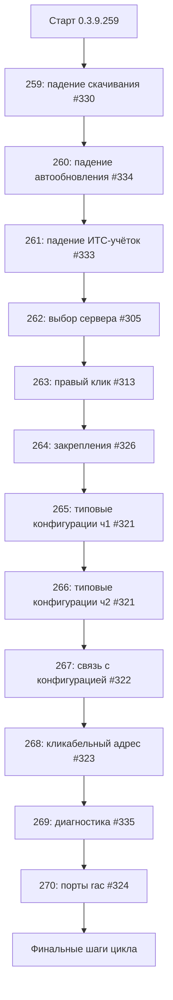

# PLAN — цикл 0.3.9.259–0.3.9.270 — новые комментарии 7OH: падения потоков, регрессии выделения, окна конфигураций и ИТС

Репозиторий [`sivatorov/ConfigurationManagement`](https://github.com/sivatorov/ConfigurationManagement),
локальная копия `f:\Yandex.Disk\h\Configuration_Management`, ветка `main`.
На момент составления плана в рабочем дереве **0.3.9.256** ([`Configuration Management.csproj`](../Configuration%20Management/Configuration%20Management.csproj:62),
строки 62–65) — правки #325 (#256) НЕ закоммичены и НЕ релизнуты; 0.3.9.257 (#327) и 0.3.9.258 (#309) —
этапы прежнего плана [`plans/PLAN-0.3.9.254-258.md`](PLAN-0.3.9.254-258.md). Новый цикл стартует
**после завершения цикла 0.3.9.254–258** (все три версии 256/257/258 выпущены и закоммичены);
первая микроверсия нового цикла — **0.3.9.259**. Нумерация условна — перед стартом каждого этапа
исполнитель сверяет фактическую версию в csproj.

Режим: Архитектор (план) → **по одному пункту в отдельной задаче** в режиме **code** (`new_task`
на каждый этап, по требованию пользователя). **Один issue = одна версия = один коммит.**
Issues **НЕ закрываются**; комментарий «Исправлено в версии X» — только после релиза версии,
без ключевых слов автозакрытия («fixes», «closes»).

Источник требований — [`new_comments_after_1935.json`](../new_comments_after_1935.json) (комментарии 7OH
после 2026-10-01T19:35Z). Подтверждения без кода: **#337** (полный стек XamlParseException —
подтверждение бага, исправленного в 0.3.9.254), **#328** (подтверждено ранее). Они в цикл НЕ входят.

---

## 1. Сводка цикла

| № | Версия | Issue | Тема |
|---|--------|-------|------|
| 1 | 0.3.9.259 | #330 | Падение при открытии «Скачивание платформы»: ScrollToEnd с фонового потока |
| 2 | 0.3.9.260 | #334 | Падение при «Автообновление платформы»: ScrollToEnd с фонового потока + пустой ответ портала |
| 3 | 0.3.9.261 | #333 | Падение окна «Учётные данные ИТС»: TwoWay к read-only IsPrimary + дубль «Основная» в списках выбора |
| 4 | 0.3.9.262 | #305 | Создание серверной базы: выбор сервера не подставляет текст, ввод с автоподбором ломается |
| 5 | 0.3.9.263 | #313 | «Для выделенных»: «текущая» строка пропадает из набора при Ctrl+правый клик |
| 6 | 0.3.9.264 | #326 | Выделение в закреплениях: Shift/Ctrl строит диапазон по общему списку |
| 7 | 0.3.9.265 | #321 (часть 1) | Окно типовых конфигураций: дубль строки, невидимые редакции, высота окна |
| 8 | 0.3.9.266 | #321 (часть 2) | Окно типовых конфигураций: поиск/отбор, ширина, подсветка перекрытия, Сегмент УРЛ, учётка |
| 9 | 0.3.9.267 | #322 | «Связать с конфигурацией»: компоновка, понятность поиска, различимость типовой/нетиповой |
| 10 | 0.3.9.268 | #323 | Окно «Проверка обновлений»: адрес каталога релизов кликабельным |
| 11 | 0.3.9.269 | #335 | «Диагностика подключения»: кнопки на вторую строку, пустой список серверов |
| 12 | 0.3.9.270 | #324 | Порты rac/RAS: комментарий-объяснение + мини-фикс подсказки/пустого результата |
| — | резерв 0.3.9.271+ | #326 / #321 | Второй раунд, если этап 6 или 7–8 не решит проблему по отзыву пользователя |

Зависимости и порядок:

- **#330/#334/#333 первыми** — пользователь не может открыть три окна вовсе (падения блокируют
  проверку любых других правок); это критические дефекты, доставляются отдельными микроверсиями.
- **#305/#313/#326** — регрессии взаимодействия с деревом, средняя сложность; идут сразу после падений.
- **#321** — крупнейший UI-этап (7 требований), разбит на две версии: часть 1 (данные: дубль,
  редакции, высота окна) до часть 2 (комфорт: поиск, ширина, подсветка, сегмент URL, учётка).
- **#322/#323/#335** — небольшие независимые UI-правки, низкий риск; между сложными этапами.
- **#324 — последним**: скорее объяснение, чем фикс; код минимальный (подсказка/пустое сообщение).

---

## 2. Общие требования к КАЖДОМУ этапу (обязательно)

1. Обе платформы (Windows/WPF + Linux/Avalonia), где применимо. Чистая логика — в сервисах/
   моделях/хелперах без платформенных зависимостей; UI-ветки — только `Views/*.xaml(.cs)` /
   `Views/*.Avalonia.cs` / `Controls/*.Avalonia.cs`.
2. Инкремент версии в [`Configuration Management.csproj`](../Configuration%20Management/Configuration%20Management.csproj:62)
   (строки 62–65: Version/AssemblyVersion/FileVersion/InformationalVersion) на 1 патч.
3. Запись в [`CHANGELOG.md`](../CHANGELOG.md:12) (сверху, раздел «Исправлено», номер issue + версия +
   перечень файлов) и обновление бейджа версии в [`README.md`](../README.md:3).
4. Комментарий на issue через `gh api repos/sivatorov/ConfigurationManagement/issues/<N>/comments`
   — шаблон в `publish/comment-<N>-<version>.md`. **Issue не закрывать**, ключевые слова
   автозакрытия не использовать. Для #321, разбитого на 2 версии, комментарий пишется на каждую
   версию (вторая ссылается на первую).
5. Тесты: `dotnet test` зелёный; `dotnet build -p:BuildLinux=true` без ошибок. Юнит-тесты — xUnit
   (`[Fact]`/`[Theory]`), стиль существующих файлов в `ConfigurationManagement.Tests/`.
6. Один коммит на версию (без пуша). Сообщение: `0.3.9.<N>: #<issue> — <тема>`.
7. Перед реализацией сверять фактические сигнатуры и адреса строк: этапы цикла меняют общие файлы.
8. Локализация: новые тексты через `LocalizationManager.T`, ключи парами в
   [`ru.json`](../Configuration%20Management/Localization/Languages/ru.json:1)/`en.json`.
9. Открытие URL в браузере — только через существующий `OneCLauncher.OpenUrl(url)`
   ([`Services/OneCLauncher.cs`](../Configuration%20Management/Services/OneCLauncher.cs:426) —
   Windows/UseShellExecute; [`OneCLauncher.Linux.Process.cs`](../Configuration%20Management/Services/OneCLauncher.Linux.Process.cs:298) —
   xdg-open), а не собственным `Process.Start`.

---

## 3. Этап 1 — 0.3.9.259 — #330 «Скачивание платформы» (падение при открытии)

### 3.1. Факты (из исследования)

- Стек 7OH: `InvalidOperationException` «Вызывающий поток не может получить доступ к данному
  объекту» в `PlatformDownloadWindow.OnViewModel_PropertyChanged` →
  [`Views/PlatformDownloadWindow.xaml.cs:112`](../Configuration%20Management/Views/PlatformDownloadWindow.xaml.cs:111)
  (`LogBox.ScrollToEnd()`) ← `PlatformDownloadViewModel.AppendLog` (строка 291) ← `LoadCatalogAsync`
  (строка 353) из `OnWindow_Loaded`.
- Причина подтверждена кодом: `AppendLog` вызывает `OnPropertyChanged(nameof(LogText))` из
  **фонового** потока — после `await _service.GetAvailableReleasesAsync().ConfigureAwait(false)`
  ([`ViewModels/PlatformDownloadViewModel.cs`](../Configuration%20Management/ViewModels/PlatformDownloadViewModel.cs:326)).
  Обработчик WPF выполняется на том же фоновом потоке и дёргает `ScrollToEnd()` — WPF бросает
  `Dispatcher.VerifyAccess`.
- **Avalonia-зеркало уже корректно**: [`Views/PlatformDownloadWindow.Avalonia.cs`](../Configuration%20Management/Views/PlatformDownloadWindow.Avalonia.cs:92)
  ставит автопрокрутку через `Dispatcher.UIThread.Post(...)` — править не требуется.

### 3.2. Решение

WPF [`Views/PlatformDownloadWindow.xaml.cs:111`](../Configuration%20Management/Views/PlatformDownloadWindow.xaml.cs:111):

- Автопрокрутку вынести в UI-поток: в обработчике `OnViewModel_PropertyChanged` для `LogText`
  заменить прямой `LogBox.ScrollToEnd()` на
  `Dispatcher.BeginInvoke(new Action(() => LogBox?.ScrollToEnd()))` (либо
  `if (!Dispatcher.CheckAccess()) { Dispatcher.Invoke(...); return; }` — единый путь и для
  синхронных, и для фоновых уведомлений).
- Защита `LogBox is not null` + `?.` (окно может быть в процессе закрытия).
- Тот же паттерн применить везде, где WPF-окна реагируют на `PropertyChanged` от VM, работающей
  с `ConfigureAwait(false)`, — в рамках этого этапа только данное окно (остальные — свои этапы).

### 3.3. Тесты

- Прямого юнит-теста на UI-поток нет (окно WPF). Добавить регрессионный тест на **VM-уровне**:
  `AppendLog` из фоновой задачи не должен менять поведение контракта (`LogText` поднимает
  PropertyChanged после вызова) — существующие `PlatformDownloadViewModelTests` дополнить
  проверкой, что вызовы из `Task.Run` безопасны (контракт VM: уведомления поднимаются,
  исключений нет).
- Регрессия `dotnet test`; кросс-сборка Linux; ручная проверка: открыть «Скачивание платформы»
  с реальной сетью и без неё (каталог недоступен — журнал пишется, падения нет).

### 3.4. Риски

- Если у `LogBox` в момент `BeginInvoke` окно уже закрыто — защита `?.`.
- Низкий риск: правка одной точки + защитный `?.;` контракт VM не меняется.

---

## 4. Этап 2 — 0.3.9.260 — #334 «Автообновление платформы» (падение при открытии)

### 4.1. Факты

- Стек 7OH: то же `InvalidOperationException` в
  [`Views/PlatformUpdateWindow.xaml.cs:125`](../Configuration%20Management/Views/PlatformUpdateWindow.xaml.cs:123)
  (`LogBox?.ScrollToEnd()`) ← `PlatformUpdateViewModel.AppendLog`
  ([`ViewModels/PlatformUpdateViewModel.cs`](../Configuration%20Management/ViewModels/PlatformUpdateViewModel.cs:207))
  ← `CheckUpdatesAsync` (строка 242, `await ...ConfigureAwait(false)` на строке 253).
- Дополнительно в логе: `[WARN] Не удалось получить страницу (пустое тело или HTTP-ошибка):
  https://releases.1c.ru/project/Platform83` — это НЕ падение (обрабатывается как статус ≠ Ok,
  `errorKey` в журнал + `NotifyError`). Падение — только поток.
- Avalonia-зеркало уже корректно: [`Views/PlatformUpdateWindow.Avalonia.cs`](../Configuration%20Management/Views/PlatformUpdateWindow.Avalonia.cs:180)
  использует `Dispatcher.UIThread.Post` (та же структура, что и в #330).

### 4.2. Решение

1. **Фикс потока** — как в этапе 1: [`Views/PlatformUpdateWindow.xaml.cs:121`](../Configuration%20Management/Views/PlatformUpdateWindow.xaml.cs:121)
   автопрокрутку через `Dispatcher.BeginInvoke(...)` (+`LogBox?.`).
2. **Обработка пустого ответа** (оценить в рамках этапа, код минимальный): сейчас статус ошибки
   уже пишется в журнал ключом локализации и через `NotifyError` — проверить, что
   `PlatformUpdateService.ErrorNetwork` не «пустой» текст и что пользователь видит понятное
   сообщение («не удалось получить каталог»). Если текст корректен — код не менять, только
   зафиксировать в комментарии; если пустой/технический — добавить ключ локализации.

### 4.3. Тесты

- `PlatformUpdateViewModelTests` — дополнить: `AppendLog` из фонового потока безопасен;
  сценарий «пустой ответ провайдера → статус ошибки, исключение не пробрасывается».
- Регрессия `dotnet test`; кросс-сборка Linux; ручная проверка: открыть «Обновление платформы»
  с доступным и недоступным порталом.

### 4.4. Риски

- Пустой ответ портала — внешняя зависимость (releases.1c.ru); в этой версии не чинить сам
  провайдер, только убедиться в понятном сообщении.

---

## 5. Этап 3 — 0.3.9.261 — #333 «Учётные данные ИТС» (падение окна + дубль «Основная»)

### 5.1. Факты

- Стек 7OH: `InvalidOperationException` «Привязка типа TwoWay или OneWayToSource не может работать
  с доступным только для чтения свойством "IsPrimary"» — при открытии окна справочника.
- Причина: [`Views/ItsAccountsWindow.xaml:168`](../Configuration%20Management/Views/ItsAccountsWindow.xaml:168) —
  `<CheckBox IsChecked="{Binding IsPrimary}" IsHitTestVisible="False" .../>` без `Mode=OneWay`;
  свойство [`ItsAccountItemViewModel.IsPrimary`](../Configuration%20Management/ViewModels/ItsAccountItemViewModel.cs:27)
  доступно только для чтения (`=> Model.IsPrimary`).
- Avalonia-зеркало не затронуто: там чекбокс строится кодом
  ([`Views/ItsAccountsWindow.Avalonia.cs`](../Configuration%20Management/Views/ItsAccountsWindow.Avalonia.cs:104),
  `IsChecked = account.IsPrimary`, `IsHitTestVisible = false`).
- **Дубль «Основная»** (комментарий 7OH в #322: «В списке учеток для доступа на итс - 2 раза
  Основная»): [`ItsAccountSelectionBuilder.Build`](../Configuration%20Management/ViewModels/ItsAccountsViewModel.cs:113)
  всегда добавляет виртуальный пункт «Основная» (`Id == null`) ПЕРВЫМ, а затем все записи
  справочника — включая реальную запись с именем `ItsAccountsStore.PrimaryName` («Основная»),
  которая гарантированно появляется при миграции старых настроек
  ([`ItsAccountsStore.MigrateFromSettings`](../Configuration%20Management/Services/ItsAccountsStore.cs:193)).

### 5.2. Решение

1. **Фикс привязки** (WPF): [`Views/ItsAccountsWindow.xaml:168`](../Configuration%20Management/Views/ItsAccountsWindow.xaml:168) —
   `<CheckBox IsChecked="{Binding IsPrimary, Mode=OneWay}" IsHitTestVisible="False" .../>`.
   (Альтернатива — сделать setter у VM — НЕ предлагается: флаг меняется только через
   `SetPrimary`, право редактирования закрыто намеренно, issue #333.)
2. **Дубль «Основная»** — в [`ItsAccountSelectionBuilder.Build`](../Configuration%20Management/ViewModels/ItsAccountsViewModel.cs:113):
   - если в справочнике (`store.Load()`) есть запись с именем, равным
     `ItsAccountsStore.PrimaryName` (без учёта регистра) — виртуальный пункт «Основная» НЕ
     добавляется (реальная запись уже представлена в списке);
   - иначе — виртуальный пункт первым (прежнее поведение).
   Список окна справочника (`ItsAccountsViewModel.Rows`) при этом не меняется — дубля там нет
   (строится прямо из `Load()`). Точки использования `Build`: настройки (вкладка ИТС) и редактор
   типовой конфигурации — обе получают дедуплицированный список.
3. Проверить, что нигде больше «Основная» не дублируется (например, колонка
   `ConfigTypeItemViewModel.AccountDisplay` возвращает «Основная» только как fallback —
   дублей не создаёт).

### 5.3. Тесты

- Новый тест на `ItsAccountSelectionBuilder`: «в справочнике есть запись „Основная“ → в списке
  один пункт „Основная“»; «записи „Основная“ нет → виртуальный пункт первый, всего N+1»;
  регистронезависимость сравнения.
- Регрессия `ItsAccountsStoreTests`, `CustomConfigTypesStoreTests`.
- Регрессия `dotnet test`; кросс-сборка Linux; ручная проверка: открыть справочник ИТС (не
  падает), открыть настройки→ИТС и редактор типовой конфигурации (в списке учёток нет дубля).

### 5.4. Риски

- Смена поведения списка выбора: у пользователей, у которых НЕТ реальной «Основной», всё как
  было; у остальных пропадает «лишний» пункт — это и есть цель.
- Привязка чекбокса меняется только в WPF XAML — Avalonia не трогаем.

---

## 6. Этап 4 — 0.3.9.262 — #305 «Создание серверной базы» (выбор сервера)

### 6.1. Факты

- 7OH: «при выборе сервера из списка — всё ещё ничего не подставлено; текст, совпадающий со
  списком, ввести нельзя — букву L съедает, вводится только ocalhost».
- Код WPF [`Views/CreateInfobaseWindow.xaml.cs:620`](../Configuration%20Management/Views/CreateInfobaseWindow.xaml.cs:620):
  `OnServerBox_SelectionChanged` → `ServerBox.Text = item` + отложенный
  `Dispatcher.BeginInvoke(SelectedItem = null)` (строки 620–637). Avalonia
  [`Views/CreateInfobaseWindow.Avalonia.cs:919`](../Configuration%20Management/Views/CreateInfobaseWindow.Avalonia.cs:919)
  — та же логика `SplitSelectedServer`.
- Комбобокс редактируемый, `IsTextSearchEnabled` по умолчанию **true** (обе платформы). При вводе
  первого символа WPF автоматически выбирает первый совпадающий элемент — срабатывает
  `SelectionChanged` → код принудительно подставляет полный текст элемента, «съедая» ручной ввод,
  а отложенный сброс `SelectedItem=null` синхронизирует `Text` обратно (затирает). Итог: либо
  «ничего не подставляется», либо ручной ввод ломается.
- Разметка: [`Views/CreateInfobaseWindow.xaml:79`](../Configuration%20Management/Views/CreateInfobaseWindow.xaml:79)
  (`ServerBox IsEditable="True"`), Avalonia — поле `_serverBox` (строка 52).

### 6.2. Решение

Цель: клик по элементу списка подставляет «server:port» в текст, ручной ввод не перебивается.

1. **Отключить автоподбор ввода**:
   - WPF [`Views/CreateInfobaseWindow.xaml:79`](../Configuration%20Management/Views/CreateInfobaseWindow.xaml:79):
     добавить `IsTextSearchEnabled="False"`;
   - Avalonia [`Views/CreateInfobaseWindow.Avalonia.cs:52`](../Configuration%20Management/Views/CreateInfobaseWindow.Avalonia.cs:52):
     при создании `_serverBox` установить `IsTextSearchEnabled = false`.
   После этого ручной ввод не вызывает `SelectionChanged`, текст сохраняется как набран.
2. **Сохранить подстановку при выборе из списка**: `ServerBox.Text = item` + отложенный
   `SelectedItem = null` оставить (теперь он срабатывает только от реального выбора элемента).
3. **Проверить ввод совпадающего текста**: при `IsTextSearchEnabled=false` набор «localhost»
   вручную идёт без вмешательства; при выборе «localhost:…» из списка текст подставляется целиком.
4. Проверить, что создание базы использует `ServerBox.Text` через
   [`CreateInfobaseService.ParseServerPort`](../Configuration%20Management/Views/CreateInfobaseWindow.xaml.cs:714) —
   текст остаётся источником истины (уже так).

### 6.3. Тесты

- Логика парсинга «server:port» уже покрыта (`CreateInfobaseDbServerStringTests` и т.п.) —
  регрессия. Добавить юнит-тест, если выносится чистый хелпер (например, «выбор строки →
  нормализованный текст») — опционально.
- Регрессия `dotnet test`; кросс-сборка Linux; ручная проверка на обеих платформах: выбрать
  сервер из списка (текст подставлен), вручную ввести «localhost» (ни один символ не пропадает),
  создать базу.

### 6.4. Риски

- Клавиатурная навигация по списку при вводе (TextSearch) отключается — приемлемо: список
  короткий, выбор мышью/стрелками работает.
- На Avalonia поведение TextSearch может отличаться — проверить ручным сценарием 7OH.

---

## 7. Этап 5 — 0.3.9.263 — #313 «Для выделенных» (текущая строка при Ctrl+правый клик)

### 7.1. Факты

- 7OH: «если выделять с контролом 2 и 3 строку при просто текущей первой, то при правом клике
  выделение на первой пропадает. … при клике с контролом не на текущей строке, ставить
  внутреннюю галку выделения текущей строке тоже».
- Сейчас `ToggleBatchSelection` («Ctrl») просто делает toggle целевой строки
  ([`ViewModels/MainViewModel.Batch.cs:89`](../Configuration%20Management/ViewModels/MainViewModel.Batch.cs:77)),
  не добавляя «текущую» (последнюю выбранную без Ctrl). Правый клик набор НЕ меняет
  (`BuildRightClickSet`, [`Services/BatchSelectionHelper.cs:96`](../Configuration%20Management/Services/BatchSelectionHelper.cs:96)),
  но «текущая» (SelectedInfobase без Ctrl) и так не входит в набор — при первом Ctrl-клике
  пользователь ожидает, что текущая останется в выделении, а её «теряет».
- Обработчики левого клика: WPF [`Views/MainWindow.Events.cs:663`](../Configuration%20Management/Views/MainWindow.Events.cs:662)
  (`Ctrl → ToggleBatchSelection`), Avalonia [`Controls/LeveledTreeView.Avalonia.cs:126`](../Configuration%20Management/Controls/LeveledTreeView.Avalonia.cs:126).

### 7.2. Решение (по предложению 7OH)

Семантика Ctrl-клика: **первый Ctrl-клик по строке, отличной от «текущей», добавляет в набор и
«текущую», и целевую** (как в проводнике); повторный Ctrl-клик по строке набора — toggle.

1. [`Services/BatchSelectionHelper.cs`](../Configuration%20Management/Services/BatchSelectionHelper.cs:39):
   в `ApplyModifiedClick` добавить опциональный параметр `string? includeId = null`
   (или отдельный чистый метод `ApplyFirstCtrlClick`) — «если набор пуст и targetId != includeId —
   добавить includeId». Правило секций (#326) соблюдается: `includeId` добавляется только если
   его секция совпадает с секцией цели (передавать `includeSectionIsPinned`).
2. [`ViewModels/MainViewModel.Batch.cs:77`](../Configuration%20Management/ViewModels/MainViewModel.Batch.cs:77):
   в ветке «Ctrl» при пустом наборе передавать `SelectedInfobase` как `includeId`
   (и его признак секции `_batchSectionIsPinned == null ? isPinnedSection : ...` — на пустом
   наборе секция ещё не установлена, поэтому секцию «текущей» берём из признака секции самой
   текущей строки, которую знает UI).
   Для этого `ToggleBatchSelection` нужно принимать не только `isPinnedSection` цели, но и
   признак секции «текущей» строки (либо UI передаёт `SelectedInfobaseSectionIsPinned`).
3. UI-точки вызова передают новый параметр: WPF [`Views/MainWindow.Events.cs:667`](../Configuration%20Management/Views/MainWindow.Events.cs:667),
   Avalonia [`Controls/LeveledTreeView.Avalonia.cs:132`](../Configuration%20Management/Controls/LeveledTreeView.Avalonia.cs:132).
   Признак секции текущей строки — `BatchSelectionHelper.IsPinnedSection(контейнер SelectedInfobase)` —
   определить аккуратно: текущая строка может быть закреплённой копией.
4. `BuildRightClickSet` и обработчики правого клика не меняются: набор на правом клике фиксируется
   таким, какой есть (теперь он включает и «текущую» — жалоба уходит).

### 7.3. Тесты

- [`BatchSelectionHelperTests`](../ConfigurationManagement.Tests/BatchSelectionHelperTests.cs):
  - первый Ctrl-клик по строке ≠ текущей → набор {текущая, цель};
  - первый Ctrl-клик по текущей строке → toggle (только текущая);
  - повторный Ctrl-клик по строке набора → снятие (toggle, без потери остальных);
  - разные секции → текущая НЕ добавляется;
  - `BuildRightClickSet` не меняет набор.
- Регрессия `dotnet test`; кросс-сборка Linux; ручная проверка сценария 7OH (1 без Ctrl → Ctrl+2,
  Ctrl+3 → правый клик по 3 — первая остаётся в «Для выделенных (3)»).

### 7.4. Риски

- Изменение семантики Ctrl может задеть сценарии, привычные текущим пользователям: изменения
  минимальны (только «первый Ctrl-клик при пустом наборе») и покрыты тестами.
- Определение секции «текущей» строки в UI — единственное место, где нужна аккуратность с
  обёртками PinnedInfobaseItem.

---

## 8. Этап 6 — 0.3.9.264 — #326 «Выделение в закреплениях» (Shift/Ctrl по общему списку)

### 8.1. Факты

- 7OH: «При выделении с контролом или шифтом - выделение происходит не в закреплении, а в общем
  списке … выделяю от текущей в закреплении до другой в закреплении с шифтом, а оно выделяет
  полсписка обычного». Фикс 0.3.9.238 не помог.
- Точки вызова Shift-диапазона:
  - WPF [`Views/MainWindow.Events.cs:675`](../Configuration%20Management/Views/MainWindow.Events.cs:675):
    `SelectRange(SelectedInfobase, infobase, VisibleInfobasesInOrder(isPinnedSection), isPinnedSection)`;
  - Avalonia [`Controls/LeveledTreeView.Avalonia.cs:137`](../Configuration%20Management/Controls/LeveledTreeView.Avalonia.cs:137).
- `VisibleInfobasesInOrder(pinnedSection)` фильтрует строки по `BatchSelectionHelper.IsPinnedSection`
  (WPF [`Views/MainWindow.Tree.cs:85`](../Configuration%20Management/Views/MainWindow.Tree.cs:85),
  Avalonia [`Controls/LeveledTreeView.Avalonia.cs:176`](../Configuration%20Management/Controls/LeveledTreeView.Avalonia.cs:176)).
- `ApplyModifiedClick` (Shift) строит диапазон по переданному `visibleOrder` от `anchorId`
  ([`Services/BatchSelectionHelper.cs:54`](../Configuration%20Management/Services/BatchSelectionHelper.cs:54));
  якорь — `SelectedInfobase` (последний клик без Ctrl).

### 8.2. Гипотезы (диагностика — обязательный первый шаг этапа)

- **H1. Признак секции не тот**: строка узла «Закреплённые» в обработчике приходит не как
  `PinnedInfobaseItem`, а как `Infobase` (или обёртка потеряна в конкретной ветке) → `isPinnedSection`
  = false → порядок строится по обычному списку → «полсписка обычного». Проверить тип
  `treeViewItem.DataContext` для закреплённой строки в рантайме (лог) на обеих платформах.
- **H2. Якорь — обычная копия**: `SelectedInfobase` после клика по закреплённой строке — объект
  из обычного списка (развёрнут), а `VisibleInfobasesInOrder(true)` содержит закреплённые копии —
  `IndexOf` по Id совпадает, но если порядок построен неверно (H1) — диапазон расходится.
- **H3. Виртуализация контейнеров (WPF)**: `GetVisibleTreeViewItems` использует
  `ItemContainerGenerator.ContainerFromIndex` — невидимые (невиртуализированные) строки узла
  «Закреплённые» могут отсутствовать в порядке → индекс якоря/цели не находится, диапазон
  вырождается или строится по неправильному подмножеству.
- **H4. Ctrl-клик в закреплениях** помечает набор с `_batchSectionIsPinned=true`, но следующий
  Shift-клик в той же секции попадает в другую ветку (если строка не найдена обработчиком) —
  проверить маршрут событий для строк узла «Закреплённые».

### 8.3. Диагностика в рамках этапа

1. Воспроизвести сценарий 7OH (Windows/WPF и Linux/Avalonia): 3–5 закреплённых баз + обычный
   список; Ctrl/Shift-клики внутри «Закреплённых».
2. Залогировать (Trace-уровень, как в #309): для каждой строки клика — тип `DataContext`,
   `IsPinnedSection`, вычисленный `VisibleInfobasesInOrder(section)` (id, порядок), якорь
   (`SelectedInfobase.Id`), результат `ApplyModifiedClick`.
3. Сверить порядок в логе с фактическим порядком строк на экране.
4. Проверить H3: включить/выключить виртуализацию, прокрутить узел «Закреплённые» до конца —
   меняется ли порядок.

### 8.4. Направления фикса (по результатам)

- **F1 (если H1)**: гарантировать обёртку `PinnedInfobaseItem` для строк узла «Закреплённые» во
  всех ветках WPF/Avalonia (сверить построение узла и `IsPinnedSection`).
- **F2 (если H2)**: строить якорь от контейнера под выделением, а не от `SelectedInfobase`
  (аналог `FindCurrentRowIndex` в навигации, [`Views/MainWindow.Tree.cs:110`](../Configuration%20Management/Views/MainWindow.Tree.cs:110)).
- **F3 (если H3)**: строить порядок секции не по контейнерам, а по данным узла
  (модель `PinnedInfobaseItem` / `GroupNodeViewModel` + инфобазы), сохраняя видимый порядок
  (свёрнутые группы) — или убрать зависимость от виртуализации.
- **F4 (если H4)**: единый маршрут обработки кликов для обычных и закреплённых строк.
- Сопроводить фикс инструментальным логом (выключен по умолчанию), чтобы при повторном отзыве
  видеть фактические значения.

### 8.5. Тесты

- [`BatchSelectionHelperTests`](../ConfigurationManagement.Tests/BatchSelectionHelperTests.cs):
  Shift-диапазон в «закреплённой» секции с заведомо другим порядком обычного списка — диапазон
  строится только по закреплённым (уже частично есть — дополнить сценарием «обычный список
  длиннее, цель и якорь в закреплениях»).
- Если логика порядка выносится в чистый хелпер (построение видимого порядка секции по модели) —
  юнит-тесты на него (WPF-часть виртуализации не тестируется — покрывается ручной проверкой).
- Регрессия `dotnet test`; кросс-сборка Linux; ручная проверка сценария 7OH.

### 8.6. Риски

- Проблема может быть специфична для WPF (виртуализация/обёртки) или общей — поэтому диагностика
  обязательна; при неуспехе — резерв 0.3.9.271 по логу.

---

## 9. Этап 7 — 0.3.9.265 — #321 «Окно Типовые конфигурации», часть 1 (данные и редактор)

### 9.1. Факты

- **Дубль строки ЗУП** при правке встроенной записи: [`Views/ConfigTypesEditWindow.xaml.cs:85`](../Configuration%20Management/Views/ConfigTypesEditWindow.xaml.cs:85)
  `RebuildRows()` добавляет ВСЕ `BuiltInConfigTypes.All` + ВСЕ `_customTypes` — без правила замены.
  Правка встроенной создаёт пользовательскую копию (`OverridesBuiltIn=true`,
  [`OnEditRow`](../Configuration%20Management/Views/ConfigTypesEditWindow.xaml.cs:105), строки 111–119),
  и в окне списка появляются ДВЕ строки ЗУП: предопределённая (★) и копия без звезды.
  Единый загрузчик `CustomConfigTypesStore.LoadAll()` уже применяет замену
  ([`Services/CustomConfigTypesStore.cs:89`](../Configuration%20Management/Services/CustomConfigTypesStore.cs:89)) —
  окно списка им не пользуется.
- **Редакции не видны при добавлении**: [`Views/ConfigTypeEditWindow.xaml.cs:25`](../Configuration%20Management/Views/ConfigTypeEditWindow.xaml.cs:25) —
  `_editions` это `List<OneCConfigEdition>`, `EditionsList.ItemsSource = _editions` (строка 60),
  `OnAddEditionClick` делает `_editions.Add(...)` — обычный List не уведомляет UI; строки
  появляются только после переоткрытия/сохранения.
- **Высота окна**: [`Views/ConfigTypeEditWindow.xaml:7`](../Configuration%20Management/Views/ConfigTypeEditWindow.xaml:7) —
  `Height="580" MinHeight="500"`, список редакций `MaxHeight="110"` (строка 124) — пользователю
  не видно 3–4 строки редакций.

### 9.2. Решение (часть 1)

1. **Дубль**: `RebuildRows()` (WPF) и её зеркало в [`Views/ConfigTypesEditWindow.Avalonia.cs`](../Configuration%20Management/Views/ConfigTypesEditWindow.Avalonia.cs:29)
   перевести на единый источник `_store.LoadAll()`:
   - список = `LoadAll()` (пользовательская копия заменяет встроенную с тем же кодом, обычные
     пользовательские добавляются следом) — дублей нет;
   - `_customTypes` остаётся рабочим буфером для `Save()`;
   - визуально пометить пользовательские строки и копии-переопределения (см. часть 2, этап 8) —
   здесь минимально: оставить звёздочку только у `IsBuiltIn`, добавить значок «изменено» для
   `OverridesBuiltIn` (может быть в части 2, если объём).
   Синхронизировать `RebuildRows` и `_customTypes` после `OnEditRow`/`OnAddConfigClick`/`OnDeleteRow`.
2. **Редакции**: `_editions` заменить на `ObservableCollection<OneCConfigEdition>` (обе
   платформы); в `OnAddEditionClick` после `Add` — `EditionsList.SelectedItem = edition;` +
   `ScrollIntoView(edition)`. `Result` по-прежнему копирует `new List<OneCConfigEdition>(_editions)`.
   (Уведомления о смене полей редакции — по желанию; достаточно переключения выделения, как сейчас.)
3. **Высота окна** (обе платформы): `ConfigTypeEditWindow` — `Height` ~720 / `MinHeight` ~620,
   список редакций `MaxHeight` ~200 (3–4 строки видны); согласовать с Avalonia-зеркалом
   (`ConfigTypeEditWindow.Avalonia.cs` — параметры окна/списка).

### 9.3. Тесты

- [`CustomConfigTypesStoreTests`](../ConfigurationManagement.Tests/CustomConfigTypesStoreTests.cs):
  сценарий «правка встроенной → LoadAll возвращает ровно одну запись с кодом» (замена, без
  дубля) — дополнить, если отсутствует.
- Новый/расширенный тест на построение списка окна, если выносится чистый хелпер
  «список строк для окна = LoadAll()» — иначе покрыть регрессией store + ручной проверкой.
- Регрессия `dotnet test`; кросс-сборка Linux; ручная проверка: правка ЗУП → в списке одна ЗУП
  (копия с пометкой), добавление редакции → строка появляется сразу, окно выше.

### 9.4. Риски

- Перевод `RebuildRows` на `LoadAll()` меняет порядок строк (пользовательские копии встают на
  место встроенных) — ожидаемое поведение, проверить визуально.
- Avalonia-версия окна построена кодом — править зеркально.

---

## 10. Этап 8 — 0.3.9.266 — #321 «Окно Типовые конфигурации», часть 2 (UI-комфорт)

### 10.1. Факты (требования 7OH)

- «Список явно нужно делать шире по умолчанию» — [`Views/ConfigTypesEditWindow.xaml:8`](../Configuration%20Management/Views/ConfigTypesEditWindow.xaml:8) `Width="720"`.
- «Сегмент УРЛ надо проработать… подписи» — колонка «Сегмент УРЛ» без пояснения; нужен ToolTip/
  подпись, что это сегмент web-адреса обновлений (`UrlCode`, fallback — имя).
- «Если пользовательская строка перекрывает типовую — подсветить факт (зачёркивание/пометка)» —
  сейчас строка-копия (`OverridesBuiltIn`) ничем не отличается от обычной пользовательской.
- «Основная учетка показывается в виде ключа — непонятно» — проверить рендер колонки
  «Учётная запись» (иконка Key вместо имени; ожидается текст + тултип). Проверить на WPF и
  Avalonia (шаблоны колонок [`Views/ConfigTypesEditWindow.xaml:185`](../Configuration%20Management/Views/ConfigTypesEditWindow.xaml:185)
  и зеркало).
- «Уже надо добавлять поиск/отбор» — большие списки конфигураций (перенос из СтартМенеджера).

### 10.2. Решение (часть 2)

1. **Ширина**: окно списка `Width` ~920–960 (и `MinWidth` ~720), колонки `*` пропорционально;
   Avalonia-зеркало — те же размеры.
2. **Сегмент УРЛ**: заголовок/подсказка — ToolTip на колонке (и в заголовке окна редактора)
   «Сегмент web-адреса обновлений: подставляется в URL каталога релизов; если пуст —
   используется наименование» + пояснительный текст в шапке окна (ключи локализации).
3. **Подсветка перекрытия**: в `ConfigTypeItemViewModel` добавить признак
   `IsOverride => Model.OverridesBuiltIn` (и, возможно, `IsCustom => !Model.IsBuiltIn`);
   колонка/иконка «изм. копия предопределённой» (например, значок карандаша поверх ★ + ToolTip
   «пользовательская копия перекрывает типовую»); текст встроенной строки, заменённой копией,
   в списке не показывается (правило LoadAll) — при желании вариант «зачёркнутая типовая»
   обсудить с пользователем в комментарии.
4. **Учётка «ключ»**: разобраться с рендером; ожидаемое состояние — текст (`AccountDisplay`)
   + ToolTip с именем/логином; иконку ключа/замка убрать или сопроводить подписью. Если это
   штатная иконка «основная запись» — оставить, но добавить текст рядом.
5. **Поиск/отбор** (обе платформы): TextBox над таблицей + фильтр по `Name`/`UrlCode`/`Nick`/
   `EditionsSummary` (без учёта регистра), сброс по Esc/кнопке; реализовать через чистый
   фильтр-предикат (переиспользуем паттерн окна «Добавление базы»). При пустом запросе — полный
   список.

### 10.3. Тесты

- Юнит-тест на фильтр-предикат (если выносится чистый хелпер): подстроки, регистр, поля,
   пустой запрос.
- `ConfigTypeItemViewModel` — признак перекрытия (`IsOverride`).
- Регрессия `dotnet test`; кросс-сборка Linux; ручная проверка на скриншоте-сценарии 7OH
  (ширина, поиск, подсветка, учётка).

### 10.4. Риски

- Чисто визуальные правки — легко разъехаться; сравнивать с ширинами других окон (720→960 может
  выйти за маленькие экраны — окно ресайзится, `MinWidth` не завышать).
- Поиск должен работать и на списке из LoadAll (с заменёнными встроенными).

---

## 11. Этап 9 — 0.3.9.267 — #322 «Связать с конфигурацией»

### 11.1. Факты

- 7OH: (1) «Подвинем кнопку и надпись… название конфигурации бывает большим» — компоновка
  [`Views/ConfigUpdateLinkWindow.xaml`](../Configuration%20Management/Views/ConfigUpdateLinkWindow.xaml:1)
  (и Avalonia-зеркало [`Views/ConfigUpdateLinkWindow.Avalonia.cs`](../Configuration%20Management/Views/ConfigUpdateLinkWindow.Avalonia.cs:1)):
  кнопке/подписи нужно больше места под название.
- (2) «непонятно, в каком поле ищется ЗарплатаИУправлениеПерсоналом… нашло ТИПОВУЮ запись;
  в списке выбора нетиповой записи нет или не ясно, как их отличить».
  Логика поиска: [`ConfigUpdateLinkWindow.TryAutoMatchConfig`](../Configuration%20Management/Views/ConfigUpdateLinkWindow.xaml.cs:251) →
  [`ConfigTypeMatcher.FindByInfobaseName`](../Configuration%20Management/Services/ConfigTypeMatcher.cs:24) —
  приоритет: точное имя → точный `EffectiveUrlCode` → вхождения. Список `_configs` строится из
  `_store.LoadAll()` (строка 82) — нетиповые в списке ЕСТЬ, но: (а) если имя базы точно совпало с
  типовой ЗУП («Зарплата и управление персоналом» с пробелами), нетиповая запись с совпадающим
  сегментом URL не участвует (приоритет имени выше); (б) в выпадающем списке нетиповые
  визуально не отличаются от типовых.
- (3) «В списке учеток для доступа на итс - 2 раза Основная» — исправляется на этапе 3 (#333);
  перекрёстная ссылка.

### 11.2. Решение

1. **Компоновка** (обе платформы): освободить место под название конфигурации — кнопку
   «Типовые конфигурации…» и подпись подвинуть/перенести (например, строка с ComboBox
   «Конфигурация» занимает всю ширину, кнопка переезжает на отдельную строку или вправо;
   сверить сетку XAML/Avalonia). Название конфигурации не должно обрезаться (`TextTrimming`
   допустим, но не при стандартной ширине окна).
2. **Понятность поиска**:
   - в окне показать, из какого поля берётся имя для автопоиска (подпись у блока
     «Определить версию»: «Ищет по имени конфигурации базы (вкладка „Платформа“)», затем по
     сегменту URL);
   - в выпадающем списке пометить происхождение: «типовая», «пользовательская»,
     «пользовательская копия (перекрывает типовую)» — через суффикс/иконку в `ToString()`
     (осторожно: `ToString` используется и в других местах — лучше отдельное свойство
     `DisplayName` в списке окна или шаблон ComboBox с двумя TextBlock);
   - если после меток пользователь не находит нетиповую запись из-за приоритета имени —
     рассмотреть показ «найдено по имени / по сегменту URL» в строке результата
     (`TryAutoMatchConfig` уже пишет `Updates.ConfigMatched` — дополнить детализацией причины).
3. **Дубль «Основная»** — см. этап 3 (#333); в этом этапе только проверить, что в выпадающих
   списках окна связи его нет (уже дедуплицируется через `Build`).

### 11.3. Тесты

- [`ConfigTypeMatcherTests`](../ConfigurationManagement.Tests/ConfigTypeMatcherTests.cs): добавить
  сценарии «нетиповая запись с совпадающим UrlCode vs типовая с совпадающим именем» — зафиксировать
  ожидаемый приоритет; при изменении приоритета (если решим поднять UrlCode выше имени) — обновить
  тесты и проверить регрессию автоопределения (#323/#322).
- Регрессия `dotnet test`; кросс-сборка Linux; ручная проверка сценария 7OH.

### 11.4. Риски

- Менять приоритет матчера — рискованно для автоопределения каталога релизов
  ([`UpdateCheckWindow`](../Configuration%20Management/Views/UpdateCheckWindow.xaml.cs:78) тоже
  использует `ConfigTypeMatcher`): по умолчанию НЕ менять логику, только объяснять результат.
- `ToString()` у `OneCConfigType` перегружен — не расширять его суффиксами (сломает ComboBox
  в других окнах).

---

## 12. Этап 10 — 0.3.9.268 — #323 «Окно Проверка обновлений» (кликабельный адрес)

### 12.1. Факты

- 7OH: «Адрес в браузере открывается, кстати сделать бы его кликабельным для возможности
  проверки вручную».
- Адрес каталога релизов выводится в [`Views/UpdateCheckWindow.xaml:123`](../Configuration%20Management/Views/UpdateCheckWindow.xaml:122)
  (`UrlText` — обычный `TextBlock`, `FontSize=12`, secondary) из
  [`Views/UpdateCheckWindow.xaml.cs:150`](../Configuration%20Management/Views/UpdateCheckWindow.xaml.cs:150)
  (`UrlText.Text = _row.Url`). Avalonia-зеркало — [`Views/UpdateCheckWindow.Avalonia.cs`](../Configuration%20Management/Views/UpdateCheckWindow.Avalonia.cs:205+).
- Готовый хелпер открытия URL: `OneCLauncher.OpenUrl(url)` (см. п. 2.9).

### 12.2. Решение

1. WPF: заменить `TextBlock x:Name="UrlText"` на `TextBlock` с `Hyperlink` (Run) — клик по ссылке
   вызывает `OneCLauncher.OpenUrl(_row.Url)`; курсор Hand, стиль ссылки (AccentBrush, подчёркивание
   при наведении); защита: пустой/невалидный URL — ссылка неактивна (при `_row.Url` = «—»).
2. Avalonia: аналогично — `TextBlock` с подчёркиванием + `PointerPressed` →
   `OneCLauncher.OpenUrl(url)`.
3. Сохранить перенос текста (`TextWrapping="Wrap"`) и вторичный цвет; ToolTip «Открыть каталог
   релизов в браузере».

### 12.3. Тесты

- Регрессия `dotnet test`; кросс-сборка Linux; ручная проверка: открыть «Проверка обновлений»,
   клик по адресу — браузер открывает releases.1c.ru; при отсутствии адреса ссылка неактивна.

### 12.4. Риски

- `_row.Url` может содержать не-URL текст («—») — защита валидацией (`Uri.TryCreate` + http/https).
- Оба окна (WPF/Avalonia) — править зеркально.

---

## 13. Этап 11 — 0.3.9.269 — #335 «Диагностика подключения» (компоновка + пустой список серверов)

### 13.1. Факты

- 7OH: «Окно стало Уже - кнопки не видно. Может кнопки на вторую строку перенести?» +
  «В поле Серверы - ничего нет - пусто».
- Верхняя панель [`Views/NetworkDiagnosticsWindow.xaml:41`](../Configuration%20Management/Views/NetworkDiagnosticsWindow.xaml:41) —
  один горизонтальный `StackPanel`: Host (200) + Сервер (150) + Порт (64) + 5 кнопок. При
  недостаточной ширине `StackPanel` обрезает кнопки (переноса нет). Avalonia-зеркало
  ([`Views/NetworkDiagnosticsWindow.Avalonia.cs`](../Configuration%20Management/Views/NetworkDiagnosticsWindow.Avalonia.cs:55)) —
  аналогичная компоновка.
- Список серверов наполняется из [`GetAvailableServers`](../Configuration%20Management/ViewModels/MainViewModel.Commands.cs:146)
  (только серверы клиент-серверных баз списка). Если таких баз нет (или сервер пуст) — список
  пуст; плюс в VM [`NetworkDiagnosticsViewModel`](../Configuration%20Management/ViewModels/NetworkDiagnosticsViewModel.cs:53)
  нет гарантии, что `target.Host` попадёт в список.

### 13.2. Решение

1. **Компоновка** (обе платформы): разделить верхнюю панель на две строки:
   - строка 1: «Адрес» (Host) + «Сервер» (ComboBox) + «Порт» + кнопка «Проверить»;
   - строка 2: кнопки «Проверить порты 1С», «Проверить хранилище», «Повторить», «Закрыть».
   Либо использовать `WrapPanel` (auto-wrap). Согласовать вертикальные отступы и выравнивание.
2. **Список серверов**:
   - расширить источник в точке вызова
     ([`MainViewModel.Tools.cs:2689`](../Configuration%20Management/ViewModels/MainViewModel.Tools.cs:2689) /
     [`MainViewModel.Avalonia.Tools.cs:1647`](../Configuration%20Management/ViewModels/MainViewModel.Avalonia.Tools.cs:1646)):
     объединить `GetAvailableServers()` + серверы из `IServerPortsStore` (сохранённые при
     мониторинге/диагностике) + `target.Host`;
   - в `NetworkDiagnosticsViewModel` гарантировать включение `target.Host` в
     `AvailableServers` (даже если список извне пуст).

### 13.3. Тесты

- [`NetworkDiagnosticsViewModelTests`](../ConfigurationManagement.Tests/NetworkDiagnosticsViewModelTests.cs):
  сценарий «список серверов пуст → target.Host присутствует и выбран»; «несколько источников —
  дедупликация и сортировка» (если объединение выносится в чистый хелпер).
- Регрессия `dotnet test`; кросс-сборка Linux; ручная проверка: окно на 1024px и 1366px — кнопки
  видны; список серверов не пуст при наличии клиент-серверных баз/сохранённых портов.

### 13.4. Риски

- Сузить окно нельзя (было «окно стало уже») — наоборот, проверить минимальную ширину; кнопки
  не должны «прыгать» при разных DPI.

---

## 14. Этап 12 — 0.3.9.270 — #324 «Серверы 1С» (порты rac/RAS) — комментарий + мини-фикс

### 14.1. Факты

- 7OH: «везде пишут про 1545 порт; у меня 1540/1541 — таймаут, 1545 подключается, но говорит,
  что ничего не найдено; rac.exe localhost:27545 cluster list в командной строке работает
  (порт кластера 27541)».
- Техническая картина: **1540 — порт агента (ragent), 1541 — порт кластера (rmngr),
  1545 — порт сервера администрирования RAS**. rac подключается к агенту или RAS, НЕ к порту
  кластера. У пользователя нестандартные порты (ragent/RAS 27540/27545, кластер 27541) — в
  приложение нужно вводить адрес агента/RAS (27545), а не 1540/1541; 1545 (стандартный RAS)
  слушает что-то другое либо RAS не на том порту — «подключается, но пусто» — ожидаемо.
- Код уже поддерживает `host:port` одним токеном (`RacClient.BuildArguments`,
  [`Services/RacClient.cs:144`](../Configuration%20Management/Services/RacClient.cs:144), комментарий
  «issue #324» — фикс соединения был сделан ранее). Пустой вывод при ExitCode=0 → пустой список
  кластеров → «ничего не найдено» без пояснения
  ([`Services/RacClient.cs:206`](../Configuration%20Management/Services/RacClient.cs:206) + парсеры).
- Подсказки в окнах: `ClusterImportViewModel`/`ServerMonitorViewModel` документируют «порт агента,
  по умолчанию 1540; для RAS — 1545» ([`ViewModels/ClusterImportViewModel.cs:71`](../Configuration%20Management/ViewModels/ClusterImportViewModel.cs:71),
  [`ViewModels/ServerMonitorViewModel.cs:85`](../Configuration%20Management/ViewModels/ServerMonitorViewModel.cs:85)).

### 14.2. Решение (оценить объём; по умолчанию — комментарий + малый код)

1. **Комментарий на issue** — объяснение портов (агент/RAS vs кластер; 1545 — RAS, ввод порта
   кластера 1541 не сработает; у пользователя нестандартные порты — вводить 27545) + инструкция
   проверки (команда из окна — та же, что у него работает). Техническая часть — без изменений
   соединения (уже исправлено).
2. **Мини-фикс кода** (если приемлемо по объёму):
   - при пустом списке кластеров после успешного ExitCode=0 добавить Warn-лог и понятное
     сообщение в окнах монитора/импорта: «Подключение установлено, но кластеры не найдены.
     Проверьте порт: указывайте порт агента (1540) или RAS (1545), а не порт кластера (1541)»
     (новый ключ локализации);
   - обновить ToolTip/подсказку в окнах монитора/импорта (явно: «не порт кластера»).
   Точки: `ClusterImportViewModel`, `ServerMonitorViewModel`, соответствующие окна и локализация.
3. Если код решится не менять — этап сводится к комментарию без инкремента версии (см. раздел 15,
   вариант «без изменений»); но по конвенции цикла фиксируем в 0.3.9.270 с мини-фиксом.

### 14.3. Тесты

- [`RacClientTests`](../ConfigurationManagement.Tests/RacClientTests.cs) (аргументы) — регрессия.
- Тест на сообщение о пустом списке, если логика выносится (опционально).
- Регрессия `dotnet test`; кросс-сборка Linux; ручная проверка: монитор/импорт с портом 1541 —
  понятное сообщение, с корректным портом агента — кластер виден.

### 14.4. Риски

- Не пытаться «самообнаруживать» порт кластера из ответа RAS: выход за рамки; объяснение —
  основной вклад этапа.

---

## 15. Финальные шаги цикла

1. Полный прогон `dotnet test` (весь набор `ConfigurationManagement.Tests` зелёный).
2. Кросс-сборка Linux: `dotnet build -p:BuildLinux=true` без ошибок.
3. Сборки для релиза: Windows — `dotnet publish -c Release`
   (скрипт [`Configuration Management/build-windows-single-file.ps1`](../Configuration%20Management/build-windows-single-file.ps1:1));
   Linux — `build-linux-single-file.*` + AppImage/deb (скрипты [`package/linux`](../package/linux/appimage.sh:1));
   артефакты в `publish/out-0.3.9.270/`.
4. Контроль документации: CHANGELOG (все записи цикла), README (бейдж), ARCHITECTURE.md —
   при изменении архитектуры (#313: семантика Ctrl; #326: порядок секций; #321: единый загрузчик
   LoadAll в окне списка).
5. Коммиты: по одному на версию (`0.3.9.<N>: #<issue> — <тема>`); рабочее дерево чистое кроме
   plan-файла.
6. Комментарии на issues по шаблонам `publish/comment-<N>-<version>.md` через
   `gh api repos/sivatorov/ConfigurationManagement/issues/<N>/comments --field body=@file`.
   Issues НЕ закрывать. #321 комментируется дважды (0.3.9.265 и 0.3.9.266).
7. Релиз на GitHub: тело — `publish/release_body_0.3.9.270.md` (по образцу прежних);
   `gh release create v0.3.9.270` с артефактами. **Важно**: `GH_TOKEN` в env невалиден —
   использовать keyring (дефолт gh CLI).
8. Итоговый контроль: 12 коммитов цикла; все 12 issues прокомментированы, ни один не закрыт;
   #337/#328 — отмечены в релиз-теле как «подтверждено пользователем».

---

## 16. Таблица декомпозиции задач (для передачи в code-режим по одной)

| № | Версия | Issue | Ключевые файлы | Тесты | Главные риски |
|---|--------|-------|----------------|-------|---------------|
| 1 | 0.3.9.259 | #330 | `PlatformDownloadWindow.xaml.cs:111` (Dispatcher.BeginInvoke), зеркало уже ОК | `PlatformDownloadViewModelTests` (контракт AppendLog из Task.Run) | Закрытие окна во время BeginInvoke — `?.` |
| 2 | 0.3.9.260 | #334 | `PlatformUpdateWindow.xaml.cs:121`, `PlatformUpdateViewModel` (пустой ответ) | `PlatformUpdateViewModelTests` (фон + пустой ответ) | Внешняя зависимость releases.1c.ru |
| 3 | 0.3.9.261 | #333 | `ItsAccountsWindow.xaml:168` (Mode=OneWay), `ItsAccountsViewModel.cs:113` (Build без дубля) | новый тест `ItsAccountSelectionBuilder`; регрессия `ItsAccountsStoreTests` | Дедупликация меняет вид списков выбора |
| 4 | 0.3.9.262 | #305 | `CreateInfobaseWindow.xaml:79` (IsTextSearchEnabled=False), `CreateInfobaseWindow.Avalonia.cs:52`; обработчики Text/Selection | регрессия парсинга server:port; ручная проверка | Поведение TextSearch в Avalonia |
| 5 | 0.3.9.263 | #313 | `BatchSelectionHelper.cs` (includeId), `MainViewModel.Batch.cs`, `MainWindow.Events.cs:667`, `LeveledTreeView.Avalonia.cs:132` | `BatchSelectionHelperTests` (первые Ctrl-клики, секции) | Смена семантики Ctrl; секция «текущей» строки |
| 6 | 0.3.9.264 | #326 | `MainWindow.Tree.cs:85`, `MainWindow.Events.cs:675`, `LeveledTreeView.Avalonia.cs:137/176`; возможный хелпер порядка | `BatchSelectionHelperTests` (порядок секций); ручная проверка | Виртуализация/обёртки WPF — диагностика обязательна; резерв 271 |
| 7 | 0.3.9.265 | #321 ч1 | `ConfigTypesEditWindow.xaml.cs:85` (RebuildRows→LoadAll), `ConfigTypeEditWindow.xaml.cs:25` (ObservableCollection), `ConfigTypeEditWindow.xaml:7/124`, зеркала Avalonia | `CustomConfigTypesStoreTests` (замена без дубля); регрессия | Порядок строк после LoadAll; зеркальность Avalonia |
| 8 | 0.3.9.266 | #321 ч2 | `ConfigTypesEditWindow.xaml:8/185+` (ширина, колонки, поиск), `ConfigTypeItemViewModel.cs` (IsOverride), фильтр-предикат, зеркала | юнит на фильтр; `ConfigTypeItemViewModelTests` | Разъезд компоновки; маленькие экраны |
| 9 | 0.3.9.267 | #322 | `ConfigUpdateLinkWindow.xaml` + `.Avalonia.cs` (компоновка, метки списка), `ConfigTypeMatcher.cs` (приоритет — только объяснение) | `ConfigTypeMatcherTests` (приоритеты) | Не менять приоритет матчера без необходимости |
| 10 | 0.3.9.268 | #323 | `UpdateCheckWindow.xaml:123` + `.xaml.cs:150` (Hyperlink), `UpdateCheckWindow.Avalonia.cs` | регрессия; ручная проверка | Валидация URL («—») |
| 11 | 0.3.9.269 | #335 | `NetworkDiagnosticsWindow.xaml:41` (2 строки/WrapPanel), `MainViewModel.Tools.cs:2689`, `NetworkDiagnosticsViewModel.cs:53` (target.Host), зеркало | `NetworkDiagnosticsViewModelTests` (источники серверов) | Минимальная ширина окна, DPI |
| 12 | 0.3.9.270 | #324 | комментарий + `ClusterImportViewModel.cs:71`, `ServerMonitorViewModel.cs:85` (подсказка/пустое сообщение), ru/en.json | `RacClientTests` регрессия | Не пытаться автоопределять порт кластера |

---

## 17. Риски цикла (сводно) и митигации

| Риск | Митигация |
|------|-----------|
| Падения #330/#334/#333 блокируют проверку остальных правок | Фиксы — первыми тремя микроверсиями; до их релиза не начинать UI-этапы |
| #326: причина в виртуализации/обёртках WPF, не воспроизводится в тестах | Инструментальный лог (Trace) в 0.3.9.264; резерв 0.3.9.271 для правки по логу |
| #321: крупный этап (7 требований) | Разбит на две версии (265 — данные, 266 — комфорт); при переполнении 265 — перенести часть в 266 |
| Изменение семантики Ctrl (#313) задевает привычное поведение | Только «первый Ctrl-клик при пустом наборе»; покрыть `BatchSelectionHelperTests` |
| Изменение приоритета ConfigTypeMatcher (#322) ломает автоопределение (#323/#322) | Приоритет НЕ менять; объяснять причину в UI/комментарии |
| Дубль «Основная» имеет несколько точек (списки выбора) | Единая точка — `ItsAccountSelectionBuilder.Build`; проверка других мест (колонка AccountDisplay) |
| Смещение фактического HEAD/строк | Перед каждым этапом сверять сигнатуры (п. 2.7) |
| Дублирование WPF/Avalonia | Чистая логика в хелперах; зеркальные файлы правятся парой |
| Issues случайно закроются | Без ключевых слов автозакрытия; финальный чек |
| Локализация ru/en рассинхронизирована | Все тексты через `LocalizationManager.T`; ключи парами |

---

## 18. Вопросы, требующие решения до старта

1. **Тактика релиза версий**: выпускать микроверсии подряд (каждая — отдельный релиз, падения
   доезжают до пользователя сразу) или накопить 0.3.9.259–0.3.9.270 и релизнуть разом? —
   *предложение: подряд, как в прежних циклах (прецедент — цикл 254–258); падения #330/#334/#333
   требуют быстрой доставки.*
2. **#333**: считать ли дедупликацию «Основной» в списках выбора частью этого этапа (одна версия
   0.3.9.261) или отдельной микроверсией? — *предложение: вместе (общая область «учётные записи
   ИТС», экономит релиз).*
3. **#321**: допустимо ли разбить один issue на две версии (0.3.9.265 и 0.3.9.266) с двумя
   комментариями? — *предложение: да, объём требований велик, а каждая часть релизуема и
   проверяема отдельно.*
4. **#322**: приоритет матчера (имя > сегмент URL) не менять — только объяснить в UI? —
   *предложение: не менять; если пользователь настаивает на приоритете сегмента — отдельная
   микроверсия с тестами `ConfigTypeMatcherTests`.*
5. **#324**: достаточно ли комментария-объяснения + подсказки «не порт кластера», или требуется
   автоопределение порта агента из данных RAS? — *предложение: комментарий + мини-фикс подсказки;
   автоопределение выходит за рамки и требует отдельного проектирования.*
6. **Резервные версии**: после 0.3.9.270 допускается 0.3.9.271+ для повторных попыток #326/#321 —
   *предложение: да, нумерация сдвигается без пересборки плана.*