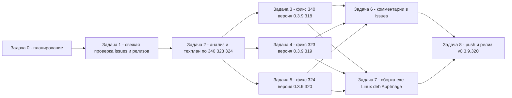

# PLAN 0.3.9.318–320 — релизный цикл: issues #340, #323, #324

Дата: 2026-10-06. Текущая версия: **0.3.9.317** ([`Configuration Management.csproj`](../Configuration%20Management/Configuration%20Management.csproj:62)).
Режим: Архитектор — только планирование, код НЕ изменяется. Каждый пункт цикла выполняется **отдельной задачей** (new_task), строго по этому плану.

Двухплатформенный проект: Windows/WPF (`#if WINDOWS`, `*.xaml`/`*.xaml.cs`) и Linux/Avalonia (`#if LINUX`, `*.Avalonia.cs`); общая логика (сервисы, модели, ViewModel) — общая. Правки UI выполняются **параллельно для обеих платформ** внутри каждой задачи.

---

## 1. Цель цикла

- Закрыть (по исправлению) три открытых issue, где последний комментарий принадлежит пользователю (не sivatorov): **#340**, **#323**, **#324**.
- Каждое исправление: код обеих платформ + юнит-тесты → версия → CHANGELOG.md/README.md → комментарий в issue → итоговый релиз.
- Собрать 1 исполняемый файл Windows и 1 исполняемый файл Linux (+ `.deb` и `.AppImage`), выложить на GitHub, создать релиз.
- Issues **НЕ закрывать**.

## 2. Установленный рабочий процесс (по `PLAN.md`, `PLAN-0.3.9.307.md`, CHANGELOG)

1. Внести правку кода (обе платформы) + юнит-тесты.
2. Поднять версию во всех четырёх полях csproj (`Version`, `AssemblyVersion`, `FileVersion`, `InformationalVersion`).
3. Запись в [`CHANGELOG.md`](../CHANGELOG.md) (`## [0.3.9.XXX] — 2026-10-06`, разделы «Исправлено»/«Тесты», ссылки на файлы кода) + бейдж версии в [`README.md`](../README.md:3).
4. `dotnet test` зелёный; кросс-сборка Linux (`dotnet build -p:ForceLinux=true`) без ошибок.
5. Один коммит на версию.
6. Комментарий в issue: `$env:GH_TOKEN=''; gh issue comment <N> --body-file publish/comment-<N>-<версия>.md` — «Исправлено в версии **X.Y.Z.N**», «Что было», «Как исправлено», «Как проверить». **Issue не закрывать**.
7. Сборка бинарников: `build-windows-single-file.ps1` → `dist/win-x64/ConfigurationManagement.exe`; `build-linux-single-file.ps1` (кросс-сборка из Windows, ключ `ForceLinux=true`) → `dist/linux-x64/ConfigurationManagement`.
8. `.deb`: скрипт по образцу `publish/build_deb_win_0.3.9.316.py` + проверка `publish/check_deb_win_<версия>.py`. AppImage: `package/linux/appimage.sh` (требует Linux/WSL + appimagetool).
9. `git push origin main`; релиз: `gh release create v<версия> dist/win-x64/ConfigurationManagement.exe dist/linux-x64/ConfigurationManagement <deb> <AppImage> --notes-file publish/release_body_<версия>.md`.

**ВАЖНО:** глобальная `GH_TOKEN` невалидна — перед КАЖДЫМ вызовом `gh` выполнять `$env:GH_TOKEN='';` (PowerShell).

## 3. Снимок issues (по локальным JSON-снимкам от 2026-10-06; свежая проверка — Задача 1)

| № | Issue | Автор | Комментариев | Последний комментарий (автор, дата UTC) | Действие |
|---|-------|-------|--------------|------------------------------------------|----------|
| 1 | [#340](https://github.com/sivatorov/ConfigurationManagement/issues/340) «Снятие выделения после контекстного меню» | 7OH | 28 | **7OH**, 2026-10-06T12:16:41Z — «…после пропажи текущей строки пропадает реакция на стрелки, TAB → кнопка Минимизации» | **fix → 0.3.9.318** |
| 2 | [#323](https://github.com/sivatorov/ConfigurationManagement/issues/323) «Окно Проверка обновлений» | 7OH | 27 | **7OH**, 2026-10-06T12:14:38Z — лог: `url=…/project/HRM30` → `Вход запущен: reason=redirect-login … location=https://login.1c…` | **fix → 0.3.9.319** |
| 3 | [#324](https://github.com/sivatorov/ConfigurationManagement/issues/324) «Серверы 1С» | 7OH | 18 | **7OH**, 2026-10-06T05:49:18Z — «Надо бы вернуть тикет в работу — её тут будет много, похоже» | **fix → 0.3.9.320** |
| 4 | [#334](https://github.com/sivatorov/ConfigurationManagement/issues/334) «Автообновление платформы» | 7OH | 17 | sivatorov, 2026-10-05T11:30:14Z | skip (последний комментарий наш) |
| 5 | [#330](https://github.com/sivatorov/ConfigurationManagement/issues/330) «Скачивание … платформы из стартера» | Ollivhv | 18 | sivatorov, 2026-10-05T11:30:12Z | skip (последний комментарий наш) |

> Правило отбора: (а) нет комментариев → fix по описанию; (б) последний комментарий не от `sivatorov` → fix по последним комментариям. #330/#334 — пропуск (ждём реакции пользователя).

## 4. Требования и данные для анализа по каждому issue

### 4.1 #340 «Снятие выделения после контекстного меню» (→ 0.3.9.318)

**Последний комментарий 7OH (28/28, 2026-10-06T12:16:41Z):**
«Добавлю наблюдений — после пропажи текущей строки пропадает и реакция на попытку перемещения по списку курсором. Если нажать TAB — фокус получает кнопка Минимизации окна».

**Контекст:** в CHANGELOG 0.3.9.317 уже зафиксированы `FocusTreeAfterMenuClose`/`ShouldReturnKeyboardFocusToTree` (возврат фокуса дереву, стрелки/TAB). Необходимо проверить полноту реализации на обеих платформах и закрыть остаток сценария «выделение пропало → фокус ушёл из дерева».

**Данные для анализа:**
- `issues_details.json`, `issues_details_live.json` (#340), `new_comments_after_1935.json`, `publish/_comments_340.json`, `publish/_extract_340_324.txt`, все `publish/comment-340-*.md`.
- Код: `Views/MainWindow.Hotkeys.cs`, `Views/MainWindow.Events.cs`, `Views/MainWindow.Tree.cs`, `Views/MainWindow.Avalonia.Events.cs` (открыт в редакторе), `Views/MainWindow.Avalonia.cs`, `Services/BatchSelectionHelper.cs`, `Services/MenuCloseTrace.cs`, `Services/MenuCloseTraceFormat.cs`, `Services/TraceFlags.cs`, `Services/TraceFlagsFormat.cs`.
- Тесты: `ConfigurationManagement.Tests/BatchSelectionHelperTests.cs`, `MenuCloseTraceFormatTests.cs`, `Etap13ListStateTests.cs`, `TraceFlagsTests.cs`.

**Ожидаемые правки:** восстановление фокуса и выделения при закрытии контекстного меню кликом по другой строке; клавиатурная навигация после закрытия; WPF ↔ Avalonia симметрия; диагностика `CM_MENUCLOSE`/`CM_MENUCLICK`. Юнит-тесты чистой логики (`BatchSelectionHelper`, `MenuCloseTraceFormat`), ручная проверка сценария обязательна.

### 4.2 #323 «Окно Проверка обновлений» (→ 0.3.9.319)

**Последний комментарий 7OH (2026-10-06T12:14:38Z):**
«Пока всё там же» + лог: `Проверка: config='Зарплата и управление персоналом', url=https://releases.1c.ru/project/HRM30` → `Вход запущен: reason=redirect-login, url=…, location=https://login.1c…` — программный вход на portal.1c.ru всё ещё не доводится до конца.

**Контекст:** 8 итераций (0.3.9.306…316), в 0.3.9.316 добавлено звено CAS `security_check` после POST кабинета. Проблема не ушла — пользователь подтвердил логом.

**Данные для анализа:**
- `issues_details.json`, `issues_details_live.json` (#323), `publish/_comments_323.json`, `publish/_comments_issue_323.txt`, все `publish/comment-323-*.md`.
- Код: `Services/OneCUpdatesService.cs` (основной; цепочка GET формы → POST → `security_check` → повтор каталога, cookie-контейнер, лимиты попыток), `Services/PlatformUpdateService.cs`, `ViewModels/UpdateCheckViewModel.cs` (или аналог), окна `Views/UpdateCheckWindow.xaml(.cs)`/`UpdateCheckWindow.Avalonia.cs`, локализация `Localization/Languages/ru.json`/`en.json`.
- Тесты: `OneCUpdatesLoginFlowTests.cs`, `UpdateCheckCatalogTests.cs`, `OneCUpdatesUrlTests.cs`, `NetworkDiagnostics*` (при связке).
- Пример рабочего кода 1С от @7OH (комментарий 23) — эталон цепочки `security_check`.

**Ожидаемые правки:** довести программный вход до валидной сессии (заполнение/логика `security_check`, cookie `SESSION`/`JSESSIONID` для `releases.1c.ru`), честная диагностика `AuthFailed/AuthRequired/LoginLimitReached`; проверка требует живых учётных данных ИТС (иначе — шаги проверки в комментарии к issue).

### 4.3 #324 «Серверы 1С» (→ 0.3.9.320)

**Последний комментарий 7OH (2026-10-06T05:49:18Z):** «Надо бы вернуть тикет в работу — её тут будет много, похоже» (тикет возвращается в работу).

**Открытые пункты из истории (7OH, 2026-10-04):**
1. Если кластер один — сразу выбрать его в списке.
2. В списке отображается ключ вместо значения.
3. «Ошибка разбора данных от кластера» при этом монитор продолжает попытки получения (циклический поллинг без остановки).
4. Переключатель отключения «Автообновления вкл (5 с)» прямо на форме.
5. (Проверить полный список из `publish/_comments_issue_324.txt` при анализе — Задача 2.)

**Данные для анализа:**
- `publish/issue_324.json`, `publish/issue_324_comments.json`, `publish/issue_324_comments_live.json`, `publish/_comments_issue_324.txt`, `publish/_extract_340_324.txt`, раздел 324 в `publish/_current_comments.json`, все `publish/comment-324-*.md`.
- Код: `Services/RacClient.cs`, `Services/RacOutputParser.cs`, `Services/RacInfobaseMapper.cs`, `Models/RacJobRow.cs` (или аналог), `ViewModels/ServerMonitorViewModel.cs`, `Views/ServerMonitorWindow.xaml(.cs)`/`ServerMonitorWindow.Avalonia.cs`, `Services/ServerPortsStore.cs`, `Services/ServerPortsGuesser.cs`, локализация ru/en.
- Тесты: `RacClientTests.cs`, `RacOutputParserTests.cs`, `RacJobRowTests.cs`, `RacInfobaseMapperTests.cs`, `ServerMonitorViewModelTests.cs`.

**Ожидаемые правки:** авто-выбор единственного кластера, отображение значения вместо ключа, корректная обработка ошибок разбора без бесконечного поллинга, кнопка-переключатель автообновления, юнит-тесты парсера/ViewModel, ручная проверка на живом кластере 1С (пользователем).

## 5. Стратегия версий

- Один инкремент на исправление (как согласовано в цикле 0.3.9.307–308):
  - **#340 → 0.3.9.318**
  - **#323 → 0.3.9.319**
  - **#324 → 0.3.9.320**
- Итоговый релиз — **v0.3.9.320** (бинарники содержат все три исправления; в CHANGELOG будут записи 318/319/320).
- Версии поднимаются **последовательно** (коммиты линейны, конфликтов csproj нет).

## 6. Декомпозиция на задачи (каждая — ОТДЕЛЬНАЯ new_task)

| № | Задача | Режим | Зависимости |
|---|--------|-------|-------------|
| 0 | Планирование цикла (этот документ) | architect | — |
| 1 | Свежая проверка состояния issues и релизов на GitHub | code | 0 |
| 2 | Анализ и технический план по #340/#323/#324 | architect | 1 |
| 3 | Исправление #340 → 0.3.9.318 | code | 2 |
| 4 | Исправление #323 → 0.3.9.319 | code | 2 |
| 5 | Исправление #324 → 0.3.9.320 | code | 2 |
| 6 | Комментарии в issues #340/#323/#324 | code | 3, 4, 5 |
| 7 | Сборка исполняемых файлов (exe, Linux, .deb, AppImage) | code | 3, 4, 5 |
| 8 | git push + создание релиза v0.3.9.320 | code | 6, 7 |

### Задача 0. Планирование (выполнена этим документом)

**Цель:** согласованный план релизного цикла, декомпозиция, критерии готовности.
**Выход:** [`plans/PLAN-0.3.9.318-320.md`](PLAN-0.3.9.318-320.md).
**Критерий готовности:** план согласован пользователем.

### Задача 1. Свежая проверка состояния issues и релизов (code)

**Цель:** актуальное состояние открытых issues, релизов и комментариев на момент старта — без опоры на локальные снимки.
**Действия:**
1. `$env:GH_TOKEN=''; gh auth status` — убедиться в авторизации как `sivatorov`.
2. `$env:GH_TOKEN=''; gh issue list --state open --limit 100` — полный список открытых issues.
3. По #340/#323/#324/#330/#334 — `gh issue view <N>` и последние комментарии (через `gh api` REST постранично); зафиксировать `CommentsCount`, `LastCommentAuthor`, `LastCommentDate`, текст последнего комментария.
4. `$env:GH_TOKEN=''; gh release list` — проверить, существует ли `v0.3.9.317`; формат тегов.
5. Обновить локальные снимки: `issues_live_state.json`, `issues_details_live.json`, `new_comments_after_1935.json` (форматы сохранить), создать `publish/issues_snapshot_<дата>.md` с таблицей fix/skip.

**Выход:** обновлённые JSON-снимки + `publish/issues_snapshot_*.md`.
**Критерии готовности:** список совпадает с GitHub; по каждому issue известен автор/дата последнего комментария; решение fix/skip обосновано правилом п. 3; наличие/отсутствие v0.3.9.317 подтверждено.

### Задача 2. Анализ и технический план по #340/#323/#324 (architect)

**Цель:** для каждого отобранного issue — конкретная причина по коду, перечень файлов (обе платформы), новые/изменённые тесты, ручной сценарий проверки, риски.
**Вход:** результат Задачи 1, данные п. 4, код репозитория.
**Выход:** [`plans/PLAN-0.3.9.318-320-fixes.md`](PLAN-0.3.9.318-320-fixes.md) — детальный техплан по кластерам (A: #323; B: #340; C: #324), готовый к передаче в задачи 3–5.
**Критерии готовности:** по каждому исправлению определены причина, изменяемые файлы, тесты, шаги ручной проверки, риски.

### Задача 3. Исправление #340 (code) → 0.3.9.318

**Вход:** техплан (раздел B), комментарий 7OH 28/28, код `MainWindow.*`/`BatchSelectionHelper`/`MenuCloseTrace*`.
**Действия:**
1. Анализ существующего механизма фокуса (`FocusTreeAfterMenuClose`, `ShouldReturnKeyboardFocusToTree`) на обеих платформах; закрыть остаток сценария «выделение пропало → стрелки/TAB не работают».
2. Правка WPF и Avalonia **параллельно** (одна и та же логика).
3. Юнит-тесты чистой логики (`BatchSelectionHelperTests`, `MenuCloseTraceFormatTests` и др.).
4. `dotnet test` зелёный; `dotnet build -p:ForceLinux=true` без ошибок.
5. Версия → 0.3.9.318 (4 поля csproj), запись CHANGELOG.md, бейдж README.md.
6. Коммит (один на версию).

**Выход:** код + тесты + версия 0.3.9.318 + CHANGELOG/README + коммит.
**Критерии готовности:** сценарий «ПКМ → клик по другой строке → меню закрылось, выделение и фокус остались в дереве» воспроизводится без сбоев; `dotnet test` зелёный; обе платформы собираются.

### Задача 4. Исправление #323 (code) → 0.3.9.319

**Вход:** техплан (раздел A), лог 7OH от 2026-10-06T12:14:38Z, эталон кода 1С (@7OH, комментарий 23), `OneCUpdatesService.cs`.
**Действия:** аналогично Задаче 3 — правки входа portal.1c.ru (обе платформы через общий сервис), окна проверки обновлений WPF+Avalonia, локализация, тесты (`OneCUpdatesLoginFlowTests`, `UpdateCheckCatalogTests`), версия 0.3.9.319, CHANGELOG/README, коммит.
**Критерии готовности:** цепочка «GET формы → POST → security_check → повтор каталога без 302» покрыта тестами; при наличии живых кредов ИТС — каталог получается; иначе в комментарии к issue — шаги проверки.

### Задача 5. Исправление #324 (code) → 0.3.9.320

**Вход:** техплан (раздел C), открытые пункты 7OH (п. 4.3), `publish/_comments_issue_324.txt`.
**Действия:** правки монитора «Серверы 1С» (WPF + Avalonia), парсер rac, ViewModel, переключатель автообновления, локализация, тесты (`RacOutputParserTests`, `ServerMonitorViewModelTests` и др.), версия 0.3.9.320, CHANGELOG/README, коммит.
**Критерии готовности:** авто-выбор единственного кластера, значения вместо ключей, остановка поллинга при ошибке разбора, тумблер автообновления; `dotnet test` зелёный; обе платформы собираются; ручная проверка — пользователем на живом кластере.

### Задача 6. Комментарии в issues (code)

**Вход:** версии 0.3.9.318/319/320, тексты «что было/как исправлено/как проверить» из задач 3–5.
**Действия:**
1. Создать `publish/comment-340-0.3.9.318.md`, `publish/comment-323-0.3.9.319.md`, `publish/comment-324-0.3.9.320.md` по образцу `publish/comment-301-0.3.9.70.md` (разделы «Исправлено в версии …», «Что было», «Как исправлено», «Как проверить», «Тесты», ссылка на CHANGELOG).
2. `$env:GH_TOKEN=''; gh issue comment 340 --body-file publish/comment-340-0.3.9.318.md` (аналогично 323, 324).
3. Проверить `gh issue view <N>` → `state: open` (issues НЕ закрывать).
4. Закоммитить файлы комментариев.

**Выход:** 3 опубликованных комментария + файлы в `publish/`.
**Критерии готовности:** в каждом комментарии указана версия исправления и шаги проверки; все три issue открыты.

### Задача 7. Сборка исполняемых файлов (code)

**Вход:** коммиты задач 3–5 (csproj = 0.3.9.320).
**Действия:**
1. Windows: `.\build-windows-single-file.ps1` → `dist/win-x64/ConfigurationManagement.exe`.
2. Linux (кросс-сборка из Windows): `.\build-linux-single-file.ps1` → `dist/linux-x64/ConfigurationManagement`.
3. `.deb`: создать `publish/build_deb_win_0.3.9.320.py` по образцу `build_deb_win_0.3.9.316.py`, запустить, проверить `publish/check_deb_win_0.3.9.320.py` → `package/linux/deb/out/`.
4. AppImage: `package/linux/appimage.sh` (требуется Linux/WSL + `appimagetool`; при отсутствии среды — зафиксировать риск и собрать иным доступным способом или приложить только при наличии) → `package/linux/out/ConfigurationManagement-0.3.9.320-x86_64.AppImage`.
5. Проверить версию в бинарниках (запуск/`VersionInfo`), контрольные суммы `publish/SHA256SUMS_0.3.9.320.txt`.

**Выход:** exe, Linux-бинарь, `.deb`, `.AppImage` (+ SHA256SUMS).
**Критерии готовности:** все артефакты собраны, версия = 0.3.9.320; AppImage — при доступности среды (иначе явно отмечено).

### Задача 8. Push и создание релиза (code)

**Вход:** артефакты Задачи 7, тело релиза.
**Действия:**
1. `git add -A && git commit -m "Релиз 0.3.9.320: #340, #323, #324"` (если не закоммичено) и `git push origin main`.
2. Создать `publish/release_body_0.3.9.320.md` — сводка по #340/#323/#324 с номерами.
3. `$env:GH_TOKEN=''; gh release create v0.3.9.320 dist/win-x64/ConfigurationManagement.exe dist/linux-x64/ConfigurationManagement package/linux/deb/out/<deb>.deb package/linux/out/<AppImage>.AppImage --notes-file publish/release_body_0.3.9.320.md`.
4. Проверить: оба (четыре) asset прикреплены, тело отображается, автообновление находит новую версию.

**Выход:** коммиты на `origin/main`, релиз `v0.3.9.320`.
**Критерии готовности:** `git status` чистый; релиз создан с вложениями и телом; issues остались открытыми.

## 7. Последовательность и зависимости

**Обоснование порядка:** #340 — самый свежий и трудный (12-я итерация) → ставится первым для итерационного цикла «фикс → комментарий → ответ пользователя»; #323 — продолжение кластера входа portal.1c.ru; #324 — самостоятельный, хорошо декомпозированный блок монитора серверов. Задачи 3–5 затрагивают разные файлы, но версии присваиваются последовательно (коммиты линейны). Комментарии — после присвоения версий; сборка и релиз — в конце.

## 8. Риски и ограничения

| Риск / ограничение | Влияние | Митигация |
|--------------------|---------|-----------|
| Невалидная глобальная `GH_TOKEN` | Сбои `gh` | Перед каждым вызовом `$env:GH_TOKEN=''`; проверка `gh auth status` в Задаче 1 |
| #340: 11 неудачных попыток до 0.3.9.317 | 12-й фикс может не сработать «вслепую» | Опора на последний комментарий 7OH + диагностика `CM_MENUCLOSE`; юнит-тесты чистой логики; проверка пользователем |
| #323: живой вход portal.1c.ru требует кредов ИТС | Фикс не проверяем локально | Юнит-тесты цепочки входа; публикация с шагами проверки; итерационный цикл по логам пользователя |
| #324: форматы вывода rac отличаются по версиям | Ошибки разбора / бесконечный поллинг | Тесты парсера на реальных выводах из issue; остановка поллинга при ошибке; проверка пользователем на живом кластере |
| AppImage требует Linux/WSL + appimagetool | Артефакт может быть недоступен на Windows-хосте | Отдельный шаг в Задаче 7 с явным риском; альтернатива — приложить .deb и бинарь, AppImage собрать при доступной среде |
| GitHub rate limit / размер вложений (exe ~80 МБ, Linux ~50 МБ) | Долгие операции | Все запросы с токеном; стандартная процедура `gh release create` |
| Issues не должны закрываться (правило) | Нарушение процесса | Никаких `gh issue close`; контроль `state: open` в Задаче 6 |
| Версия в 4 полях csproj рассинхронизирована | Неверные метаданные | Единая правка 4 полей; проверка `InformationalVersion` в .deb/AppImage |
| Изменение состава открытых issues между планированием и выполнением | План устаревает | Задача 1 перепроверяет фактический список |
| Активный терминал `_t13_wait_actions.ps1` (фоновый watcher) | Может мешать при публикации релиза | Учесть при выполнении Задачи 8; при необходимости остановить скрипт |
| Резерв локального `.git` | Потеря истории | `f:\Yandex.Disk\h\CM_clean`; перед push — `git status` и `git fetch` |

## 9. Чек-лист завершения цикла

- [ ] Задача 1: свежий снимок issues/релизов; #340/#323/#324 — fix, #330/#334 — skip.
- [ ] Задача 2: техплан `plans/PLAN-0.3.9.318-320-fixes.md` по кластерам A/B/C.
- [ ] Задача 3: #340 исправлен, версия 0.3.9.318, тесты зелёные, коммит.
- [ ] Задача 4: #323 исправлен, версия 0.3.9.319, тесты зелёные, коммит.
- [ ] Задача 5: #324 исправлен, версия 0.3.9.320, тесты зелёные, коммит.
- [ ] Задача 6: комментарии в #340/#323/#324 опубликованы; issues открыты.
- [ ] Задача 7: собраны exe, Linux-бинарь, .deb, AppImage (+ SHA256SUMS).
- [ ] Задача 8: `git push origin main`; релиз v0.3.9.320 с вложениями и телом; автообновление находит новую версию.

## 10. Решения для согласования

1. **Порядок фиксов:** #340 → #323 → #324 (версии 0.3.9.318/319/320). Альтернатива: начать с #324 как с самого декомпозируемого.
2. **Релиз:** один итоговый **v0.3.9.320** (все три исправления в бинарниках), как в цикле 0.3.9.307–308. Альтернатива: промежуточные релизы на каждую версию (318/319), как в поздних циклах.
3. **AppImage:** собирается только при доступной Linux/WSL-среде с `appimagetool`; иначе прикладываются exe + Linux-бинарь + .deb, AppImage — при наличии.
4. **#324:** состав открытых пунктов уточняется в Задаче 2 по полному списку комментариев (`publish/_comments_issue_324.txt`); приоритет — пункты 1–4 из п. 4.3.