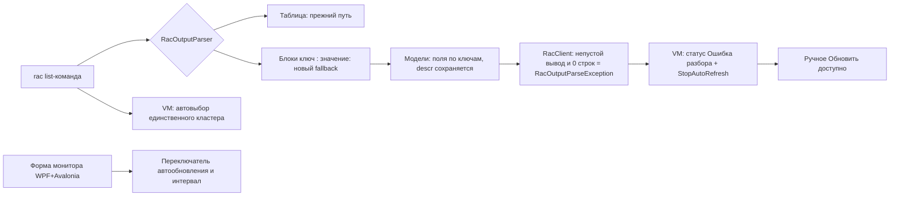

# PLAN 0.3.9.318 — Issue #324 «Серверы 1С»

- Режим: **architect** — план; код НЕ изменяется до одобрения.
- Текущая версия: **0.3.9.316** (целевая цикла — **0.3.9.318**). В цикле — ОДНО исправление
  (#324). Циклы 0.3.9.317 (#340) и 0.3.9.319 (#323) — отдельные.
- Issue переоткрыто владельцем (18/18 от 2026-10-06 05:49:18Z: «Надо бы вернуть тикет в работу»);
  требования — из комментариев 15/18–17/18.

---

## 0. Контекст и требования пользователя

| № комм. | Дата | Требование |
|---|---|---|
| 15/18 | 2026-10-04 | 1) если кластер один — выбрать его сразу в списке; 2) «в списке ключ вместо значения»; 3) «Ошибка разбора данных от кластера, при этом оно постоянно пытается их получить дальше» (бесконечные повторы) |
| 16/18 | 2026-10-04 | Реальный вывод `rac connection list --cluster=<guid>` — блоки «ключ : значение»: `connection`/`session`/`object`(?)/`locked`/`descr` — то есть новые версии rac отдают list-команды БЛОКАМИ key-value, а не таблицами |
| 17/18 | 2026-10-04 | «как отключить Автообновления вкл (5с)? Может быть должен быть переключатель на форме?» |

### Вывод по корню проблемы (по коду)

1. **Парсер**: [`RacOutputParser`](Configuration%20Management/Services/RacOutputParser.cs)
   умеет key-value БЛОКИ только для кластеров — `ToClusters` (fallback на
   `TryParseKeyValueBlocks(…, "cluster", IsGuid)`). Все остальные методы —
   [`ToProcesses`](Configuration%20Management/Services/RacOutputParser.cs:316),
   [`ToSessions`](Configuration%20Management/Services/RacOutputParser.cs:359),
   [`ToConnections`](Configuration%20Management/Services/RacOutputParser.cs:409),
   [`ToLocks`](Configuration%20Management/Services/RacOutputParser.cs:446),
   [`ToInfobaseSummaries`](Configuration%20Management/Services/RacOutputParser.cs:482),
   [`ToJobs`](Configuration%20Management/Services/RacOutputParser.cs:523) — разбирают ТОЛЬКО
   таблицы (`ParseTable`). На новых версиях rac строки вида `connection : <GUID>` таблицей не
   парсятся: первая «колонка» становится ключом, GUID не распознаётся → список пуст. Отсюда
   пустые вкладки и, после косметической правки статуса, формулировка пользователя «Ошибка
   разбора данных от кластера».
2. **«В списке ключ вместо значения»**: при ошибочном табличном разборе key-value-строки
   значения колонок замещаются текстом ключей (`connection`, `session`, `blocked`, …), а
   `descr` (реальное описание соединения/клиента) вообще не извлекается — нет ни поля в модели
   [`RacConnectionInfo`](Configuration%20Management/Models/RacModels.cs:157), ни колонки в UI.
3. **Бесконечный ретрай**: [`ServerMonitorViewModel.LoadClusterDataAsync`](Configuration%20Management/ViewModels/ServerMonitorViewModel.cs:365)
   запускает 7 параллельных задач `Task.WhenAll`; при исключении — `LoadFailed`, но таймер
   автообновления ([`StartAutoRefresh`](Configuration%20Management/ViewModels/ServerMonitorViewModel.cs:611),
   период [`AutoRefreshIntervalMs`](Configuration%20Management/ViewModels/ServerMonitorViewModel.cs:23) = 5000 мс)
   продолжает тикать и повторять запросы каждые 5 с без остановки.
4. **Автовыбор единственного кластера** уже частично есть (`ConnectAsync`: при пустом выборе —
   `ClusterRows[0]`), но при key-value формате списки могли быть пустыми, поэтому выбор не
   устанавливался; требование — гарантировать немедленный выбор при ОДНОМ кластере.
5. **Переключатель автообновления** на форме отсутствует (есть только текст
   `AutoRefreshText` для подсказки).

---

## 1. Схема решения



---

## 2. Задача 1 — Парсер key-value блоков для всех list-команд

Файл: `Configuration Management/Services/RacOutputParser.cs`.

1. **Обобщить разбор блоков**: существующий private
   [`TryParseKeyValueBlocks`](Configuration%20Management/Services/RacOutputParser.cs:261)
   сделать `internal static` (доступен тестам) и добавить публичную обёртку
   `public static IReadOnlyList<IReadOnlyDictionary<string, string>> ParseKeyValueBlocks(
       string output, string blockStartKey)` — блоки «ключ : значение», ключи сравниваются
   регистронезависимо, значения снимаются с кавычек (`Unquote`).
2. **Признак «вывод в формате блоков»**: helper
   `private static bool LooksLikeKeyValueOutput(string output)` — первая непустая строка
   соответствует `^\S+\s*:` (ключ: значение) И не содержит `\t`. Используется, чтобы НЕ
   тратить попытку табличного разбора впустую (и не ломать табличные регрессии).
3. **Fallback в каждом методе** (паттерн одинаковый, как в `ToClusters`):
   - `ToProcesses`: блок начинается ключом `process`; маппинг полей:
     `process→Id`, `host→Host`, `pid→Pid`, `port→Port`, `started-at→StartedAt`,
     `memory-size→MemorySize`, `memory-total→MemoryTotal`, `memory-available→MemoryAvailable`,
     `memory-excess→MemoryExcess`, `threads→Threads`, `cpu→Cpu`,
     `available-performances→AvailablePerformances`, `running→Running`, `infobases→Infobases`;
   - `ToSessions`: блок `session`; `session→Id`, `infobase→InfobaseId` (nullable),
     `user-name→User`, `host→Host`, `app-id→AppId`, `started-at→StartedAt`,
     `last-active-at→LastActiveAt`, `blocked-by-ls→BlockedByLs`,
     `blocked-by-deadlock→BlockedByDeadlock`, `db-proc-duration→DbProcDuration`,
     `duration-all→DurationAll`, `duration-current→DurationCurrent`,
     `duration-dbms→DurationDbms`, `duration-cpu→DurationCpu`, `duration-wait→DurationWait`,
     `memory→Memory`, `bytes→Bytes`, `position→Position`, `read→Read`, `write→Write`,
     `connection→ConnectionId`, `hibernate→Hibernate`, `state→State`;
   - `ToConnections`: блок `connection`; `connection→Id`, `session→SessionId`,
     `blocked→Blocked`, `connector→Connector`, `process→ProcessId`, `host→Host`,
     `port→Port`, `established-at→EstablishedAt`, `last-connection-time→LastConnectionTime`,
     `duration→Duration`, **`descr→Descr` (новое поле)**;
   - `ToLocks`: блок `lock`; `lock→Id`, `session→SessionId`, `infobase→InfobaseId`,
     `connection→ConnectionId`, `transaction→TransactionId`, `waiting→Waiting`,
     `blocking→Blocking`, `object→Object` (ключ `object` — зарезервированное слово C#, брать
     через словарь, не через имя переменной);
   - `ToInfobaseSummaries`: блок `infobase`; `infobase→InfobaseId`, `name→Name`,
     `descr→Descr`, `dbms→Dbms`, `db-server→DbServer`, `db-name→DbName`, `db-user→DbUser`,
     `locale→Locale`, `security-level→SecurityLevel`, `licensed→Licensed`;
   - `ToJobs`: блок `job`; `job→Id`, `infobase→InfobaseId` (nullable), `name→Name`,
     `method-name→MethodName`, `predefined→Predefined`, `schedule→Schedule`, `state→State`,
     `started-at→StartedAt`, `next-start→NextStart`, `last-start→LastStart`,
     `last-end→LastEnd`, `last-success→LastSuccess`, `last-error→LastError`,
     `last-error-descr→LastErrorDescr`, `process→ProcessId`, `result→Result`.
   Все значения через `Unquote` + типизацию существующими `ParseInt/ParseLong/ParseDouble/
   ParseBool/ParseDateTime/ParseGuid/ParseNullableGuid`; отсутствующий ключ → default.
4. **Условие применения fallback**: табличный разбор вернул 0 строк И
   `LooksLikeKeyValueOutput(output)` И найден хотя бы один блок по стартовому ключу. Регрессия
   табличного пути гарантируется порядком (таблица — первая).

## 3. Задача 2 — Модель и отображение descr («значение вместо ключа»)

Файлы: `Configuration Management/Models/RacModels.cs`,
`Configuration Management/ViewModels/RacConnectionRow.cs`,
`Configuration Management/Views/ServerMonitorWindow.xaml`,
`Configuration Management/Views/ServerMonitorWindow.Avalonia.cs`.

1. `RacConnectionInfo`: добавить `public string Descr { get; set; } = string.Empty;`
   («descr» из connection list — описание соединения).
2. `RacConnectionRow`: добавить `public string Descr => _info.Descr;`.
3. WPF XAML, вкладка «Соединения»: колонка `DataGridTextColumn` «Описание»
   (`ServerMonitor.Columns.Connection.Descr`, шириной `1*`), Binding `Descr`.
4. Avalonia `BuildConnectionRow` (в `ServerMonitorWindow.Avalonia.cs`): добавить ячейку `Descr`.
5. Локализация `Configuration Management/Localization/Languages/ru.json` и `en.json` (и, при
   генерации сборки, копия `publish/win-x64/Localization/Languages/*`): ключ
   `ServerMonitor.Columns.Connection.Descr` («Описание» / "Description"). Проверить, что
   генерация publish-локализации выполняется скриптом сборки (обновить источник + при необходимости регенерировать).

## 4. Задача 3 — Устойчивость к ошибкам разбора (без бесконечного ретрая)

Файлы: `Configuration Management/Services/RacClient.cs`, `Configuration Management/Services/RacClient.cs`
(новый тип исключения — рядом в `Services`), `Configuration Management/ViewModels/ServerMonitorViewModel.cs`.

1. **Новый тип**: `public sealed class RacOutputParseException : Exception` (файл
   `Configuration Management/Services/RacOutputParseException.cs`) с сообщением
   «Вывод rac не распознан (возможно, новый формат) — {деталь}».
2. **`RacClient`**: в методах, возвращающих СПИСКИ (`GetProcessesAsync`, `GetSessionsAsync`,
   `GetConnectionsAsync`, `GetLocksAsync`, `GetInfobasesAsync`, `GetJobsAsync`): после разбора
   `if (!string.IsNullOrWhiteSpace(output) && rows.Count == 0) throw new RacOutputParseException(...)`
   (внутренний logger.Warn с первыми 200 символами вывода). `GetClustersAsync` оставить как есть
   (пустой вывод = «нет кластеров», предупреждение уже есть). `GetClusterInfoAsync` — без изменений.
3. **`ServerMonitorViewModel.LoadClusterDataAsync`**: вместо «все задачи в `WhenAll`» — завернуть
   каждый вызов в локальный try/catch, помечающий `_parseOrLoadError`; при `RacOutputParseException`
   (или любой ошибке) — НЕ ронять окно:
   - `ErrorMessage` = «Ошибка разбора данных от кластера. Формат вывода rac не распознан — возможно,
     новая версия платформы. Автообновление остановлено; нажмите „Обновить“ вручную.» (+ деталь ex.Message);
   - `StatusText` = `ServerMonitor.Status.LoadFailed`;
   - `StopAutoRefresh()` — бесконечный ретрай прекращается;
   - данные последней успешной загрузки НЕ очищаются (вкладки продолжают показывать прежние строки).
4. Ручное «Обновить» (`Refresh()`) работает всегда: повторная попытка разбора после возможного
   обновления платформы rac. После УСПЕШНОГО ручного обновления автообновление возобновляется,
   если переключатель включён (см. Задачу 5).
5. Отдельный успешный/пустой исход (`SafeInfobasesAsync` уже ловит свои ошибки) — сохранить.

## 5. Задача 4 — Автовыбор единственного кластера

Файл: `Configuration Management/ViewModels/ServerMonitorViewModel.cs`.

1. В `ApplyClusters` (после пересборки `ClusterRows`): если `ClusterRows.Count == 1` — сразу
   `SelectedClusterId = ClusterRows[0].Id` (выбор виден в списке немедленно, ДО завершения
   ConnectAsync). Если кластеров несколько и выбор ещё не установлен — сохранить существующее
   поведение (выбор первого в `ConnectAsync`).
2. При `ClusterRows.Count == 0` — `SelectedClusterId = null`.
3. Guard от рекурсии: установка `SelectedClusterId` в `ApplyClusters` происходит при
   `HasConnected == false` — setter не запускает `LoadClusterDataAsync` (условие `value is Guid id && HasConnected`).

## 6. Задача 5 — Переключатель автообновления на форме (WPF + Avalonia)

Файл VM: `Configuration Management/ViewModels/ServerMonitorViewModel.cs`.

1. Новые свойства/команды:
   - `public bool IsAutoRefreshEnabled { get; private set; }` (default true после подключения);
   - `public int AutoRefreshIntervalSeconds { get; set; }` (default 5, диапазон 1–60,
     сеттер рестартует таймер при изменении и взведённом флаге);
   - `public ICommand ToggleAutoRefreshCommand => new RelayCommand(() => SetAutoRefreshEnabled(!IsAutoRefreshEnabled));`
   - `public void SetAutoRefreshEnabled(bool enabled)` — включение: `StartAutoRefresh()` с текущим
     интервалом; выключение: `StopAutoRefresh()`.
   - `StartAutoRefresh` использует `AutoRefreshIntervalMs` → `AutoRefreshIntervalSeconds * 1000`
     (константа `AutoRefreshIntervalMs = 5000` остаётся значением по умолчанию).
   - `OnPropertyChanged(nameof(AutoRefreshActive/AutoRefreshText/IsAutoRefreshEnabled))` в обоих
     путях (это уже частично есть в `StartAutoRefresh`/`StopAutoRefresh`).
2. Парсинг интервала из UI: простой ComboBox 5/10/15/30/60 с привязкой
   `SelectedValue="{Binding AutoRefreshIntervalSeconds}"` (WPF) и аналог в Avalonia;
   некорректные значения валидируются сеттером (clamp 1–60).
3. WPF `ServerMonitorWindow.xaml`: в панели кнопок (рядом с Refresh, строка ~73) добавить
   CheckBox «Автообновление» (`IsChecked="{Binding IsAutoRefreshEnabled, Mode=TwoWay}` на
   `SetAutoRefreshEnabled` через `ToggleAutoRefreshCommand` — CheckBox биндить на VM-свойство,
   изменение → `ToggleAutoRefreshCommand`) + ComboBox интервала (подпись
   `ServerMonitor.AutoRefreshInterval`).
   Проще: CheckBox с `Click="OnAutoRefreshToggle_Click"` → `_vm.ToggleAutoRefreshCommand.Execute(null)`,
   как остальные кнопки (code-behind паттерн окна уже такой), плюс ComboBox с
   `SelectionChanged="OnAutoRefreshInterval_Changed"`.
4. Avalonia `ServerMonitorWindow.Avalonia.cs`: рядом с `refreshButton` (строка ~82) — ToggleSwitch
   (или CheckBox) `IsChecked` + `OnAutoRefreshToggle_Click` и ComboBox интервала.
5. Локализация: `ServerMonitor.AutoRefreshToggle` («Автообновление» / "Auto-refresh"),
   `ServerMonitor.AutoRefreshInterval` («Интервал, с» / "Interval, s") в ru/en json.
6. Существующий `AutoRefreshText` (подсказка) обновляется автоматически; при ошибке разбора
   переключатель остаётся видимым, но таймер остановлен (текст статуса объясняет причину).

## 7. Задача 6 — Новые юнит-тесты

1. `ConfigurationManagement.Tests/RacOutputParserTests.cs`:
   - `ToConnections_ParsesKeyValueBlocks` — точный образец из комментария 16/18
     (`connection/session/blocked/connector/process/host/port/established-at/
     last-connection-time/duration/descr`): все поля, включая **Descr**;
   - `ToProcesses_ParsesKeyValueBlocks`, `ToSessions_ParsesKeyValueBlocks`,
     `ToLocks_ParsesKeyValueBlocks`, `ToInfobaseSummaries_ParsesKeyValueBlocks`,
     `ToJobs_ParsesKeyValueBlocks` — по образцу реальных выводов (значения с кавычками — `Unquote`);
   - регресс: табличный формат продолжает разбираться (существующие тесты);
   - `ParseKeyValueBlocks` публичный: пустой вывод → пусто; строка без «:» игнорируется;
   - смешанный вывод (блоки + мусор) не роняет парсеры.
2. `ConfigurationManagement.Tests/RacClientTests.cs` (или `ProcessInspectorParsingTests`-стиль):
   - `GetProcessesAsync_NonEmptyUnparsedOutput_ThrowsRacOutputParseException` (fake handler отдаёт
     непустой нераспознанный вывод);
   - `GetProcessesAsync_EmptyOutput_ReturnsEmpty` (регресс);
   - `GetClustersAsync_EmptyOutput_ReturnsEmpty` (без исключения).
3. `ConfigurationManagement.Tests/ServerMonitorViewModelTests.cs`:
   - `Connect_SingleCluster_AutoSelected` (fake IRacClient: 1 кластер → `SelectedClusterId` == его Id);
   - `Connect_TwoClusters_KeepsFirstSelected` (существующее поведение);
   - `LoadClusterData_ParseError_StopsAutoRefreshAndSetsError`: fake кидает
     `RacOutputParseException` → `AutoRefreshActive == false`, `ErrorMessage` непустой,
     `Refresh()` (ручной) снова вызывает загрузку;
   - `SetAutoRefreshEnabled_TogglesTimerState` (enable → `AutoRefreshActive`, disable → false);
   - `AutoRefreshIntervalSeconds_Clamped` (0 → 1, 999 → 60).
   Примечание: VM-тесты используют `dispatchToUi: null` (прямое применение) и реальный
   `System.Threading.Timer` — для проверки состояния достаточно флагов; таймер останавливается в
   `Dispose()` (тестовая очистка).

## 8. Задача 7 — Версия, CHANGELOG, README

1. `Configuration Management/Configuration Management.csproj`: 4 поля → **0.3.9.318**.
2. `CHANGELOG.md`: секция `## [0.3.9.318] — 2026-10-06` сверху:
   - парсер rac: key-value блоки для всех list-команд (process/session/connection/lock/
     infobase summary/job), `descr` извлекается и показывается («значение, а не ключ»);
   - устойчивость: нераспознанный вывод → понятная ошибка + остановка автообновления
     (без бесконечного ретрая), ручное «Обновить» доступно;
   - автовыбор единственного кластера;
   - переключатель автообновления и интервала на форме (WPF + Avalonia);
   - счётчики тестов.
3. `README.md`: раздел «Серверы 1С (CTRL+ALT+S)» (строка ~55): упомянуть поддержку нового
   формата вывода rac, переключатель автообновления/интервал, автовыбор кластера.

## 9. Задача 8 — Комментарий в issue #324

Файл `publish/comment-324-0.3.9.318.md` (публикация после релиза; issue НЕ закрываем):

```
Исправлено в версии 0.3.9.318 (Windows/WPF и Linux/Avalonia).

Что было
- Новые версии rac выводят list-команды блоками «ключ : значение», а не таблицами;
  парсер понимал такой формат только для cluster list — вкладки процессов/сеансов/
  соединений/блокировок были пустыми, «в списке ключ вместо значения», а автообновление
  (5 с) бесконечно повторяло запросы.
- Переключателя автообновления на форме не было; при одном кластере выбор в списке не
  устанавливался сразу.

Что сделано
- Парсер rac научился блокам «ключ : значение» для process/session/connection/lock/
  infobase summary/job list; описание соединения (descr) извлекается и показывается
  колонкой «Описание» во вкладке «Соединения».
- Нераспознанный вывод → понятное сообщение «Ошибка разбора данных от кластера» +
  АВТООБНОВЛЕНИЕ ОСТАНАВЛИВАЕТСЯ (без бесконечных повторов); ручное «Обновить» доступно,
  после успешного обновления автообновление возобновляется.
- Единственный кластер выбирается в списке сразу при подключении.
- На форме добавлен переключатель «Автообновление» и выбор интервала (5/10/15/30/60 с).

Как проверить
- Подключиться к серверу с новым rac: все вкладки заполняются, у соединений видна колонка
  «Описание» (descr). Один кластер — сразу выбран. Снять галочку «Автообновление» или
  поменять интервал — таймер останавливается/перезапускается.

Тесты
- RacOutputParserTests (+N), RacClientTests (+2), ServerMonitorViewModelTests (+5);
  dotnet test зелёный; кросс-сборка Linux без ошибок.
```

## 10. Задача 9 — Сборка и публикация

1. `dotnet test` (Windows) зелёный.
2. `dotnet publish -c Release` → `publish/out-0.3.9.318/`.
3. `dotnet build -p:BuildLinux=true` — без ошибок.
4. DEB: `publish/build_deb_win_0.3.9.318.py`, `check_deb_win_0.3.9.318.py` (копии 316).
5. Тег `v0.3.9.318`, релиз; `publish/_post_comments_318.ps1`; `publish/_update_state_318.ps1`.
   Issue #324 остаётся ОТКРЫТЫМ.

---

## 11. Затрагиваемые файлы (сводка)

| Файл | Изменение |
|---|---|
| `Configuration Management/Services/RacOutputParser.cs` | `ParseKeyValueBlocks` (публичный), `LooksLikeKeyValueOutput`, key-value fallback в `ToProcesses/ToSessions/ToConnections/ToLocks/ToInfobaseSummaries/ToJobs` |
| `Configuration Management/Services/RacOutputParseException.cs` | Новый тип исключения |
| `Configuration Management/Services/RacClient.cs` | Throw `RacOutputParseException` при непустом нераспознанном выводе |
| `Configuration Management/Models/RacModels.cs` | `RacConnectionInfo.Descr` |
| `Configuration Management/ViewModels/RacConnectionRow.cs` | `Descr` для колонки |
| `Configuration Management/ViewModels/ServerMonitorViewModel.cs` | Обработка ошибок разбора + остановка таймера; автовыбор единственного кластера; `IsAutoRefreshEnabled`/`AutoRefreshIntervalSeconds`/`ToggleAutoRefreshCommand` |
| `Configuration Management/Views/ServerMonitorWindow.xaml` (+ `.xaml.cs`) | Колонка «Описание»; переключатель автообновления и интервал |
| `Configuration Management/Views/ServerMonitorWindow.Avalonia.cs` | То же для Avalonia |
| `Configuration Management/Localization/Languages/ru.json`, `en.json` | Новые ключи `ServerMonitor.Columns.Connection.Descr`, `ServerMonitor.AutoRefreshToggle`, `ServerMonitor.AutoRefreshInterval` |
| `ConfigurationManagement.Tests/RacOutputParserTests.cs` | +N key-value тесты |
| `ConfigurationManagement.Tests/RacClientTests.cs` | +2 исключение/пустой вывод |
| `ConfigurationManagement.Tests/ServerMonitorViewModelTests.cs` | +5 автовыбор/ошибка разбора/переключатель |
| `Configuration Management/Configuration Management.csproj` | Версия → 0.3.9.318 |
| `CHANGELOG.md`, `README.md` | Секция 0.3.9.318; раздел «Серверы 1С» |
| `publish/comment-324-0.3.9.318.md` и скрипты цикла 318 | Копии 316 → 318 |

## 12. Риски

| Риск | Митигация |
|---|---|
| Ключи в реальном выводе отличаются от образца (регистр/дефисы) | Словарь маппинга регистронезависим; неизвестные ключи игнорируются; значения по умолчанию |
| Значения с кавычками/пробелами | `Unquote` для строковых полей (как в `ToJobs`) |
| Остановка автообновления при временном сбое нежелательна | Останавливается ТОЛЬКО при «нераспознанный вывод» (не сеть/не таймаут — они по-прежнему повторяются); ручное обновление возобновляет таймер |
| `object` как ключ C# | Доступ через словарь по строке, не через идентификатор |
| Табличный вывод регрессирует | Порядок: таблица первая, fallback только при 0 строк и признаке key-value |

## 13. Критерии приёмки

1. `dotnet test` зелёный; кросс-сборка Linux без ошибок.
2. На новых версиях rac все вкладки монитора заполняются; у соединений виден «descr».
3. При нераспознанном выводе — статус «Ошибка разбора…», автообновление остановлено,
   повторных запросов каждые 5 с НЕТ; ручное «Обновить» работает.
4. Единственный кластер выбран в списке сразу; при нескольких — первый (прежнее поведение).
5. Переключатель «Автообновление» и интервал работают в WPF и Avalonia.
6. Версия 0.3.9.318 в csproj; секция CHANGELOG; README; комментарий в #324 опубликован;
   issue ОТКРЫТ.