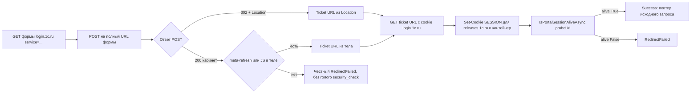

# PLAN 0.3.9.319 — Issue #323 «Окно Проверка обновлений» (9-я итерация входа на portal.1c.ru)

- Режим: **architect** — план; код НЕ изменяется до одобрения.
- Текущая версия: **0.3.9.316** (целевая цикла — **0.3.9.319**). В цикле — ОДНО исправление
  (#323). Циклы 0.3.9.317 (#340) и 0.3.9.318 (#324) — отдельные.
- Связанные issues, которые получают выгоду от того же звена: #334/#330 (автообновление
  платформы через releases.1c.ru) — регресс проверяется теми же тестами входа.

---

## 0. Контекст: последний комментарий пользователя (7OH, 27/27, 2026-10-06 12:14:38Z)

«Пока всё там же» + лог 0.3.9.316:
- POST кабинета «Личные данные» успешен; SESSION для `login.1c.ru` выпущена;
- далее `security_check 'https://releases.1c.ru/public/security_check' => status=302,
  setCookie=…SESSION; Path=/; Secure; HttpOnly`
  → `security_check редирект 302 '/error/403'` → `alive=False после security_check`
  → `RedirectFailed` / `AuthRequired`.

**Рабочий код 1С от пользователя (комментарий 23/27):**
1. GET формы логина (LOCATION1, с `service=`);
2. POST на LOCATION1 телом
   `inviteCode=&username=…&password=…&execution=…&_eventId=submit&geolocation=&submit=Войти&rememberMe=on`;
3. берёт из ответа **Location (LOCATION3)**;
4. GET LOCATION3 с cookie сессии (JSESSIONID/SESSION);
5. затем исходный запрос с JSESSIONID.

То есть: билет CAS приходит **через Location после POST**, и именно GET по нему доводит сессию
`releases.1c.ru` до живой. Наш `RunSecurityCheckAsync` делает голый GET
`/public/security_check` БЕЗ билета `ticket=ST-…` → сервер отвечает 302 → `/error/403`
(страница ошибки) → сессия мертва.

### Вывод по корню проблемы (по коду [`OneCUpdatesService.cs`](Configuration%20Management/Services/OneCUpdatesService.cs))

1. **POST-тело не совпадает с рабочим кодом 1С**: мы отправляем
   `fields + username/password/_eventId=submit`, а эталон дополнительно шлёт
   `inviteCode=` (пусто), `geolocation=` (пусто), `submit=Войти`, `rememberMe=on`. Похоже,
   Spring Security CAS при отсутствии `rememberMe`/`submit` отвечает 200 страницей личного
   кабинета вместо 302-редиректа с CAS-билетом (что и наблюдалось).
2. **Location из POST не используется как URL билета**: ветка 3xx есть
   (`postStatus is >= 300 and < 400 && Location is not null` → `FollowLoginRedirectsAsync`),
   но для 200-кабинета мы шли в `RunSecurityCheckAsync(formUrl, …)`, который строит URL БЕЗ
   билета (`ResolveSecurityCheckTarget` = голый `service` или корень) — и получает `/error/403`.
   Пропущено звено «GET на URL с `ticket=ST-…`» с cookie `login.1c.ru`.
3. `AllowAutoRedirect=false` у основного HttpClient УЖЕ установлен — Location из POST доступен;
   нужна только его обработка как ticket-URL.

---

## 1. Схема решения (9-я итерация)



Ключевые изменения:
- тело POST приводится к эталону 1С (`inviteCode`, `geolocation`, `submit=Войти`,
  `rememberMe=on` — добавляются, если отсутствуют в форме);
- ticket-URL захватывается из Location POST (ветка 3xx) или из meta-refresh/JS в теле 200;
- голый `security_check` БЕЗ билета удаляется как путь (вместо него — GET ticket URL);
- после GET ticket URL сохраняются Set-Cookie для `releases.1c.ru` (`ApplySetCookieToContainer`),
  затем alive-проверка;
- тесты: регресс точного лога (302 → /error/403) теперь должен давать alive=True через
  ticket-звено.

---

## 2. Задача 1 — Тело POST формы входа: привести к эталону 1С

Файл: `Configuration Management/Services/OneCUpdatesService.cs` (метод `TryLoginPortalAsync`,
формирование `form`, строка ~1299).

1. Ввести **чистый статический helper** (internal, тестируемый):
   ```csharp
   internal static Dictionary<string, string> BuildLoginPostBody(
       IReadOnlyDictionary<string, string> formFields,
       string login, string password)
   ```
   - копия `formFields` (execution/lt/CSRF/… из GET-формы);
   - `["username"] = login`, `["password"] = password`, `["_eventId"] = "submit"`;
   - если ключей ещё нет: `inviteCode = ""`, `geolocation = ""`, `submit = "Войти"`,
     `rememberMe = "on"` (эталон рабочего кода 1С — поля добавляются ТОЛЬКО при отсутствии,
     чтобы не ломать формы, где их нет вовсе);
   - порядок ключей — не важен (`FormUrlEncodedContent`), важна ПОЛНОТА набора.
2. Заменить ручное построение `form` на вызов helper (с сохранением строки для журнала —
   имена полей без значений).
3. Логировать состав тела в диагностику `CM_REDIRECT`: `POST fields: <имена>` — уже есть
   частично (`fieldNames` для GET); добавить итоговый набор после helper.

## 3. Задача 2 — Захват Location из POST и ticket-звено

Файл: `Configuration Management/Services/OneCUpdatesService.cs`.

1. **Ветка 3xx POST (строка ~1332)**: Location уже читается
   (`postResponse.Headers.Location`). Изменить поведение:
   - вызвать `FollowLoginRedirectsAsync(location)` (существующий метод, ходит по цепочке и
     накапливает Set-Cookie в контейнер через `ApplySetCookieToContainer` — проверить, что
     он применяет Set-Cookie; если нет — добавить вызов в цикл), затем:
   - `alive = await IsPortalSessionAliveAsync(probeUrl, ct)`; если alive → Success.
   - Это закрывает случай «Location ведёт сразу на ticket-URL». При этом `FollowLoginRedirectsAsync`
     уже НЕ считает успехом финал на странице входа.
2. **Ветка 200-кабинета (строка ~1375)**: заменить вызов
   `RunSecurityCheckAsync(formUrl, probeUrl, ct)` на новую последовательность:
   - `var ticketUrl = ExtractBodyRedirectUrl(postBody)` уже ищет meta-refresh/JS — использовать
     его результат как ticket-URL (разрешённый через `ResolveBodyRedirectTarget(postUrl, …)`),
     ЕСЛИ URL ведёт на `releases.1c.ru` и несёт `ticket=…` (или любой другой адрес
     `public/security_check`/`/` после POST);
   - если ticket-URL есть → `await RunTicketSecurityCheckAsync(ticketUrl, probeUrl, ct)`;
   - если ticket-URL нет → **НЕ ходить на голый security_check** (он даёт `/error/403`):
     честный `RedirectFailed` с предупреждением (лог 7OH: «кабинет получен, но билет CAS
     не получен — возможно, портал изменил поведение»);
   - пробная проверка alive — ТОЛЬКО ПОСЛЕ ticket-звена.
3. **Новый метод** `RunTicketSecurityCheckAsync(Uri ticketUrl, string? probeUrl, CancellationToken ct)`
   (заменяет «голый» `RunSecurityCheckAsync`):
   - GET `ticketUrl` (вручную, до `MaxRedirects` шагов), каждый шаг —
     `ApplySetCookieToContainer(response, requestUri)` + журнал
     `security_check '{url}' => status=…, setCookie=…`;
   - прерывание цепочки, если редирект уводит на `login.1c.ru` (билет не принят) — false;
   - признак успеха звена: финальный 2xx вне `login.1c.ru` и тело НЕ форма входа;
   - затем `IsPortalSessionAliveAsync(probeUrl, ct)` → вернуть alive.
   - Старый `RunSecurityCheckAsync` и `ResolveSecurityCheckTarget`/`ExtractSecurityCheckService`
     остаются, но вызовы переводятся на ticket-путь; при необходимости пометить
     `[Obsolete]`/удалить использование (тесты на них — обновить).
4. **Журналирование**: сохранить записи в стиле лога 7OH
   (`security_check '<url>' => status=…, setCookie=…`, `alive=…`), чтобы новый лог был
   сопоставим с присланным.

## 4. Задача 3 — Обновление тестов

Файл: `ConfigurationManagement.Tests/OneCUpdatesLoginFlowTests.cs`.

1. **Регресс точного лога 0.3.9.316 (должен стать зелёным — alive=True)**:
   fake-обработчик:
   - GET формы → 200 с формой (`execution`/`lt`/`username`/`password`);
   - POST → **302** с `Location: https://releases.1c.ru/public/security_check?ticket=ST-123`
     (эталон 1С: билет через Location); при этом ТЕЛО POST проверяется: содержит
     `inviteCode=`, `geolocation=`, `submit=Войти`, `rememberMe=on`;
   - GET ticket URL → 200 с контентом каталога + `Set-Cookie: SESSION=…; Domain=releases.1c.ru`;
   - повтор исходного запроса (probe) → 200 каталога;
   - Итог: `Success`, НЕ `AuthRequired`/`RedirectFailed`.
2. **Регресс варианта «200-кабинет + meta-refresh с билетом»**:
   - POST → 200 страницы «Личные данные» + `<meta http-equiv="refresh" content="0;url=https://releases.1c.ru/public/security_check?ticket=ST-456">`;
   - GET ticket → 200 каталога + Set-Cookie SESSION releases;
   - итог `Success`.
3. **Регресс старого «голого» security_check → /error/403**:
   - POST → 200 кабинет БЕЗ билета в теле;
   - НЕ должно быть запроса на голый `security_check`; итог `RedirectFailed` (не AuthRequired);
   - assert по числу запросов fake-обработчика (голого security_check не было).
4. **`BuildLoginPostBody` unit-тесты**: полный набор полей эталона добавляется при отсутствии;
   существующие поля формы (execution/lt/rememberMe из формы) не дублируются; `_eventId=submit`
   всегда.
5. Регресс существующих тестов (401 → AuthFailed, кабинет → Success, лимит попыток и пр.) —
   остаются зелёными.

## 5. Задача 4 — Версия, CHANGELOG, README

1. `Configuration Management/Configuration Management.csproj`: 4 поля → **0.3.9.319**.
2. `CHANGELOG.md`: секция `## [0.3.9.319] — 2026-10-06` сверху:
   - вход на portal.1c.ru, 9-я итерация: POST-тело приведено к эталону рабочего кода 1С
     (`inviteCode`/`geolocation`/`submit=Войти`/`rememberMe=on`); CAS-билет берётся из Location
     POST (или meta-refresh в теле) и GET по ticket-URL доводит сессию `releases.1c.ru`;
     голый `security_check` без билета больше не используется (он давал 302 → /error/403);
   - счётчики тестов.
3. `README.md`: раздел «Проверка обновлений конфигураций 1С (F9)» (строка ~40) / «Автообновление
   платформы 1С» — упоминание доведения CAS-цепочки через ticket-URL (кратко, без деталей).

## 6. Задача 5 — Комментарий в issue #323

Файл `publish/comment-323-0.3.9.319.md` (публикация после релиза; issue НЕ закрываем):

```
Исправлено в версии 0.3.9.319 (Windows/WPF и Linux/Avalonia).

Что было
- По логу 0.3.9.316: POST кабинета успешен (SESSION для login.1c.ru), но голый GET
  security_check БЕЗ билета CAS даёт 302 → /error/403 → alive=False → RedirectFailed/
  AuthRequired.

Что сделано
- Тело POST формы входа приведено к рабочему коду 1С: добавлены inviteCode (пусто),
  geolocation (пусто), submit=Войти, rememberMe=on (если отсутствуют в форме).
- CAS-билет (ticket=ST-…) теперь берётся из Location ответа POST (или из meta-refresh/JS
  в теле страницы кабинета), и GET выполняется именно по ticket-URL с cookie login.1c.ru —
  Set-Cookie SESSION для releases.1c.ru сохраняется, затем alive-проверка.
- Голый security_check без билета больше не выполняется (давал /error/403).

Как проверить
- Проверка обновлений (F9): после входа каталог открывается без повторного 302 на login.
  В логе (CM_REDIRECT) — security_check '<ticket-url>' => status=200, alive=True.

Тесты
- OneCUpdatesLoginFlowTests (+N: регресс точного лога → alive=True, вариант meta-refresh,
  контроль отсутствия голого security_check, состав POST-тела); dotnet test зелёный;
  кросс-сборка Linux без ошибок.
```

## 7. Задача 6 — Сборка и публикация

1. `dotnet test` (Windows) зелёный.
2. `dotnet publish -c Release` → `publish/out-0.3.9.319/`.
3. `dotnet build -p:BuildLinux=true` — без ошибок.
4. DEB: `publish/build_deb_win_0.3.9.319.py`, `check_deb_win_0.3.9.319.py` (копии 316).
5. Тег `v0.3.9.319`, релиз; `publish/_post_comments_319.ps1`; `publish/_update_state_319.ps1`.
   Issue #323 остаётся ОТКРЫТЫМ.

---

## 8. Затрагиваемые файлы (сводка)

| Файл | Изменение |
|---|---|
| `Configuration Management/Services/OneCUpdatesService.cs` | `BuildLoginPostBody` (internal), захват Location POST как ticket-URL, `RunTicketSecurityCheckAsync`, замена вызова `RunSecurityCheckAsync` в ветке кабинета, журнал в стиле лога 7OH |
| `ConfigurationManagement.Tests/OneCUpdatesLoginFlowTests.cs` | +N: регресс лога 0.3.9.316 (alive=True), meta-refresh ticket, отсутствие голого security_check, состав тела POST |
| `Configuration Management/Configuration Management.csproj` | Версия → 0.3.9.319 |
| `CHANGELOG.md`, `README.md` | Секция 0.3.9.319; разделы проверки обновлений/платформы |
| `publish/comment-323-0.3.9.319.md` и скрипты цикла 319 | Копии 316 → 319 |

## 9. Риски

| Риск | Митигация |
|---|---|
| Портал не отдаёт Location с билетом (другое поведение CAS) | Fallback meta-refresh/JS из тела; честный RedirectFailed вместо ложного AuthRequired; диагностика CM_REDIRECT |
| Добавление `submit=Войти`/`rememberMe=on` сломает формы, где этих полей нет | Поля добавляются ТОЛЬКО при отсутствии; набор строится от фактической формы |
| Регресс 8-й итерации (кабинет → Success без билета) | Ветка кабинета требует ticket-звено + alive; без билета — RedirectFailed (честный) |
| Лимит попыток тратится при ложном «успехе» | Успех фиксируется только после alive=True |

## 10. Критерии приёмки

1. `dotnet test` зелёный (обновлены `OneCUpdatesLoginFlowTests`); кросс-сборка Linux без ошибок.
2. Регресс точного лога 0.3.9.316 переведён в тест: POST → 302 с Location ticket → GET ticket →
   alive=True → Success.
3. В логе живого входа (CM_REDIRECT): `security_check '<url с ticket>' => status=200` и
   `alive=True`; повтор исходного запроса без `retryAfterLoginStill302`.
4. Голого GET `security_check` без билета в логе НЕТ.
5. Версия 0.3.9.319 в csproj; CHANGELOG; README; комментарий в #323 опубликован; issue ОТКРЫТ.