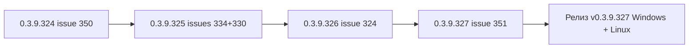
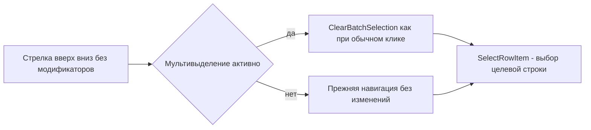
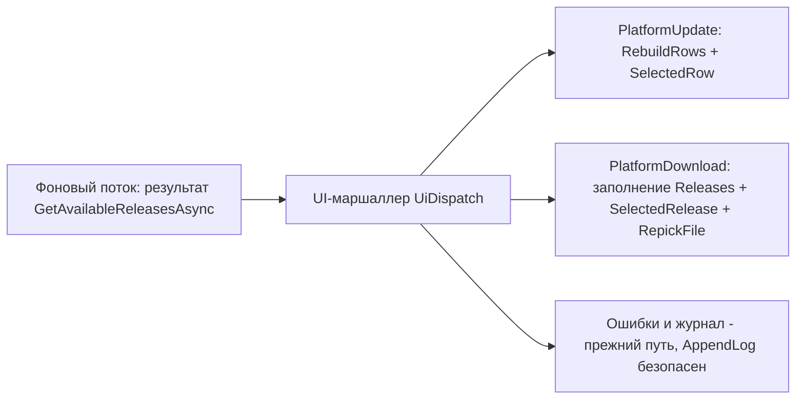
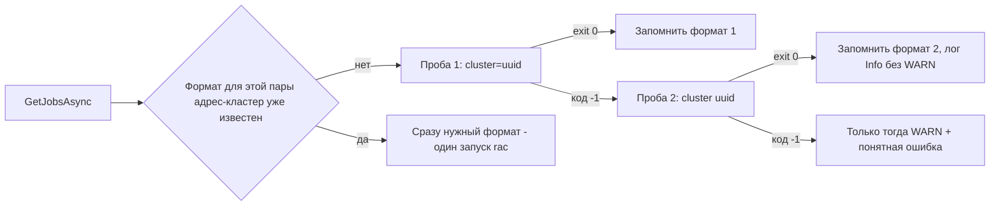
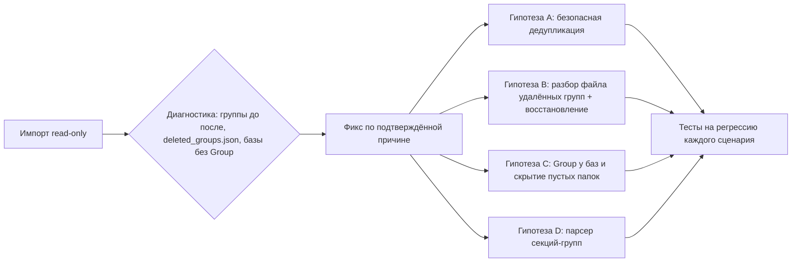

# PLAN 0.3.9.324–0.3.9.327 — цикл из 4 выпусков (#350, #334+#330, #324, #351)

- Режим: **architect** — план; код НЕ изменяется до одобрения.
- Текущая версия: **0.3.9.323** (последний коммит `da9e932`, релиз v0.3.9.323).
- Цели цикла — 5 открытых issues по критерию заказчика (0 комментариев либо последний
  комментарий не от sivatorov): **#350, #334, #330, #324, #351**.
- Правила цикла: issues сами НЕ закрываем; после каждого исправления — комментарий
  «что исправлено и в какой версии»; после каждой версии — bump в csproj +
  CHANGELOG.md + README.md (бейдж версии устарел — обновляем вместе с описаниями).
- Общий план-файл назван по первой версии цикла, как принято в репозитории
  (`PLAN-0.3.9.320-323.md` и т.п.), и описывает весь диапазон 0.3.9.324…0.3.9.327.

---

## Обзор цикла

| Версия | Issue | Суть | Сложность | Модули |
|---|---|---|---|---|
| 0.3.9.324 | #350 | Стрелки ↑/↓ не снимают мультивыделение (только WPF) | низкая | `MainWindow.Hotkeys.cs`, `MainWindow.Tree.cs`, `BatchSelectionHelper.cs` |
| 0.3.9.325 | #334 + #330 | NotSupportedException CollectionView: коллекции окон платформы меняются из фонового потока | средняя | `PlatformUpdateViewModel.cs`, `PlatformDownloadViewModel.cs`, окна WPF/Avalonia, общий `UiDispatch` |
| 0.3.9.326 | #324 | Серверы 1С: медленное подключение (fallback job list), «ключ вместо названия», WARN при успехе | средняя | `RacClient.cs`, `RacOutputParser.cs`, `ServerMonitorViewModel.cs`, `RacClusterRow.cs`, окна |
| 0.3.9.327 | #351 | Пропали ВСЕ папки (группы) после 0.3.9.323; синхронизация read-only не возвращает | высокая | `IbasesV8iImporter.cs`, `DeletedGroupPathsStore.cs`, `IbasesV8iEntry.cs`, `MainViewModel*.Sync/Tools/Commands`, `GroupNodeViewModel.cs` |

Порядок — от простого и полностью воспроизводимого по коду к сложному (где нужна живая
диагностика): **324 → 325 → 326 → 327**. Между правками зависимостей нет (разные модули);
0.3.9.325 дополнительно развязывает #334 и #330 через один общий фикс — это оправдывает
одну версию на два issues (прецедент: 0.3.9.307 закрыл общий корень #323/#330/#334 одной
версией). Каждая версия проходит полный цикл сборки (раздел «Сборка и публикация»).



---

# Цикл 0.3.9.324 — Issue #350 «Мультивыделение и нажатие на клавиатуру»

## 0. Контекст

Автор 7OH, 0 комментариев:

> Выделяем несколько строк мышкой с Ctrl или Shift, нажимаем на клавиатуре Вверх/Вниз —
> выделенные строки остаются с пометкой. Ожидание: при движении курсором стрелками
> мультивыделение снимается, как при клике мышкой.

## 1. Корень проблемы (подтверждён по коду)

Навигация стрелками обрабатывается в
[`Window_PreviewKeyDown`](Configuration%20Management/Views/MainWindow.Hotkeys.cs:385) →
[`HandleArrowNavigation`](Configuration%20Management/Views/MainWindow.Hotkeys.cs:1331):

- ↑/↓ вызывают [`SelectRowItem(rows[targetIndex])`](Configuration%20Management/Views/MainWindow.Hotkeys.cs:1354);
- [`SelectRowItem`](Configuration%20Management/Views/MainWindow.Tree.cs:184) применяет
  выбор через `ApplySelection`/`ApplyGroupSelection` и **НЕ вызывает
  `ClearBatchSelection()`**;
- обычный клик мышью в том же окне явно снимает набор:
  [`ClearBatchSelection()`](Configuration%20Management/Views/MainWindow.Hotkeys.cs:1130)
  и (для клика по строке под курсором)
  [`ClearBatchSelection()`](Configuration%20Management/Views/MainWindow.Hotkeys.cs:1170).

Итог: пометки «для выделенных» (`SelectedInfobaseIds`) остаются после стрелок, хотя
«текущая» строка сменилась. Набор затем применяется к командам «Для выделенных»
(контекстное меню), что путает пользователя.

Avalonia: собственных обработчиков стрелок нет (поиск `HandleArrow*`/`Key.Up`/`Key.Down`
в `MainWindow.Avalonia*.cs` пуст) — навигация идёт штатным `TreeView` (`SelectionMode=Single`),
который снимает выделение остальных строк сам. Проверяем Avalonia отдельно (задача 3);
основной фикс — WPF.

## 2. Схема решения



## 3. Задачи

### Задача 1 — Снятие мультивыделения при стрелках (WPF)

Файл: [`Configuration Management/Views/MainWindow.Hotkeys.cs`](Configuration%20Management/Views/MainWindow.Hotkeys.cs).

В [`HandleArrowNavigation`](Configuration%20Management/Views/MainWindow.Hotkeys.cs:1331),
ветка `Key.Up or Key.Down`, перед `SelectRowItem(rows[targetIndex])` добавить:

```csharp
// Семантика обычного клика: движение курсором снимает мультивыделение (issue #350).
if (_viewModel.HasBatchSelection())
    _viewModel.ClearBatchSelection();
```

Условие защищено самим обработчиком: `Keyboard.Modifiers == ModifierKeys.None`
(строка ~458), т.е. стрелки с Ctrl/Shift сюда не попадают. Условие
«выделение уже снято» (`HasBatchSelection() == false`) делает вызов no-op.

Вариант размещения фикса в [`SelectRowItem`](Configuration%20Management/Views/MainWindow.Tree.cs:184)
отклоняется: метод используется и для восстановления выбора (после запуска, после меню,
при `RevealAndSelectAfterRebuild`), где `ClearBatchSelection` уже обрабатывается
вызывающим кодом — дублирование сломало бы пути #340.

Дополнительно — чистый предикат в
[`BatchSelectionHelper.cs`](Configuration%20Management/Services/BatchSelectionHelper.cs)
(тестируемый, обе платформы):

```csharp
/// <summary>Нужно ли снять мультивыделение при клавиатурной навигации без модификаторов
/// (issue #350): набор активен и целевая строка отличается от «текущей».</summary>
public static bool ShouldClearBatchOnKeyboardNavigation(
    IReadOnlyCollection<string> currentIds, string? currentId, string? targetId)
    => currentIds is { Count: > 0 }
       && !string.Equals(currentId, targetId, StringComparison.Ordinal);
```

### Задача 2 — Avalonia: проверка и симметрия

Файлы: [`MainWindow.Avalonia.Tree.cs`](Configuration%20Management/Views/MainWindow.Avalonia.Tree.cs),
[`MainWindow.Avalonia.Events.cs`](Configuration%20Management/Views/MainWindow.Avalonia.Events.cs).

1. Убедиться, что в Avalonia стрелки двигают «текущее» выделение штатным TreeView и
   пометки мультивыделения не остаются (ручная проверка по сценарию issue).
2. Если пометки остаются (например, при `SelectionMode=Single` набор не сбрасывается
   из-за `SelectedInfobaseIds` модели) — найти точку обработки стрелок/смены выбора
   (`SelectionChanged`/`PreviewKeyDown` дерева) и добавить тот же
   `ClearBatchSelection()` под тем же условием (без модификаторов, target != current).
3. Применять предикат `ShouldClearBatchOnKeyboardNavigation` в обоих местах.

### Задача 3 — Тесты

1. [`BatchSelectionHelperTests.cs`](ConfigurationManagement.Tests/BatchSelectionHelperTests.cs):
   `ShouldClearBatchOnKeyboardNavigation` — набор активен + цель отличается → true;
   набор активен + цель == текущая → false (стрелка не меняет строку — не трогаем);
   набор пуст → false; null-аргументы → false.
2. Регресс существующих тестов BatchSelectionHelper (предикаты меню #340 не меняются).
3. Оконное поведение (WPF/Avalonia) юнит-тестами не покрывается — помечаем в CHANGELOG,
   проверка пользователем по сценарию: выделить несколько → стрелка ↓ → пометки сняты,
   текущая строка сменилась.

### Задача 4 — Версия, CHANGELOG, README, комментарий

1. [`Configuration Management.csproj`](Configuration%20Management/Configuration%20Management.csproj:62):
   4 поля → **0.3.9.324**.
2. `CHANGELOG.md`: секция `## [0.3.9.324] — 2026-10-07`:
   «Мультивыделение и стрелки: при навигации ↑/↓ без модификаторов мультивыделение
   снимается, как при клике мышью (issue #350); WPF — `HandleArrowNavigation` перед
   выбором строки снимает набор через предикат
   `BatchSelectionHelper.ShouldClearBatchOnKeyboardNavigation`; Avalonia — проверено,
   штатная навигация TreeView набор не сохраняет (или добавлен симметричный вызов)».
3. `README.md` — раздел «Список баз / выделение»: одна строка о поведении стрелок.
4. Комментарий в `#350` (после релиза, issue НЕ закрываем): «Исправлено в версии
   0.3.9.324. Причина: стрелки применяли выбор через SelectRowItem без снятия набора
   «для выделенных», в отличие от кликов мышью. Теперь при стрелке без модификаторов
   мультивыделение снимается; стрелки с Ctrl/Shift и Enter/прочие сочетания не
   затронуты. Как проверить: выделите несколько строк, нажмите ↓ — пометки сняты».

---

# Цикл 0.3.9.325 — Issues #334 «Автообновление платформы» и #330 «Скачивание платформы»

## 0. Контекст

Последние комментарии 7OH от 2026-10-07 (оба с одинаковым исключением):

```
#334: 2026-10-07 15:48:48.026 [ERROR] Обновление платформы: исключение при проверке
      каталога: NotSupportedException: Данный тип CollectionView не поддерживает
      изменения в своем SourceCollection из потока, отличного от потока Dispatcher.
#330: 2026-10-07 15:47:09.906 [ERROR] Скачивание платформы: исключение при получении
      каталога: NotSupportedException: … (тот же текст).
```

Оба исключения появляются сразу после «получение каталога версий с портала 1С» —
то есть вход/catalog теперь УСПЕШНЫ (итог многомесячных фиксов входа 0.3.9.307–0.3.9.323),
и падение «обнажилось» на новом звене: обновлении UI-коллекций из фонового потока.

## 1. Корень проблемы (подтверждён по коду)

- [`PlatformUpdateViewModel.CheckUpdatesAsync`](Configuration%20Management/ViewModels/PlatformUpdateViewModel.cs:252):
  `await _service.GetAvailableReleasesAsync().ConfigureAwait(false)` (строка 263) —
  продолжение выполняется на пуле потоков → [`RebuildRows`](Configuration%20Management/ViewModels/PlatformUpdateViewModel.cs:747)
  модифицирует `ObservableCollection<PlatformUpdateRowViewModel> Rows`
  (`Rows.Clear()` / `Rows.Add(row)`, строки 762–773) и `SelectedRow` из фонового потока.
  WPF связывает `Rows` с `DataGrid` через `CollectionView` — исключение
  `NotSupportedException` именно здесь (лог: [ERROR] в `CheckUpdatesAsync`, catch строка 289).
- [`PlatformDownloadViewModel.LoadCatalogAsync`](Configuration%20Management/ViewModels/PlatformDownloadViewModel.cs:322):
  `await … .ConfigureAwait(false)` (строка 335) → `Releases.Clear()` / `Releases.Add(...)`
  (строки 350–352) и `SelectedRelease = Releases[0]` (строка 362) из фонового потока —
  та же ошибка (catch строка 364).

Регрессии 0.3.9.259/279 устраняли «анти-мигание» и `Mode=OneWay` для журнала, но сама
модификация коллекций осталась в фоновом потоке. Avalonia таких исключений не имеет
(нет `CollectionView`), но изменение коллекций не из UI-потока некорректно и там.

## 2. Схема решения (общий корень — один фикс на оба окна)



Подход — единый маршаллер `UiDispatch` по образцу уже принятого в проекте
[`ServerMonitorViewModel._dispatchToUi`](Configuration%20Management/ViewModels/ServerMonitorViewModel.cs:27)
(инжектируемый `Action<Action>?`, null = прямой вызов для тестов):

1. **Общий сервис** [`Services/UiDispatch.cs`](Configuration%20Management/Services/UiDispatch.cs) (новый файл):
   - `public static void Run(Action<Action>? dispatchToUi, Action action)`
     — `dispatchToUi is null ? action() : dispatchToUi(action)`.
   - Платформенные фабрики: `UiDispatch.Wpf()` →
     `a => System.Windows.Application.Current?.Dispatcher.InvokeAsync(a)` (если
     `Application.Current` null — прямой вызов), `UiDispatch.Avalonia()` →
     `a => global::Avalonia.Threading.Dispatcher.UIThread.Post(a)`.
2. **Внедрение делегата**: конструкторы `PlatformUpdateViewModel` и
   `PlatformDownloadViewModel` получают необязательный параметр
   `Action<Action>? dispatchToUi = null` (как в `ServerMonitorViewModel`).
   Окна передают платформенную фабрику:
   - WPF: [`PlatformUpdateWindow.xaml.cs`](Configuration%20Management/Views/PlatformUpdateWindow.xaml.cs:43)
     и [`PlatformDownloadWindow.xaml.cs`](Configuration%20Management/Views/PlatformDownloadWindow.xaml.cs) —
     `dispatchToUi: UiDispatch.Wpf()`;
   - Avalonia: [`PlatformUpdateWindow.Avalonia.cs`](Configuration%20Management/Views/PlatformUpdateWindow.Avalonia.cs)
     и [`PlatformDownloadWindow.Avalonia.cs`](Configuration%20Management/Views/PlatformDownloadWindow.Avalonia.cs) —
     `dispatchToUi: UiDispatch.Avalonia()`.
3. **Границы маршалинга** (только модификация коллекций и зависимых свойств):
   - `PlatformUpdateViewModel.CheckUpdatesAsync`: весь успешный путь
     (`_availableReleases = …; RebuildRows(...); AppendLog(done); Info`) обернуть в
     `UiDispatch.Run(_dispatchToUi, () => { ... })`; ошибки/журнал — как раньше.
   - `PlatformDownloadViewModel.LoadCatalogAsync`: блок
     `Releases.Clear(); foreach …; SelectedRelease = Releases[0]; AppendLog(...)` —
     в dispatch.
   - `PlatformDownloadViewModel.LoadReleaseFilesAsync` → `RepickFile()` (меняет
     `AvailableDownloadTypes`/`DownloadTypeOptions`/`PickedFile` для ComboBox) — тоже
     через dispatch (та же ошибка возможна при выборе версии).
   - Прочие операции (Download/Install/RemoveOldVersions) обновляют свойства
     (`Progress`, `IsBusy`) — WPF переваривает PropertyChanged из фонового потока,
     но для единообразия можно обернуть итоговые `AppendLog`/`NotifyResult`.
4. **Проверка потоков**: внутри dispatch-блока повторные `await` не используются
   (блок синхронный), иначе потеряем UI-контекст — вынести await из блока заранее.

## 3. Тесты

Юнит-тесты не создают WPF-CollectionView, поэтому фиксируем ПОВЕДЕНИЕ диспетчеризации:

1. [`PlatformUpdateViewModelTests.cs`](ConfigurationManagement.Tests/PlatformUpdateViewModelTests.cs):
   - `CheckUpdates_SuccessFillsRowsViaDispatcher`: fake-сервис возвращает Ok,
     `dispatchToUi` — синхронный накопитель делегатов; после `CheckUpdatesAsync` —
     коллекция заполнена, делегат вызван (маршалинг применён), `SelectedRow` не null.
   - `CheckUpdates_ErrorNoDispatch` — статус ошибки: коллекция не трогается,
     dispatch не вызывается, журнал содержит ключ ошибки.
   - `CheckUpdates_NullDispatcherStillWorks` — `dispatchToUi == null` (тесты/эталон):
     коллекция заполняется напрямую (регресс старого поведения).
2. [`PlatformDownloadViewModelTests.cs`](ConfigurationManagement.Tests/PlatformDownloadViewModelTests.cs):
   - `LoadCatalog_FillsReleasesViaDispatcher` (тот же паттерн; `SelectedRelease = Releases[0]`).
   - `LoadReleaseFiles_RepickViaDispatcher` — `RepickFile` вызывается в делегате.
3. [`UiDispatchTests.cs`](ConfigurationManagement.Tests/UiDispatchTests.cs) (новый):
   `Run(null, …)` — прямой вызов; `Run(d, …)` — через делегат; исключение внутри
   делегата пробрасывается наружу.

## 4. Задача 4 — Версия, CHANGELOG, README, комментарий

1. csproj → **0.3.9.325**.
2. `CHANGELOG.md`: «Обновление платформы (Ctrl+F9) и Скачивание версии платформы 1С:
   исправлено NotSupportedException „CollectionView не поддерживает изменения …
   из потока, отличного от Dispatcher“ (issues #334/#330): после успешного получения
   каталога список версий и связанные свойства теперь обновляются в UI-потоке через
   общий маршаллер UiDispatch (WPF — Dispatcher.InvokeAsync, Avalonia —
   Dispatcher.UIThread.Post), внедряемый в ViewModel по образцу ServerMonitorViewModel;
   до 0.3.9.325 фиксы входа (0.3.9.307–0.3.9.323) довели каталог до успеха, и падение
   переехало с авторизации на обновление коллекции».
3. `README.md` — разделы «Автообновление платформы 1С» и «Скачивание версии платформы»:
   уточнение, что список версий обновляется в UI-потоке; удалить упоминания старой
   ошибки «мелькания», если остались.
4. Комментарии в `#334` и `#330` (после релиза, issue НЕ закрываем):
   «Исправлено в версии 0.3.9.325. Причина: каталог версий получается из фонового
   потока (ConfigureAwait(false)), а заполнение ObservableCollection выполнялось там же —
   WPF CollectionView запрещает это NotSupportedException. Теперь обновление списка и
   связанных свойств выполняется в UI-потоке через общий маршаллер; поведение
   Avalonia согласовано. Как проверить: Ctrl+F9 / „Скачивание версии платформы 1С“ —
   список версий загружается без ошибок».

---

# Цикл 0.3.9.326 — Issue #324 «Серверы 1С»

## 0. Контекст

Последний комментарий 7OH от 2026-10-07T12:51:09Z:

1. «Последние 2 версии — подключение стало заметно дольше проходить» + скриншот;
2. «Всё ещё ключ вместо названия в поле списка»;
3. лог разбора: команды rac выполняются последовательно, между командами ~1 секунда;
   `job list --cluster=<uuid>` → код -1, `job list --cluster <uuid>` → exit=0,
   stdout=4648 симв., но в журнал всё равно пишется [WARN].

## 1. Корень проблемы (подтверждено по коду)

### 1.1 Медленное подключение (задержка ~1 с)

[`RacClient.GetJobsAsync`](Configuration%20Management/Services/RacClient.cs:141)
(добавлен в 0.3.9.321) пробует форматы **последовательно**: сначала заведомо
неподдерживаемый rac 8.5.4 `--cluster=<uuid>` (код -1), затем `--cluster <uuid>`.
Каждая попытка = полный запуск процесса rac (`FindRacExecutable` + Start + WaitForExit).
Первая неудачная попытка занимает ~1 с (старт rac, разбор параметров, ошибка) и
добавляется к КАЖДОМУ циклу загрузки (ручному и автообновлению 5 с). Это главный
кандидат на «подключение стало дольше» в 0.3.9.321+. Дополнительно
[`OneCPlatformLocator.FindRacExecutable`](Configuration%20Management/Services/OneCPlatformLocator.cs)
выполняется при каждом вызове `RunAsync` (7 команд × каждый цикл) — поиск файла на
диске добавляет работу, но не 1 с.

### 1.2 «Ключ вместо названия в поле списка»

Выпадающий список: [`ServerMonitorWindow.xaml`](Configuration%20Management/Views/ServerMonitorWindow.xaml:119)
— `ItemsSource="{Binding ClusterRows}" DisplayMemberPath="DisplayText"`;
[`RacClusterRow.DisplayText`](Configuration%20Management/ViewModels/RacClusterRow.cs:29)
= `Name (Port)`, где `Name = _cluster.Name`. В 0.3.9.321 парсер покрыт тестом на точный
вывод 7OH с именем «Локальный кластер». Значит «ключ вместо значения» наблюдается на
другом выводе (имя в иной кодировке/пустое значение `name`/иной формат секции) —
гипотезы:
- `ToClusters` key-value ветка на реальном выводе пользователя не заполняет `Name`
  (например, ключ `name` с пустым значением или кавычки, не снятые из-за другой схемы);
- либо имя берётся из табличного разбора с неверной позицией колонки.

Точную причину подтверждает только фактический вывод `cluster list` пользователя —
нужна диагностика (журнал имени из `ToClusters` + запрос вывода в комментарий).

### 1.3 WARN при успешном job list

[`RacClient.GetJobsAsync`](Configuration%20Management/Services/RacClient.cs:169):
при ошибке ПЕРВОЙ попытки пишется `_logger.Warn(...)` ещё до второй попытки.
Пользователь видит [WARN] в журнале, хотя итог успешен (exit=0, 4648 симв.).
Разбор результата `job list` → `ToJobs` → `EnsureParsedOrThrow`: если схема вывода
8.5.4 не распознана, будет `RacOutputParseException` и остановка автообновления —
WARN тогда сбивает с толку.

## 2. Схема решения



## 3. Задачи

### Задача 1 — Скорость: кэш формата job list + кэш пути rac

Файл: [`Configuration Management/Services/RacClient.cs`](Configuration%20Management/Services/RacClient.cs).

1. Поле `private string? _jobListFormatKey;` + словарь форматов по ключу
   `адрес:порт|user|clusterId` (не более, например, 16 записей; ключ без пароля):
   после первого успешного формата повторные вызовы идут сразу с ним (один запуск rac).
2. `GetJobsAsync`: если формат в кэше — одна попытка; иначе пробы в прежнем порядке.
3. WARN при неуспехе первой попытки вынести ПОСЛЕ всех попыток: если какая-то попытка
   успешна — писать `Info` («job list: первый формат не поддержан rac, применён
   формат 2») без [WARN]; WARN — только когда все попытки неуспешны.
4. Кэш пути rac: добавить `OneCPlatformLocator` (или локальное статическое поле в
   `RacClient`) — `FindRacExecutable` вызывается один раз и запоминает путь, пока он
   валиден (инвалидация при явном изменении путей платформы не требуется для цикла;
   пересчитывать при отсутствии файла). Второй шаг снижает накладные расходы 7 команд.
5. Диагностика таймингов: в `RunAsync` вокруг запуска процесса замерить `Stopwatch` и
   логировать `RAC: выполнено … за N мс` — по следующему логу 7OH будет видно, где
   остаются секунды (старт rac или серверная обработка).

### Задача 2 — Имя кластера в выпадающем списке

Файлы: [`Configuration Management/Services/RacOutputParser.cs`](Configuration%20Management/Services/RacOutputParser.cs),
[`Configuration Management/ViewModels/RacClusterRow.cs`](Configuration%20Management/ViewModels/RacClusterRow.cs),
[`ServerMonitorWindow.Avalonia.cs`](Configuration%20Management/Views/ServerMonitorWindow.Avalonia.cs).

1. Диагностика: в [`ApplyClusters`](Configuration%20Management/ViewModels/ServerMonitorViewModel.cs:723)
   залогировать `RAC: кластеры: [Id=…, name='…', port=…]` (маскировать нечего — имена
   не секретны).
2. Проверить Avalonia-окно: `ItemsSource`/`DisplayMemberPath` указывают на
   `DisplayText` (а не `Name`); при необходимости исправить привязку.
3. Устойчивость парсера: расширить key-value ветку `ToClusters` на случай пустого
   значения `name` (fallback на `host:port` как «имя» либо «Без имени (порт)»), чтобы
   в списке никогда не отображался «ключ» (текст поля `name`) вместо значения.
4. В комментарий issue — просьба прислать вывод `rac.exe host:port cluster list`
   (текущий, с платформы 8.5.4) и что именно видно в списке кластеров — для финальной
   верификации.

### Задача 3 — Результат job list доходит до вкладки «Задачи»

Файлы: [`Configuration Management/Services/RacOutputParser.cs`](Configuration%20Management/Services/RacOutputParser.cs)
(`ToJobs`), [`Configuration Management/ViewModels/ServerMonitorViewModel.cs`](Configuration%20Management/ViewModels/ServerMonitorViewModel.cs).

1. Юнит-тест `ToJobs` на фактический вывод `job list` 8.5.4 (stdout 4648 симв.) —
   образец добавить в артефакты (из комментария 7OH). Если схема не распознаётся —
   добавить алиасы ключей (по аналогии с `ToConnections`/`ToLocks`).
2. Если `ToJobs` даёт 0 строк при непустом выводе — `EnsureParsedOrThrow` бросит
   `RacOutputParseException`, монитор остановит автообновление с понятной ошибкой:
   проверить, что текст ошибки не путается с WARN job list (п. Задачи 1.3) и данные
   реально отображаются.
3. После успешного разбора проверить заполнение `FilteredJobs` (вкладка «Задачи»)
   и фильтра по базам (`_infobaseNames` из `infobase summary list`).

### Задача 4 — Тесты

1. [`RacClientTests.cs`](ConfigurationManagement.Tests/RacClientTests.cs):
   - `GetJobs_UsesCachedFormat` — первый вызов: 2 попытки; второй вызов с тем же
     ключом: 1 попытка с успешным форматом (через fake-IAppLogger и подменённый
     запуск процесса или рефакторинг `RunAsync` на injectable runner — минимум:
     проверка числа лог-строк запусков rac).
   - `GetJobs_NoWarnAfterSecondSuccess` — лог содержит только Info после успешной
     второй попытки, [WARN] нет.
   - `GetJobs_WarnWhenAllFail` — обе попытки неуспешны → WARN + `RacClientException`.
2. [`RacOutputParserTests.cs`](ConfigurationManagement.Tests/RacOutputParserTests.cs):
   - `ToClusters_FallbackWhenNameEmpty` — блок с пустым `name` → DisplayName не равен
     ключу; имя «host:port»-fallback.
   - `ToJobs_ParsesRac854Output` — фактический вывод 8.5.4 (по образцу 7OH).
3. [`ServerMonitorViewModelTests.cs`](ConfigurationManagement.Tests/ServerMonitorViewModelTests.cs):
   - `ApplyClusters_LogsNames` — журнал содержит имя кластера (диагностика).
   - Регресс автовыбора единственного кластера/остановки автообновления.

### Задача 5 — Версия, CHANGELOG, README, комментарий

1. csproj → **0.3.9.326**.
2. `CHANGELOG.md`: «Монитор серверов 1С (issue #324): ускорено подключение — формат
   `job list` запоминается после первого успеха (вместо двойного запуска rac в каждом
   цикле), путь rac кэшируется; [WARN] для job list больше не пишется, если второй
   формат успешен (журнал — Info); добавлена диагностика имён кластеров и таймингов
   команд; список кластеров не показывает ключ поля вместо имени (fallback имени
   при пустом значении); разбор `job list` 8.5.4 покрыт тестом на фактический вывод».
3. `README.md` — раздел «Серверы 1С»: производительность подключения, поведение
   job list.
4. Комментарий в `#324` (после релиза, issue НЕ закрываем): описать три фикса +
   просьбу прислать свежий лог (тайминги команд), вывод `cluster list` и что видно
   в списке кластеров — если «ключ вместо названия» останется.

---

# Цикл 0.3.9.327 — Issue #351 «Пропали папки. 0.3.9.323»

## 0. Контекст

Автор RizvanShikhammatov, 0 комментариев:

> Пропали все папки в списке баз. Синхронизация не помогает. В стандартном стартере
> всё есть. Синхронизация только на чтение. (скриншот)

Симптомы: после обновления до 0.3.9.323 группы не видны в дереве; импорт из
ibases.v8i (read-only) папки НЕ возвращает; в штатном стартере 1С папки на месте.
Это «регрессия 0.3.9.320–0.3.9.323» по формулировке заказчика, однако прямое попадание
не очевидно: в 0.3.9.320–323 менялись TraceFlags/Rac/меню/portal, группы не затрагивались.
Вероятнее регрессия механизма групп, «дозревшая» в актуальной версии (0.3.9.315–316
переносили trace.json в профиль и меняли каталог данных).

## 1. Корень проблемы (гипотезы, ранжированные; подтверждение — диагностикой)

Импорт read-only: [`DoImport`](Configuration%20Management/ViewModels/MainViewModel.cs:1476)
(WPF) и [`ImportFromIbasesFileInteractive`](Configuration%20Management/ViewModels/MainViewModel.Avalonia.Sync.cs:243)
(Avalonia) → [`IbasesV8iImporter.Import`](Configuration%20Management/Services/IbasesV8iImporter.cs:50).
Импорт группы НЕ удаляет из коллекции (только добавляет через `EnsureGroups`),
НО вызывает [`RemoveDuplicateGroupsByPath`](Configuration%20Management/Services/IbasesV8iImporter.cs:372)
(конец `EnsureGroups`, строка 356) — дедупликацию по каноническому полному пути.

- **Гипотеза A (наиболее вероятная): ошибочная дедупликация.** `RemoveDuplicateGroupsByPath`
  удаляет из коллекции группу, если её нормализованный полный путь совпал с путём
  другой группы. При «сложной» иерархии (одинаковые имена на разных уровнях, старые
  дубли от прошлых синхронизаций, пути после нормализации разделителей) метод может
  удалить живую группу (например, родителя, на которого ссылаются дети), оставив
  «дубликат». Дети переназначаются только по `removedToKept` (совпадение Id);
  при отсутствии Id или несовпадении дети осиротевают. После этого каждый новый
  импорт снова запускает дедупликацию — «синхронизация не помогает» объясняется
  именно тем, что проблема воспроизводится на КАЖДОМ импорте.
- **Гипотеза B: `deleted_groups.json` (issue #327) содержит пути групп.**
  [`DeletedGroupPathsStore.Load()`](Configuration%20Management/Services/DeletedGroupPathsStore.cs:75)
  передаётся в `Import` → группы из этих путей не пересоздаются, пока под ними нет баз
  из файла. Пути добавляются только при ручном удалении пустой группы
  ([`DeleteGroup`](Configuration%20Management/ViewModels/MainViewModel.Commands.cs:507)),
  но файл мог накопиться ранее (в т.ч. унаследован от прошлых версий при переезде в
  профиль 0.3.9.316). «Синхронизация не помогает» также объясняется.
- **Гипотеза C: у баз не заполняется `Group` при импорте** (парсер/`ResolveFolderReferences`),
  а папки скрываются, потому что `PopulateItems(_showEmptyGroups)` при
  `_showEmptyGroups=false` не показывает пустые группы
  ([`RebuildGroupTree`](Configuration%20Management/ViewModels/MainViewModel.Theme.cs:834)) —
  базы уходят в «Без группы», папки не видны.
- **Гипотеза D: парсер секций** — секции-группы не распознаются как `IsGroup`
  ([`IbaseEntry.IsGroup`](Configuration%20Management/Services/IbasesV8iEntry.cs:95) =
  пустой `Connect`) либо `Enabled=false` (стартер 1С прячет группы с
  `Enable=0` — в стартере они «на месте», а приложение их фильтрует:
  [`EnsureGroups`](Configuration%20Management/Services/IbasesV8iImporter.cs:298)
  берёт только `Enabled`).

## 2. Схема решения



## 3. Задачи

### Задача 1 — Диагностика (обязательный этап перед фиксом)

Файлы: [`Configuration Management/Services/IbasesV8iImporter.cs`](Configuration%20Management/Services/IbasesV8iImporter.cs),
[`Configuration Management/ViewModels/MainViewModel.cs`](Configuration%20Management/ViewModels/MainViewModel.cs),
[`MainViewModel.Avalonia.Sync.cs`](Configuration%20Management/ViewModels/MainViewModel.Avalonia.Sync.cs).

1. В `Import`: до `EnsureGroups` логировать
   `Импорт ibases.v8i: групп было N, удалённых путей (deleted_groups.json): […]`
   (уже частично есть в конце Import — расширить заголовком и списком удалённых путей).
2. В `RemoveDuplicateGroupsByPath` при удалении дубликата логировать пару
   `путь / сохранён Id / удалён Id` и число детей, переназначенных через removedToKept.
3. В `RebuildGroupTree`/`DoImport`: один раз логировать
   `дерево: групп в модели M, баз без группы K, режим показа пустых групп = _showEmptyGroups`
   (после импорта и при старте).
4. В комментарий issue №351 попросить прислать: содержимое `deleted_groups.json`
   (каталог данных: `%APPDATA%\ConfigurationManagement\profiles\<Id>\` или корень),
   фрагмент `ibases.v8i` (первые секции-группы), количество баз «Без группы» на скриншоте.

### Задача 2 — Фикс по подтверждённой причине (по убыванию вероятности)

**Если подтвердится гипотеза A** — [`IbasesV8iImporter.RemoveDuplicateGroupsByPath`](Configuration%20Management/Services/IbasesV8iImporter.cs:372):

1. Дедуплицировать ТОЛЬКО пары, у которых совпадает и нормализованный путь, И один из
   признаков: (а) одинаковый `Id` из файла; (б) одинаковый `Name` + одинаковый
   `ParentId` (после нормализации). Группы с разными Id и одинаковым путём без
   дополнительных признаков НЕ удалять — логировать как предупреждение для анализа.
2. Перед удалением «дубликата» проверять: у дубликата нет детей и нет баз
   (`Infobase.Group` ссылается на его путь) — иначе сохранять группу с содержимым.
3. Переназначение `ParentId` детей — через `removedToKept`, как сейчас, плюс fallback
   по пути: если Id не совпал, найти сохранённую группу по полному пути и перевесить.
4. Гарантировать, что группы с корректной иерархией НЕ становятся корневыми из-за
   удаления родителя: добавить инвариант-проверку после дедупликации — если группа
   с ParentId потеряла родителя, восстановить цепочку по полному пути
   (`FindGroupByFullPath`).

**Если подтвердится гипотеза B** — [`DeletedGroupPathsStore.cs`](Configuration%20Management/Services/DeletedGroupPathsStore.cs) + точки вызова:

1. В `Import` учитывать `deletedEmptyGroupPaths` только если файл не «мусорный»:
   пути добавляются исключительно из `DeleteGroup` (ручное действие). Диагностика
   (Задача 1) покажет фактическое содержимое.
2. Если выяснится, что файл заполнился автоматически (например, legacy-путь из
   корня AppData при переезде в профиль 0.3.9.316 читался как список удалённых) —
   убрать такой перенос: `DataDirectory` должен указывать на тот же каталог, что и
   файл настроек текущего профиля; старый файл из корня не читать.
3. Дать пользователю простое восстановление: в ответе в issue указать удаление
   `deleted_groups.json`; дополнительно — кнопку «Вернуть группы» не добавлять
   (объём не оправдан), достаточно инструкции.

**Если подтвердится гипотеза C** — [`IbasesV8iImporter.cs`](Configuration%20Management/Services/IbasesV8iImporter.cs:130)
и [`RebuildGroupTree`](Configuration%20Management/ViewModels/MainViewModel.Theme.cs:726):

1. Проверить, что при импорте `existing.Group = NormalizeGroupPath(entry.Group)`
   заполняется для всех баз с Folder (включая пустые `Folder` → не затирать прежнее
   значение — сейчас присваивание только при непустом `entry.Group`, ок; проверить
   случай, когда `Folder` отсутствует, но база была в группе — Group сохраняется).
2. Проверить соответствие форматов: `NormalizeGroupPath` импортёра и
   `GroupHierarchyHelper.PathSeparator` должны давать одинаковый канонический путь,
   который потом ищется в `pathToNode` (иначе базы не раскладываются по узлам).
   Закрепить юнит-тестом round-trip: группа «НАН / Весь кобошоп» в модели ↔
   `Folder=/НАН/Весь кобошоп` в файле.
3. Если группы валидны, но скрыты из-за `_showEmptyGroups=false` — проверить, что
   по умолчанию режим показывает группы с базами; корневого изменения не требуется,
   но в диагностике (Задача 1) будет виден случай «папки есть, баз в них нет».

**Если подтвердится гипотеза D** — [`IbasesV8iEntry.cs`](Configuration%20Management/Services/IbasesV8iEntry.cs:163):
восстановить распознавание секций-групп (парсер `IsGroup`/`Enabled`) по фактическому
файлу пользователя (образец из комментария).

### Задача 3 — Тесты

1. [`IbasesV8iImporterTests.cs`](ConfigurationManagement.Tests/IbasesV8iImporterTests.cs):
   - `RemoveDuplicateGroups_KeepsDistinctGroupsWithSameNameDifferentLevels` — две группы
     «Бухгалтерия» (корень и вложенная) НЕ сливаются (регресс гипотезы A).
   - `RemoveDuplicateGroups_RedirectsChildrenByIdAndByPath` — дети удалённого дубликата
     перевешиваются по Id и по пути (fallback).
   - `RemoveDuplicateGroups_KeepsGroupWithChildrenAndBases` — «дубликат» с детьми/базами
     не удаляется.
   - `Import_RespectsDeletedGroupPathsOnlyForEmptyGroups` — группы из deleted_groups.json
     с базами в файле создаются, пустые — нет (регресс #327, гипотеза B).
   - `Import_RoundTripFolderPath` — Folder `/НАН/Весь кобошоп` ↔ внутренний путь
     «НАН / Весь кобошоп» (гипотеза C).
2. [`GroupNodeViewModelTests.cs`](ConfigurationManagement.Tests/GroupNodeViewModelTests.cs):
   - `BuildTree_OrphanGroupsBecomeRoots` — осиротевшие группы становятся корневыми
     (инвариант, защита от «пропавших папок»).
   - `PopulateItems_EmptyGroupsHiddenWhenFlagFalse` — документирует поведение
     `_showEmptyGroups` (гипотеза C).
3. Полный `dotnet test` + кросс-сборка Linux.

### Задача 4 — Версия, CHANGELOG, README, комментарий

1. csproj → **0.3.9.327**.
2. `CHANGELOG.md`: текст по фактическому фиксу (пример для гипотезы A):
   «Пропадали папки в списке баз после обновления (issue #351): импорт ibases.v8i
   дедуплицировал группы по одному лишь каноническому пути и мог удалить живую группу
   (с детьми/базами), а повторные синхронизации воспроизводили потерю. Дедупликация
   теперь требует совпадения Id или Name+ParentId и не удаляет группы с содержимым;
   осиротевшие дети перевешиваются по пути; добавлена диагностика импорта групп и
   deleted_groups.json».
3. `README.md` — раздел синхронизации/групп: уточнение про восстановление папок
   (удаление `deleted_groups.json` при ручном удалении групп) и стабильность
   дедупликации.
4. Комментарий в `#351` (после релиза, issue НЕ закрываем): что было, что сделано,
   как проверить, и (если диагностика не завершена) — просьба прислать
   `deleted_groups.json` и фрагмент `ibases.v8i`.

---

# Сводка затрагиваемых файлов

| Файл | Версия | Изменение |
|---|---|---|
| [`Configuration Management/Views/MainWindow.Hotkeys.cs`](Configuration%20Management/Views/MainWindow.Hotkeys.cs) | 0.3.9.324 | `HandleArrowNavigation` ↑/↓: `ClearBatchSelection` через предикат перед выбором |
| [`Configuration Management/Views/MainWindow.Tree.cs`](Configuration%20Management/Views/MainWindow.Tree.cs) | 0.3.9.324 | (без изменений — фикс на уровне навигации) |
| [`Configuration Management/Services/BatchSelectionHelper.cs`](Configuration%20Management/Services/BatchSelectionHelper.cs) + тесты | 0.3.9.324 | Предикат `ShouldClearBatchOnKeyboardNavigation` |
| [`Configuration Management/Views/MainWindow.Avalonia.Tree.cs`](Configuration%20Management/Views/MainWindow.Avalonia.Tree.cs) / `.Events.cs` | 0.3.9.324 | (при необходимости) симметричный вызов при стрелках |
| [`Configuration Management/Services/UiDispatch.cs`](Configuration%20Management/Services/UiDispatch.cs) (новый) + тесты | 0.3.9.325 | Общий UI-маршаллер `Run(dispatchToUi, action)`, фабрики Wpf/Avalonia |
| [`Configuration Management/ViewModels/PlatformUpdateViewModel.cs`](Configuration%20Management/ViewModels/PlatformUpdateViewModel.cs) + тесты | 0.3.9.325 | `dispatchToUi`; успешный путь `CheckUpdatesAsync` в dispatch |
| [`Configuration Management/ViewModels/PlatformDownloadViewModel.cs`](Configuration%20Management/ViewModels/PlatformDownloadViewModel.cs) + тесты | 0.3.9.325 | `dispatchToUi`; `LoadCatalogAsync`/`LoadReleaseFilesAsync` (RepickFile) в dispatch |
| [`Configuration Management/Views/PlatformUpdateWindow.xaml.cs`](Configuration%20Management/Views/PlatformUpdateWindow.xaml.cs) / `.Avalonia.cs`, [`PlatformDownloadWindow.xaml.cs`](Configuration%20Management/Views/PlatformDownloadWindow.xaml.cs) / `.Avalonia.cs` | 0.3.9.325 | Передача `UiDispatch.Wpf()`/`UiDispatch.Avalonia()` |
| [`Configuration Management/Services/RacClient.cs`](Configuration%20Management/Services/RacClient.cs) + тесты | 0.3.9.326 | Кэш формата job list; WARN→Info при успехе второй попытки; тайминги; кэш пути rac |
| [`Configuration Management/Services/OneCPlatformLocator.cs`](Configuration%20Management/Services/OneCPlatformLocator.cs) | 0.3.9.326 | (при необходимости) кэш найденного пути rac |
| [`Configuration Management/Services/RacOutputParser.cs`](Configuration%20Management/Services/RacOutputParser.cs) + тесты | 0.3.9.326 | Fallback имени кластера при пустом name; алиасы `ToJobs` 8.5.4 |
| [`Configuration Management/ViewModels/ServerMonitorViewModel.cs`](Configuration%20Management/ViewModels/ServerMonitorViewModel.cs) + тесты | 0.3.9.326 | Диагностика имён кластеров; проверка доставки job list во вкладку «Задачи» |
| [`Configuration Management/ViewModels/RacClusterRow.cs`](Configuration%20Management/ViewModels/RacClusterRow.cs) | 0.3.9.326 | Fallback отображения при пустом имени |
| [`Configuration Management/Views/ServerMonitorWindow.Avalonia.cs`](Configuration%20Management/Views/ServerMonitorWindow.Avalonia.cs) | 0.3.9.326 | (при необходимости) привязка DisplayText |
| [`Configuration Management/Services/IbasesV8iImporter.cs`](Configuration%20Management/Services/IbasesV8iImporter.cs) + тесты | 0.3.9.327 | Диагностика импорта; безопасная дедупликация; восстановление сирот; round-trip путей |
| [`Configuration Management/Services/DeletedGroupPathsStore.cs`](Configuration%20Management/Services/DeletedGroupPathsStore.cs) | 0.3.9.327 | (при подтверждении B) корректный каталог хранения/чтения |
| [`Configuration Management/Services/IbasesV8iEntry.cs`](Configuration%20Management/Services/IbasesV8iEntry.cs) | 0.3.9.327 | (при подтверждении D) распознавание секций-групп |
| [`Configuration Management/ViewModels/GroupNodeViewModel.cs`](Configuration%20Management/ViewModels/GroupNodeViewModel.cs) + тесты | 0.3.9.327 | Инвариант «сироты → корни»; документирование `_showEmptyGroups` |
| [`Configuration Management.csproj`](Configuration%20Management/Configuration%20Management.csproj:62) | ×4 | Версии 0.3.9.324…327 |
| `CHANGELOG.md`, `README.md` | ×4 | Секции версий; бейдж → 0.3.9.327; разделы клавиатуры/платформы/серверов/групп |

# Риски

| Риск | Митигация |
|---|---|
| #350: снятие набора при стрелке, которую пользователь хотел «расширить» (Shift+стрелки) | Обработчик работает только при `Modifiers == None`; Ctrl/Shift+стрелки не затрагиваются; предикат требует смены целевой строки |
| #334/#330: dispatch-блок асинхронный по ошибке (await внутри) | Блок синхронный; сетевые await вынесены до dispatch; код-ревью + тесты через синхронный fake-dispatcher |
| #334/#330: маршалинг «разорвёт» порядок журнала | Журнал остаётся в прежнем потоке (AppendLog вне dispatch) — порядок строк сохраняется |
| #324: кэш формата job list ошибочен при смене версии платформы/кластера | Ключ включает адрес+порт+user+clusterId; при неуспехе закэшированного формата — сброс ключа и повторная проба обоих форматов (fallback) |
| #324: «ключ вместо названия» не воспроизводится по текущему выводу | Диагностика имён + запрос фактического вывода в комментарий; fallback имени в DisplayText исключает «ключ» |
| #351: фикс дедупликации «разрешит» настоящие дубли папок (#165/#280) | Дедупликация сохраняется для пар с одинаковым Id или Name+ParentId; регресс-тесты #165/#280 остаются зелёными |
| #351: deleted_groups.json содержит пути, и группы не возвращаются даже после фикса | Инструкция удалить файл (задокументировано в README и комментарии); фикс переноса файла между каталогами |
| #351: без живой машины невозможно подтвердить корень | Обязательный этап диагностики (логи) + запрос данных пользователя; фиксы вносятся по подтверждённой гипотезе, не «вслепую» |
| Кросс-платформенность WPF/Avalonia | Общие Services (UiDispatch, RacClient, парсеры, импортёр) проверяются сборкой `-p:BuildLinux=true`; UI-правки дублируются симметрично |
| Issues не закрываем | Комментарии публикуются ПОСЛЕ релизов; state не меняется |

# Сборка и публикация (для каждой версии цикла)

1. `dotnet test` (Windows) — зелёный; счётчик тестов в комментарий.
2. `dotnet publish -c Release` → `publish/out-<version>/`.
3. `dotnet build -p:BuildLinux=true` (кросс-сборка Avalonia) — без ошибок.
4. DEB-скрипты `publish/build_deb_win_<version>.py`, `check_deb_win_<version>.py`
   (копии из цикла 323).
5. Тег `v<version>`, релиз; скрипты комментариев `publish/_post_comments_<version>.ps1`
   и обновления состояния `publish/_update_state_<version>.ps1`.
6. Финальный релиз **v0.3.9.327** собирает Windows и Linux исполняемые файлы
   (прошлый цикл — образец: `publish/build_result_0.3.9.323.md`,
   `publish/SHA256SUMS_0.3.9.323.txt`).

# Критерии приёмки цикла

1. 4 версии **0.3.9.324…0.3.9.327** собраны; `dotnet test` зелёный; Linux-сборка без ошибок.
2. #350: стрелки без модификаторов снимают мультивыделение (WPF; Avalonia — проверена);
   предикат покрыт тестами.
3. #334/#330: NotSupportedException больше не появляется — успешный каталог
   заполняет списки через UiDispatch; dispatch-поведение покрыто тестами.
4. #324: job list не удваивает запуск rac при известном формате; WARN отсутствует при
   успешной второй попытке; имя кластера в списке — значение, не ключ; `ToJobs`
   разбирает фактический вывод 8.5.4.
5. #351: импорт не удаляет группы по одному пути; сироты не теряются; диагностика
   в журнале; сценарии регресса #165/#280/#327 зелёные; в issue запрошены/получены
   данные для верификации.
6. CHANGELOG.md и README.md обновлены для каждой версии (бейдж README → 0.3.9.327);
   комментарии опубликованы в #350/#334/#330/#324/#351; все issues ОСТАЮТСЯ открытыми.