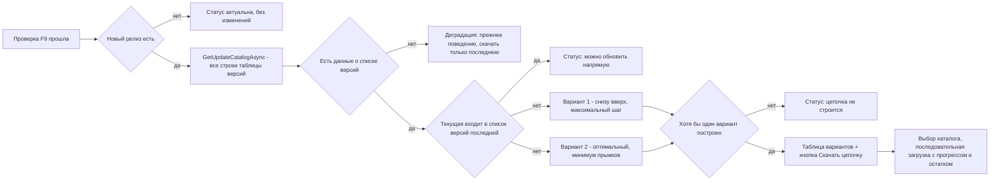

# PLAN 0.3.9.328 — Issue #352 «Цепочки обновлений для базы»

- Режим: **architect** — план; код НЕ изменяется до одобрения.
- Текущая версия: **0.3.9.327** (последний коммит `8d8370e`, релиз v0.3.9.327).
- Цель выпуска: один issue — **#352** (автор 7OH, открыт 2026-10-07, комментариев нет).
- Правила выпуска (паттерн репозитория): issue сами НЕ закрываем; после реализации —
  комментарий в issue «что сделано и в какой версии»; bump версии в csproj (4 поля) →
  CHANGELOG.md → README.md (бейдж версии + описание функции) → сборка Windows и Linux →
  релиз v0.3.9.328.

---

## Обзор

| Версия | Issue | Суть | Модули |
|---|---|---|---|
| 0.3.9.328 | #352 | В окне проверки обновления для базы (F9) строить цепочку обновлений конфигурации: вариант «снизу вверх» и оптимальный (минимум прыжков), таблица вариантов, кнопка «Скачать цепочку», прогресс по файлам | `OneCPlatformCatalogParser.cs`, `OneCUpdatesService.cs`, `IOneCUpdatesService.cs`, `PlatformRelease.cs`, новый `UpdateChainBuilder.cs`, `UpdateCheckRowViewModel.cs`, `UpdateCheckWindow.xaml/.cs/.Avalonia.cs`, локализация, тесты |

**Решение по трактовке (согласовано с заказчиком):** цепочка обновляется для
**КОНФИГУРАЦИИ** выбранной базы, целевое окно — «Проверка обновлений» для ИБ
(F9, [`UpdateCheckWindow`](Configuration%20Management/Views/UpdateCheckWindow.xaml)). Таблица
версий на `releases.1c.ru` у конфигураций имеет ту же структуру (`#versionsTable`),
что и у платформы (скриншоты в issue — платформа как наглядный пример).



---

## 0. Контекст

Текст issue #352:

> При наличии обновления в окне проверки обновления для базы - сейчас предлагает
> скачать только последнюю версию. Надо проверять - можно ли обновить текущую на
> последнюю. Список для этого в таблице на сайте есть. Текущую версию, Последнюю
> и Статус - можно поместить в один ряд - место для этого есть. Добавить таблицу
> с колонкой Номер и Список версий. При необходимости скачивания цепочки - в
> таблицу попадают варианты обновления: 1. снизу вверх - с поиском максимальной
> версии, на которую можно прыгнуть с текущей - и так до нужной; 2. оптимальный
> поиск с минимальным количеством прыжков, если такой возможен и он отличается
> от п.1. При наличии строк в таблице - появляется кнопка "Скачать цепочку", по
> которой выбираем каталог, в который будут скачаны все выбранные версии. При
> загрузке, возможно как-то подсказывать - какой файл скачивается и сколько ещё
> осталось.

**Семантика «Списка версий» (допущение):** для версии V колонка «Список версий»
в таблице каталога содержит версии, **с которых можно обновиться напрямую ДО V**
(стандарт каталога релизов 1С). Цепочка — последовательность версий от текущей
до последней, где каждая следующая версия принимает обновление с предыдущей.

---

## 1. Текущее поведение (подтверждено по коду)

1. Окно F9 [`UpdateCheckWindow`](Configuration%20Management/Views/UpdateCheckWindow.xaml:1)
   показывает имя базы, **текущую версию конфигурации**, **последнюю версию** и
   **статус** (стек-метки `CurrentVersionText` / `LatestVersionText` / `StatusText`,
   XAML строки 100–120; Avalonia — [`BuildRoot`](Configuration%20Management/Views/UpdateCheckWindow.Avalonia.cs:462),
   `MakeFieldRow`, строки 490–500).
2. Проверка [`RunCheckAsync`](Configuration%20Management/Views/UpdateCheckWindow.xaml.cs:62)
   вызывает [`CheckForUpdatesAsync`](Configuration%20Management/Services/OneCUpdatesService.cs:244):
   страница каталога `releases.1c.ru/project/<ник>` парсится **только первой строкой**
   таблицы [`ParseLatestVersionFromProjectHtml`](Configuration%20Management/Services/OneCUpdatesService.cs:417);
   результат применяется к строке [`ApplyResult`](Configuration%20Management/ViewModels/UpdateCheckRowViewModel.cs:136).
3. Кнопка «Скачать» (код-бэк WPF [`OnDownloadRow`](Configuration%20Management/Views/UpdateCheckWindow.xaml.cs:330),
   Avalonia [`OnDownloadRow`](Configuration%20Management/Views/UpdateCheckWindow.Avalonia.cs:387))
   скачивает **только последнюю версию** через
   [`DownloadUpdateAsync`](Configuration%20Management/Services/OneCUpdatesService.cs:586):
   ответ `version_files` → выбор `setup*.zip` → однопоточная загрузка с прогрессом
   (`IProgress<double>`). Папка не выбирается — диалог сохранения файла.
4. Полную таблицу версий (ВСЕ строки `#versionsTable`, версия + ссылка `version_files`)
   уже умеет парсить общий парсер
   [`OneCPlatformCatalogParser.ParseVersions`](Configuration%20Management/Services/OneCPlatformCatalogParser.cs:77)
   (используется сервисом платформы [`PlatformUpdateService`](Configuration%20Management/Services/PlatformUpdateService.cs:87)).
   Колонка **«Список версий» не извлекается** — модель
   [`PlatformRelease`](Configuration%20Management/Models/PlatformRelease.cs:10) содержит
   только `Version` и `VersionFilesUrl`.
5. Авторизованный GET портала с распознаванием статусов — [`FetchPageAsync`](Configuration%20Management/Services/OneCUpdatesService.cs:917)
   (`PortalFetchStatus`: Ok/AuthRequired/AuthFailed/LoginLimitReached/FormUnavailable/NotFound/NetworkError/Cancelled).
   Выбор каталога — [`OpenFolderDialog`](Configuration%20Management/Services/IDialogService.cs:48)
   (реализован в WPF и Avalonia).
6. Локализация — плоские ключи [`ru.json`](Configuration%20Management/Localization/Languages/ru.json)/`en.json`
   (префиксы `Updates.*`, `PlatformUpdate.*`).

**Вывод:** вся инфраструктура (парсинг полной таблицы, авторизованный HTTP, загрузка
с прогрессом, диалог каталога) уже есть. Не хватает: парсинга «Списка версий»,
алгоритмов построения цепочки, состояния цепочки в VM, UI-блока цепочки и самой
загрузки по шагам.

---

## 2. Схема решения

### Новые компоненты

| Компонент | Назначение |
|---|---|
| `Models/UpdateChainVariant.cs` | Результат построения: номер варианта, тип (снизу вверх / оптимальный), шаги (версии) |
| `Models/ConfigUpdateCatalogResult.cs` | Результат получения полного каталога конфигурации (статус + ошибка + релизы) |
| `Services/UpdateChainBuilder.cs` | Чистые алгоритмы: прямое обновление, вариант 1 (жадный), вариант 2 (BFS) |
| `ViewModels/UpdateChainVariantViewModel.cs` | Строка таблицы вариантов (№, тип, текст списка версий) |

### Изменяемые компоненты

| Компонент | Изменение |
|---|---|
| `Models/PlatformRelease.cs` | Новое поле `Sources` (версии, с которых можно обновиться напрямую) |
| `Services/OneCPlatformCatalogParser.cs` | `ParseVersions`: извлекать «Список версий» из каждой строки таблицы |
| `Services/IOneCUpdatesService.cs` | Новый метод `GetUpdateCatalogAsync` |
| `Services/OneCUpdatesService.cs` | Реализация каталога (переиспользует `FetchPageAsync` + `ParseVersions`) + хелпер абсолютного URL `version_files` |
| `ViewModels/UpdateCheckRowViewModel.cs` | Состояние цепочки: варианты, прямое обновление, отсутствие данных, прогресс цепочки |
| `Views/UpdateCheckWindow.xaml` | Ряд «Текущая / Последняя / Статус», таблица вариантов, кнопка «Скачать цепочку», прогресс цепочки |
| `Views/UpdateCheckWindow.xaml.cs` | Построение цепочки после проверки, загрузка цепочки по шагам |
| `Views/UpdateCheckWindow.Avalonia.cs` | То же в `BuildRoot` |
| `Localization/Languages/ru.json`, `en.json` | Ключи `Updates.Chain.*` |
| `ConfigurationManagement.Tests/*` | Тесты парсера и построителя цепочек |

---

## 3. Задачи

### Задача 1 — Модель: поле «Список версий» в PlatformRelease

Файл: [`Configuration Management/Models/PlatformRelease.cs`](Configuration%20Management/Models/PlatformRelease.cs).

Добавить в `PlatformRelease`:

```csharp
/// <summary>Версии, из которых можно обновиться НАПРЯМУЮ до этой версии
/// (колонка «Список версий» таблицы #versionsTable каталога релизов).
/// Пусто — данные о совместимости отсутствуют (прямой путь неизвестен).</summary>
public List<string> Sources { get; set; } = new();
```

Поле используется и платформенным каталогом (`Platform83`/`Platform85`) — там
колонка тоже будет заполняться бесплатно, что не мешает существующим тестам.

### Задача 2 — Парсер: извлечение «Списка версий» из #versionsTable

Файл: [`Configuration Management/Services/OneCPlatformCatalogParser.cs`](Configuration%20Management/Services/OneCPlatformCatalogParser.cs).

В [`ParseVersions`](Configuration%20Management/Services/OneCPlatformCatalogParser.cs:77),
в цикле строк `#versionsTable`, после извлечения версии и href (без изменения
существующей логики дедупликации/сортировки):

1. Снять со строки HTML-теги: `Regex.Replace(row, "<[^>]+>", " ")`.
2. Убрать из текста саму версию (первый `version_files`-линк уже извлечён).
3. Найти все числовые токены вида `\d{1,4}(\.\d{1,4}){1,3}` (паттерн
   `VersionTokenRegex` из [`OneCUpdatesService`](Configuration%20Management/Services/OneCUpdatesService.cs:458)),
   провалидировать [`TryParseVersion`](Configuration%20Management/Services/OneCUpdatesService.cs:546).
4. Исключить собственную версию строки, нормализовать (как
   [`NormalizeVersion`](Configuration%20Management/Services/OneCPlatformCatalogParser.cs:187)),
   дедуплицировать, сохранить в `release.Sources`.

Устойчивость: пустая/отсутствующая колонка → пустой `Sources` (без исключений);
формат «список через запятую» и «диапазон через —» обрабатываются одинаково
(токены обоих концов диапазона попадут в `Sources`; при реальном HTML диапазона
уточнить на фикстуре — см. риски).

**Предварительный шаг реализации:** зафиксировать реальный HTML страницы каталога
типовой конфигурации (лог `GetPageTextAsync`/отладка) и сверить структуру ячейки
«Список версий» — по нему пишется фикстура теста.

### Задача 3 — Сервис: получение полного каталога конфигурации

Файлы: [`IOneCUpdatesService.cs`](Configuration%20Management/Services/IOneCUpdatesService.cs),
[`OneCUpdatesService.cs`](Configuration%20Management/Services/OneCUpdatesService.cs),
новый [`ConfigUpdateCatalogResult.cs`](Configuration%20Management/Models/ConfigUpdateCatalogResult.cs).

Интерфейс:

```csharp
/// <summary>Получает полный каталог версий конфигурации (все строки #versionsTable)
/// по адресу страницы каталога релизов, включая колонку «Список версий» (issue #352).
/// Ошибки не бросаются: итог — статус и ключ локализации «Updates.*».</summary>
Task<ConfigUpdateCatalogResult> GetUpdateCatalogAsync(string url, CancellationToken ct = default);
```

Модель результата:

```csharp
public sealed class ConfigUpdateCatalogResult
{
    public PortalFetchStatus Status { get; init; } = PortalFetchStatus.NetworkError;
    public string ErrorKey { get; init; } = string.Empty;   // «Updates.*»
    public IReadOnlyList<PlatformRelease> Releases { get; init; } = new List<PlatformRelease>();
}
```

Реализация в `OneCUpdatesService` (≈30 строк):

1. `FetchPageAsync(url, ct)` — переиспользует всю авторизацию (CAS, cookie, Basic).
2. Маппинг статусов в ключи как в [`Failure`](Configuration%20Management/Services/PlatformUpdateService.cs:289),
   но с ключами «Updates.*»: `AuthRequired`→`Updates.AuthRequired`,
   `AuthFailed`→`Updates.AuthFailed`, `LoginLimitReached`→`Updates.LoginLimitReached`,
   `FormUnavailable`→`Updates.FormUnavailable`, `NotFound`→`Updates.NotFound`,
   `Cancelled`→`Updates.Cancelled`, `NetworkError`→`Updates.NetworkError`.
3. `OneCPlatformCatalogParser.ParseVersions(text)`; пустой список → `Unavailable`
   (ключ `Updates.Unavailable`, как в `CheckForUpdatesAsync`).
4. Вернуть релизы отсортированными по убыванию (парсер уже сортирует).

Дополнительно — внутренний хелпер абсолютного URL страницы файлов релиза
(симметрия с [`BuildVersionFilesUrl`](Configuration%20Management/Services/PlatformUpdateService.cs:269)):

```csharp
/// <summary>Абсолютный адрес version_files для загрузки по шагу цепочки:
/// относительный href из каталога дополняется хостом портала.</summary>
internal static string ToAbsoluteVersionFilesUrl(string? href, string fallbackBaseUrl)
```

`CheckForUpdatesAsync` и кэш [`SaveUpdateCache`](Configuration%20Management/Views/UpdateCheckWindow.xaml.cs:294)
НЕ меняются (обратная совместимость с Центром обслуживания и окном «Актуальные релизы»).

### Задача 4 — Алгоритмы построения цепочки (UpdateChainBuilder)

Новый файл: [`Configuration Management/Services/UpdateChainBuilder.cs`](Configuration%20Management/Services/UpdateChainBuilder.cs)
+ модель [`UpdateChainVariant.cs`](Configuration%20Management/Models/UpdateChainVariant.cs).

```csharp
public enum UpdateChainKind { BottomUp, Optimal }

/// <summary>Один вариант цепочки: номер (1..n) и шаги (версии от текущей до последней).</summary>
public sealed class UpdateChainVariant
{
    public int Number { get; init; }
    public UpdateChainKind Kind { get; init; }
    public IReadOnlyList<PlatformRelease> Steps { get; init; } = Array.Empty<PlatformRelease>();
}

/// <summary>Результат построения цепочек.</summary>
public sealed class UpdateChainSet
{
    public bool HasSourceData { get; init; }   // хотя бы у одного релиза есть Sources
    public bool IsDirectUpdate { get; init; }  // C можно обновить напрямую до T
    public IReadOnlyList<UpdateChainVariant> Variants { get; init; } = Array.Empty<UpdateChainVariant>();
}
```

Статический чистый класс `UpdateChainBuilder` (без сети и UI, покрывается тестами):

```csharp
public static class UpdateChainBuilder
{
    public static UpdateChainSet Build(
        string currentVersion, string targetVersion, IReadOnlyList<PlatformRelease> releases);
}
```

Логика:

1. **Данные.** `HasSourceData = releases.Any(r => r.Sources.Count > 0)`. Если данных
   нет — вернуть `{ HasSourceData=false }` (UI деградирует к прежнему поведению).
2. **Прыжок.** `CanJump(from, to)` = `to.Version > from` (численно, через
   [`CompareVersions`](Configuration%20Management/Services/OneCPlatformCatalogParser.cs:176))
   и `from ∈ to.Sources` (сравнение регистронезависимое, без суффиксов).
3. **Прямое обновление.** `IsDirectUpdate = CanJump(current, target)`.
4. **Вариант 1 — «снизу вверх» (жадный).** От текущей версии каждый шаг — выбор
   **максимальной** версии из всех более новых, чей `Sources` содержит текущую;
   повторять, пока не достигнута последняя версия. Если на каком-то шаге кандидатов
   нет (тупик) — вариант недоступен (null). Жадный шаг может «перепрыгнуть» и не
   дойти до цели, поэтому отдельно считается:
5. **Вариант 2 — оптимальный (минимум прыжков).** Поиск в ширину (BFS) по
   направленному графу `u → v` (ребро существует, если `CanJump(u, v)`); старт —
   текущая версия, цель — последняя. Первый найденный путь — кратчайший (веса рёбер 1).
6. **Сборка вариантов:**
   - если жадный вариант построен → строка №1 (`BottomUp`);
   - если оптимальный построен **и** его последовательность версий отличается от
     жадного → строка №2 (`Optimal`);
   - если жадный не построен, а оптимальный есть → одна строка (оптимальный, №1);
   - совпадение последовательностей → одна строка.

Тестовые сценарии (см. Задачу 9) обязательны: прямое обновление; жадный = оптимальный;
жадный ≠ оптимальный; жадный заходит в тупик, оптимальный проходит; пути нет;
нет данных о совместимости; пустая текущая версия.

### Задача 5 — ViewModel: состояние цепочки

Файлы: [`UpdateCheckRowViewModel.cs`](Configuration%20Management/ViewModels/UpdateCheckRowViewModel.cs),
новый [`UpdateChainVariantViewModel.cs`](Configuration%20Management/ViewModels/UpdateChainVariantViewModel.cs).

`UpdateChainVariantViewModel`:

```csharp
public sealed class UpdateChainVariantViewModel : ViewModelBase
{
    public int Number { get; }                       // 1, 2
    public UpdateChainKind Kind { get; }
    public IReadOnlyList<PlatformRelease> Steps { get; }
    public string VersionsText => string.Join(" → ", Steps.Select(s => s.Version));
    public string KindText => локализованный заголовок варианта; // Updates.Chain.VariantBottomUp/Optimal
}
```

В `UpdateCheckRowViewModel` добавить:

```csharp
public ObservableCollection<UpdateChainVariantViewModel> ChainVariants { get; } = new();

public bool HasChain            // ChainVariants.Count > 0 → видимость таблицы и кнопки
public bool IsDirectUpdate      // → статус «можно обновить напрямую»
public bool HasSourceData       // false → статус «нет данных о совместимости»
public string ChainStatusText   // локализованный статус цепочки (прямая/нет данных/не строится)
public UpdateChainVariantViewModel? SelectedVariant   // выбор строки таблицы
public bool IsChainDownloading  // → панель прогресса цепочки
public double ChainProgress     // общий прогресс 0..1
public string ChainProgressText // «Скачивается 2 из 4: версия 3.0.158.71 … Осталось: 2»

public void SetChains(UpdateChainSet set) { /* заполнить ChainVariants, статусы, OnPropertyChanged */ }
public void ResetChains() { /* очистить коллекцию и статусы */ }
```

При изменении `SelectedVariant`/`IsChainDownloading` — `RaiseCanExecuteChanged` для
команды загрузки цепочки. Команды: можно оставить в code-behind (паттерн окна),
либо добавить `DownloadChainCommand` в VM — на усмотрение исполнителя, единообразно
для обеих платформ.

### Задача 6 — WPF UI (UpdateCheckWindow.xaml + .xaml.cs)

Файлы: [`UpdateCheckWindow.xaml`](Configuration%20Management/Views/UpdateCheckWindow.xaml),
[`UpdateCheckWindow.xaml.cs`](Configuration%20Management/Views/UpdateCheckWindow.xaml.cs).

**XAML:**

1. Заменить стек-метки (строки 100–120) на один ряд из трёх колонок
   («Текущая версия», «Последняя версия», «Статус») с сохранением
   `x:Name` (`CurrentVersionText`, `LatestVersionText`, `StatusText`),
   чтобы code-behind не менялся (`Width="*"` на средние колонки, перенос строк).
2. Ниже карточки — блок цепочки (видимость управляется в коде):
   - заголовок `Updates.Chain.Title`;
   - пояснение «1 — снизу вверх (максимальный шаг); 2 — оптимальный (минимум шагов)»;
   - таблица [`DataGrid`](Configuration%20Management/Views/PlatformUpdateWindow.xaml:94)
     (паттерн окна платформы): колонки **«№»** (`Number`) и **«Список версий»**
     (`VersionsText`); `SelectionMode=Single`, `SelectedItem` → `SelectedVariant`;
     подсказка `KindText` в ToolTip;
   - кнопка **«Скачать цепочку»** (видима при `HasChain`);
   - панель прогресса цепочки: `ProgressBar` (`ChainProgress`) + текст
     `ChainProgressText`.
3. Кнопка «Скачать» (последнюю версию) сохраняется как была — обратная совместимость.

**Code-behind:**

1. В [`RunCheckAsync`](Configuration%20Management/Views/UpdateCheckWindow.xaml.cs:62)
   после `ApplyResult(result)` — если `result.HasNewer` и есть текущая версия:
   вызвать `_updates.GetUpdateCatalogAsync(url, token)` (в `Task.Run`), затем
   `UpdateChainBuilder.Build(currentVersion, latestVersion, releases)` и
   `_row.SetChains(set)`; при ошибках каталога — `ResetChains()` + статус
   «нет данных»/ошибка без падения (не ронять результат основной проверки).
2. Метод `DownloadChainAsync`:
   - вариант = `_row.SelectedVariant ?? _row.ChainVariants.FirstOrDefault()`;
   - `folder = _dialogs.OpenFolderDialog(T("Updates.Chain.ChooseFolder"), UserProfile)`;
     отмена — no-op;
   - цикл по `variant.Steps` (порядок — от текущей к последней):
     - URL: `OneCUpdatesService.ToAbsoluteVersionFilesUrl(step.VersionFilesUrl, _row.Url)`;
     - имя файла: `{SanitizeFileName(_row.Name)}_{step.Version}.zip`
       (паттерн [`BuildDownloadFileName`](Configuration%20Management/Views/UpdateCheckWindow.xaml.cs:382));
     - `_row.ChainProgressText = Format(T("Updates.Chain.DownloadProgress"), i + 1, total, step.Version)`
       + `Format(T("Updates.Chain.Remaining"), total - i - 1)`;
     - `_updates.DownloadUpdateAsync(url, target, new Progress<double>(p => ChainProgress = (i + p)/total), ct)`;
     - счётчики успех/неудача;
   - итог: `ShowInfo`/`ShowWarning` — `Updates.Chain.LoadedOk` / `LoadedFailed`;
   - `finally: _row.IsChainDownloading = false`.

### Задача 7 — Avalonia UI (UpdateCheckWindow.Avalonia.cs)

Файл: [`UpdateCheckWindow.Avalonia.cs`](Configuration%20Management/Views/UpdateCheckWindow.Avalonia.cs).

Зеркально в [`BuildRoot`](Configuration%20Management/Views/UpdateCheckWindow.Avalonia.cs:462):

1. Ряд «Текущая / Последняя / Статус» — `Grid` с тремя колонками вместо
   трёх `MakeFieldRow` (строки 490–500).
2. Блок цепочки между карточкой и нижней панелью: заголовок, список строк
   (каждая — `Grid` «№ | Список версий», паттерн `ActualReleasesWindow`),
   кнопка «Скачать цепочку» (стиль `ControlThemes.DialogConfirmButton`),
   панель прогресса (`_progressBar`-подобная, отдельная от загрузки последней версии).
3. В `RefreshDetailDisplay` — обновление видимости блока цепочки и кнопок
   по `_row.HasChain` / `IsDirectUpdate` / `HasSourceData`.
4. В `RunCheckAsync` — построение цепочки (та же логика, что в Задаче 6;
   маршалинг изменений UI через `Dispatcher.UIThread.Post`, как в
   [`UpdateProgressDisplay`](Configuration%20Management/Views/UpdateCheckWindow.Avalonia.cs:363)).
5. `DownloadChainAsync` — как в WPF, диалог `_dialogs.OpenFolderDialog`.

### Задача 8 — Локализация

Файлы: [`ru.json`](Configuration%20Management/Localization/Languages/ru.json),
`en.json`.

Новые ключи (`ru` / `en`):

| Ключ | ru | en |
|---|---|---|
| `Updates.Chain.Title` | Цепочка обновлений | Update chain |
| `Updates.Chain.Column.Number` | № | # |
| `Updates.Chain.Column.Versions` | Список версий | Version list |
| `Updates.Chain.Direct` | Можно обновить напрямую | Can be updated directly |
| `Updates.Chain.NoData` | Нет данных о совместимости версий — доступна загрузка последней версии | No version compatibility data — only the latest release can be downloaded |
| `Updates.Chain.Impossible` | Не удалось построить цепочку обновлений для текущей версии | Failed to build an update chain for the current version |
| `Updates.Chain.VariantBottomUp` | Вариант {0}: снизу вверх (максимальный шаг) | Option {0}: bottom-up (maximum step) |
| `Updates.Chain.VariantOptimal` | Вариант {0}: оптимальный (минимум шагов) | Option {0}: optimal (minimum steps) |
| `Updates.Chain.Download` | Скачать цепочку | Download chain |
| `Updates.Chain.ChooseFolder` | Выберите каталог для загрузки цепочки обновлений | Choose a folder for the update chain |
| `Updates.Chain.DownloadProgress` | Скачивается {0} из {1}: версия {2} | Downloading {0} of {1}: version {2} |
| `Updates.Chain.Remaining` | Осталось файлов: {0} | Files remaining: {0} |
| `Updates.Chain.LoadedOk` | Загружено файлов: {0} из {1}\nКаталог: {2} | Files downloaded: {0} of {1}\nFolder: {2} |
| `Updates.Chain.LoadedFailed` | Не удалось загрузить файлов: {0} | Failed to download files: {0} |

### Задача 9 — Тесты

1. [`OneCPlatformCatalogParserTests.cs`](ConfigurationManagement.Tests/OneCPlatformCatalogParserTests.cs):
   - `ParseVersions_SourcesColumn_FillsSources` — строка с ячейкой «Список версий»
     (список через запятую) → `Sources` содержат перечисленные версии;
   - `ParseVersions_SourcesColumn_ExcludesOwnVersion` — собственная версия строки
     не попадает в `Sources`;
   - `ParseVersions_SourcesColumn_EmptyAndMissing` — пустая/отсутствующая колонка →
     пустой `Sources`, существующие тесты не ломаются (регресс всего файла);
   - `ParseVersions_RangeSyntax_ParsesBothEnds` — «8.3.27.1500 — 8.3.27.1688».
2. Новый [`UpdateChainBuilderTests.cs`](ConfigurationManagement.Tests/UpdateChainBuilderTests.cs):
   - прямое обновление (`C ∈ Sources(T)`) → `IsDirectUpdate=true`, вариантов нет;
   - жадный == оптимальный → одна строка;
   - жадный ≠ оптимальный (цепочки `[3,4,5,6]` vs `[2,5,6]`) → две строки, номера 1 и 2;
   - жадный заходит в тупик, оптимальный проходит → одна строка (оптимальный);
   - пути нет → вариант 0, `IsDirectUpdate=false`;
   - `Sources` пусты везде → `HasSourceData=false`;
   - пустая/непарсимая текущая версия → безопасный пустой результат;
   - сравнение версий числовое («8.3.9» < «8.3.27»).
3. Регресс: `OneCUpdatesUrlTests`, `PlatformUpdateServiceTests`, `PlatformUpdateViewModelTests`
   (критерии построения цепочки не должны затронуть платформенные сценарии);
   `ConfigurationManagement.Tests` в целом — сборка решения.

### Задача 10 — Версия, CHANGELOG, README, комментарий, сборка, релиз

Порядок (паттерн репозитория):

1. [`Configuration Management.csproj`](Configuration%20Management/Configuration%20Management.csproj:62):
   версия (4 поля) → **0.3.9.328**.
2. `CHANGELOG.md`: секция `## [0.3.9.328] — <дата>`: описание функциональности
   (цепочки обновлений для базы), ссылка на issue #352, обе платформы.
3. `README.md`: обновить бейдж версии и описание функции «Проверка обновлений»
   (упомянуть цепочки и кнопку «Скачать цепочку»).
4. Комментарий в issue #352: что реализовано, в какой версии, как работает
   (вариант 1 и вариант 2, кнопка, прогресс), что делать при «нет данных».
5. Сборка: Windows (WPF, Release x64) и Linux (Avalonia) — по существующим
   скриптам `package/linux/…` и процессу публикации.
6. Релиз v0.3.9.328 на GitHub: артефакты Windows + Linux, SHA256SUMS
   (как в `publish/SHA256SUMS_0.3.9.327.txt`).

---

## 4. Порядок реализации и точки интеграции

Жёсткий порядок (зависимости):

1. **Задача 1** (модель) → **Задача 2** (парсер) → **Задача 9** (тесты парсера) —
   фундамент, ничего не ломает (существующие тесты парсера — регресс-барьер).
2. **Задача 3** (сервис) — изолированный публичный метод; интеграция точек
   вызова НЕ меняет `CheckForUpdatesAsync`/кэш.
3. **Задача 4** (алгоритмы) — чистый класс + тесты, до UI.
4. **Задача 5** (VM) → **Задача 6** (WPF UI) → **Задача 7** (Avalonia UI) —
   общая VM используется обеими платформами (паттерн `PlatformUpdateViewModel`).
5. **Задача 8** (локализация) — параллельно с 6–7.
6. **Задача 10** — только после ручной проверки сценариев (сеть/портал доступны
   у разработчика): прямая загрузка, цепочка из двух и более шагов, деградация
   при отсутствии данных.

Точки интеграции:

- Проверка: [`RunCheckAsync`](Configuration%20Management/Views/UpdateCheckWindow.xaml.cs:62)
  (WPF) и [`RunCheckAsync`](Configuration%20Management/Views/UpdateCheckWindow.Avalonia.cs:105)
  (Avalonia) — ветка `NewerAvailable` после `ApplyResult`.
- Скачивание: [`OnDownloadRow`](Configuration%20Management/Views/UpdateCheckWindow.xaml.cs:330)
  остаётся для последней версии; новый обработчик цепочки рядом.
- Общая строка: [`UpdateCheckRowViewModel`](Configuration%20Management/ViewModels/UpdateCheckRowViewModel.cs)
  — единая для обеих платформ.

---

## 5. Риски и допущения

1. **Реальная структура ячейки «Список версий»** в `#versionsTable` каталога
   конфигурации может отличаться от ожидаемой (разделители, диапазоны, отсутствие
   колонки). Митигация: шаг фиксации реального HTML в начале реализации; устойчивый
   токен-парсинг; при пустых данных — честная деградация к прежнему поведению
   (статус «Нет данных о совместимости», остаётся только кнопка «Скачать» последнюю).
2. **Семантика «Списка версий»** принята как «версии, с которых можно обновиться
   напрямую» (стандарт каталога 1С). Если реальный смысл колонки иной (например,
   диапазон) — корректируется в `UpdateChainBuilder.CanJump` и парсере, API не меняется.
3. **Дополнительный сетевой запрос** каталога (после `CheckForUpdatesAsync`) —
   один лишний GET той же страницы при `NewerAvailable`. Приемлемо; объединение
   запросов возможно позже без изменения публичного контракта.
4. **Кнопка «Скачать» (последнюю)** сохраняется наряду с «Скачать цепочку» —
   обратная совместимость и возможность ручной установки последней версии.
5. **Сравнение версий** — числовыми сегментами через
   [`CompareVersions`](Configuration%20Management/Services/OneCPlatformCatalogParser.cs:176);
   версии с суффиксами («+», пробелами) нормализуются существующими хелперами.
6. Окно F9 — модальное, поток изменений UI соблюдается как сейчас (WPF — контекст
   UI, Avalonia — `Dispatcher.UIThread.Post`), чтобы не повторить
   NotSupportedException CollectionView (issue #334/#330).