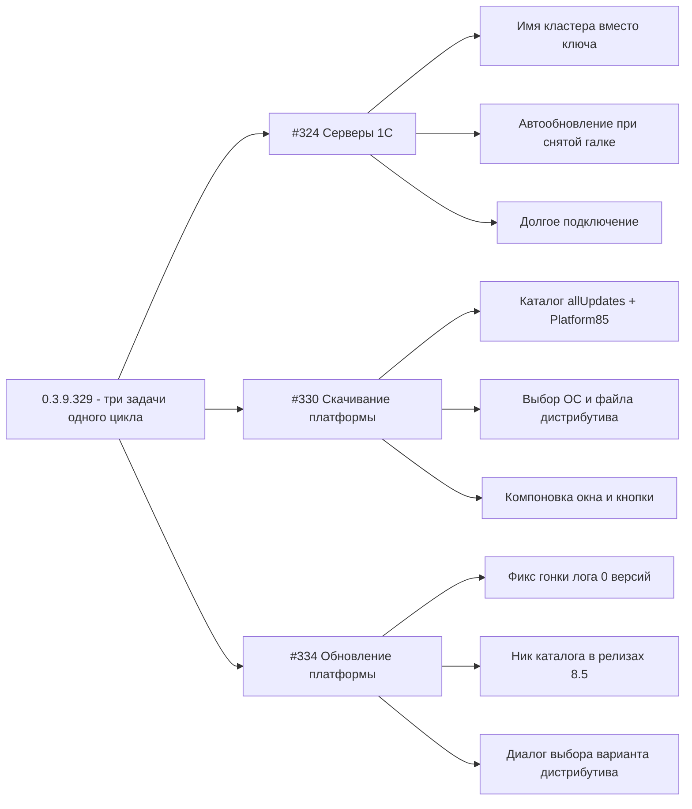

# PLAN 0.3.9.329 — цикл #324 + #330 + #334 (монитор серверов, скачивание и обновление платформы 1С)

- Режим: **architect** — план; код НЕ изменяется до одобрения.
- Текущая версия: **0.3.9.328** (HEAD `0a2bbbf`, тег v0.3.9.328), полный набор `dotnet test` = **1941 тест**.
- Следующая версия цикла: **0.3.9.329** (один номер для всех трёх issues — паттерн репозитория «в одном релизе могут закрываться несколько issues»).
- В скоупе: **#324**, **#330**, **#334** — по последним комментариям 7OH (от 2026-10-07).
- Вне скоупа: #351, #352 (последний комментарий от sivatorov — исправлено в 0.3.9.327/0.3.9.328).
- Правила выпуска: issues сами НЕ закрываем; после реализации — комментарий «что исправлено и в какой версии» в каждый issue (черновики `publish/comment-{324,330,334}-0.3.9.329.md`, публикация PowerShell `Invoke-RestMethod` с заголовками из `.gh_headers`); bump версии в csproj (4 поля) → CHANGELOG.md → README.md → сборка Windows/Linux → git commit/push → аннотированный тег `v0.3.9.329` → GitHub Release (published).

**Замечания среды:** WSL на машине нет — AppImage и smoke-запуск Linux пропускаются (ELF-проверка структурная). Артефакты (`dist/`, `package/linux/deb/out/`, `publish/out-*`) в git не добавляются. Авторизация GitHub — из файла `.gh_headers`.

---

## Обзор

| Версия | Issue | Суть | Модули |
|---|---|---|---|
| 0.3.9.329 | #324 | Монитор «Серверы 1С»: 1) имя кластера в выпадающем списке показывается как «ключ»; 2) галка автообновления снята, но таймер работает и индикатор показывает «включено», после ошибки продолжаются попытки; 3) подключение долгое (~5 с локально) | `RacOutputParser.cs`, `RacClusterRow.cs`, `RacClient.cs`, `ServerMonitorViewModel.cs`, `ServerMonitorWindow.xaml(.cs)/.Avalonia.cs`, `RacClientTests`, `ServerMonitorViewModelTests`, `RacClusterRowTests` |
| 0.3.9.329 | #330 | Окно «Скачивание версии платформы 1С»: тип дистрибутива только «АВТО» и кнопки неактивны; «Файл» пуст; кнопка «Выбрать» обрезана; окно низкое; в списке только последние версии (нет allUpdates и Platform85); нужен выбор ОС/файла и представление деревом | `OneCPlatformCatalogParser.cs`, `PlatformUpdateService.cs`, `IPlatformUpdateService.cs`, `PlatformDistributionPicker.cs`, `PlatformDownloadViewModel.cs`, `PlatformDownloadWindow.xaml(.cs)/.Avalonia.cs`, `PlatformVersionPicker*`, локализация, тесты |
| 0.3.9.329 | #334 | Окно «Обновление платформы 1С»: «setup.exe не найден в архиве» + «получено 0 версий каталога»; непонятно что скачивается (x86/x64, полный/тонкий) — нужен диалог выбора варианта после «Скачать и установить» с фильтром по ОС | `PlatformUpdateService.cs`, `IPlatformUpdateService.cs`, `PlatformRelease.cs`, `PlatformUpdateViewModel.cs`, `PlatformUpdateWindow.xaml(.cs)/.Avalonia.cs`, `OneCUpdatesService.cs`, локализация, тесты |



---

## 0. Контекст — последние комментарии 7OH (ориентируемся строго на них)

### #324 (2026-10-07T18:08:19Z, id 6043903620)

> «В поле по-прежнему ключ вместо имени. Галка автообновления снята перед подключением, но внизу упорно показывает, что оно включено и оно таки включено, так как после ошибки продолжает пытаться получить данные. Подключение всё ещё долгое (в логах видно - почти 5 секунд и это локально). Лог во вложении app-20261007.log.»

Три задачи: **T324-1** имя кластера в ComboBox = «ключ» (несмотря на фикс 0.3.9.326); **T324-2** чекбокс снят, но индикатор «включено» и таймер реально тикает после ошибки; **T324-3** подключение ~5 с локально.

### #330 (2026-10-07T18:30:22Z, id 6044269674)

1. Тип дистрибутива — только «АВТО»: нужен реальный выбор — либо выбор ОС из групп на странице `version_files?nick=Platform83&ver=8.3.27.2342` (windows 32/64, linux 64 и пр.) и затем файлов для ОС; либо проще — все файлы с представлениями и сортировкой.
2. «Файл» показывает только подсказку (нет информации, какой файл будет скачан).
3. Кнопка «ВЫБРАТЬ» напротив «Папка загрузки» видна наполовину (текст обрезан).
4. Кнопки «Запустить установщик» и «Скачать» не активны (вероятно из-за п.1).
5. Окно слишком низкое: список минимум на 8 строк, по горизонтали ~25% ширины; справа сверху вниз: Разрядность, тип дистрибутива, информация об учётной записи, файл и папка загрузки с кнопкой выбора, кнопки «открыть папку» и «Запустить установщик».
6. В списке только версия 8.3.27, не все версии: парсить полный адрес `https://releases.1c.ru/project/Platform83?allUpdates=true#updates`, поддержать `Platform85`; отображать деревом `8.x \ 8.x.yy` с сортировкой по убыванию (как в выборе платформы, но без разрядности).

### #334 (2026-10-07T18:35:48Z, id 6044361805)

> «Список версий показывает - большой и даже 8.5 версии. При попытке скачать: setup.exe не найден в архиве. 2026-10-07 21:32:15.251 [INFO] Обновление платформы: получение каталога версий с портала 1С; 21:32:15.371 [INFO] Обновление платформы: получено 0 версий каталога. При этом визуально - оно ничего не скачивало даже. Попутно вопрос - а какую оно пытается скачивать? х86\х64? Полную платформу, тонкий клиент? Похоже нужен дополнительный диалог, который после выбора версии и нажатия "Скачать и установить" - сначала посмотрит доступные версии (с определением текущей ОС и фильтром вариантов для неё), потом предложит выбрать из списка вариантов. А уже потом будет что скачивать и пытаться установить».

Две задачи: **T334-1** «setup.exe не найден в архиве» при скачивании (получено 0 версий каталога при повторном заходе); **T334-2** диалог выбора варианта дистрибутива (фильтр по текущей ОС) после нажатия «Скачать и установить».

---

## 1. Текущее поведение и диагнозы по коду (подтверждены чтением файлов)

### 1.1 #324 — диагнозы

#### T324-1 «Ключ вместо имени»

Цепочка отображения: `RacOutputParser.ToClusters` ([RacOutputParser.cs:210](Configuration%20Management/Services/RacOutputParser.cs:210)) → `RacClusterRow.DisplayText` ([RacClusterRow.cs:33](Configuration%20Management/ViewModels/RacClusterRow.cs:33)) → ComboBox (WPF `DisplayMemberPath="DisplayText"` в [ServerMonitorWindow.xaml:120](Configuration%20Management/Views/ServerMonitorWindow.xaml:120); Avalonia `FuncDataTemplate → row.DisplayText` в [ServerMonitorWindow.Avalonia.cs:138](Configuration%20Management/Views/ServerMonitorWindow.Avalonia.cs:138)).

Текущая защита (0.3.9.326): пустое имя → плейсхолдер `(порт)`. Пользователь сообщает, что «по-прежнему ключ вместо имени» — значит, на практике в `RacCluster.Name` попадает мусор (сам текст ключа / GUID / строка с префиксом), либо формат вывода rac 8.5 не покрывается ни табличным, ни блочным разбором:

- Табличный путь ([ParseTable](Configuration%20Management/Services/RacOutputParser.cs:37)): позиционный разбор применяется только при единообразном выравнивании; иначе — `MultiSpaceSeparator` (2+ пробела) — имя кластера с одиночными пробелами при таком разборе может быть порезано или слипнуто с соседними колонками.
- Блочный путь ([TryParseKeyValueBlocks](Configuration%20Management/Services/RacOutputParser.cs:261)): стартует блок по строке `cluster : GUID`; имя читается жёстко по ключу `name` (`Get(block, "name")`) и `Unquote`. Если rac выдаёт имя другим ключом (`fullName`/`displayName`/`description`) или в YAML-виде с дефисами / `=`-разделителем — `Name` пуст или содержит сам текст «name : …».
- WPF ComboBox: `SelectedValuePath="Id"` + `SelectedValue={Binding SelectedClusterId}` (Guid?) — при первом применении `ApplyClusters` (асинхронный `BeginInvoke`) выбор устанавливается по Id; сама привязка корректна, но если имя пустое, в свёрнутом ComboBox виден плейсхолдер/мусор, а не «Локальный кластер».

Вывод: точный корень требует сверки с реальным выводом rac из вложения `app-20261007.log` (issue #324). План предусматривает обязательный диагностический шаг + расширение парсера (алиасы имени, устойчивость к форматам) + валидацию имени в `DisplayText` (не показывать значение, выглядящее как ключ/GUID).

#### T324-2 Автообновление игнорирует снятую галку — БАГ ПОДТВЕРЖДЁН

[ServerMonitorViewModel.ConnectAsync](Configuration%20Management/ViewModels/ServerMonitorViewModel.cs:369):

```csharp
// строка 388 — БЕЗУСЛОВНО при успешном подключении:
StartAutoRefresh();
```

`StartAutoRefresh()` ([строка 683](Configuration%20Management/ViewModels/ServerMonitorViewModel.cs:683)) создаёт `Timer` без проверки `IsAutoRefreshEnabled`. Итог: пользователь снял галку ДО подключения → `ConnectAsync` при успехе всё равно запускает таймер → `AutoRefreshActive=true`, индикатор «Автообновление включено (5 с)» (хотя галка снята) → тики `Refresh()` каждые 5 с, включая повторные попытки после ошибки (в `catch (Exception)` ветке `LoadClusterDataAsync` ([строка 478](Configuration%20Management/ViewModels/ServerMonitorViewModel.cs:478)) таймер НЕ останавливается — в отличие от `RacOutputParseException` ([строка 476](Configuration%20Management/ViewModels/ServerMonitorViewModel.cs:476))).

Покрытие тестами: `AutoRefresh_StartsAfterConnect_AndStopsOnDispose` и `SetAutoRefreshEnabled_TurnsOffAndOn_Timer` ([ServerMonitorViewModelTests.cs:442,595](ConfigurationManagement.Tests/ServerMonitorViewModelTests.cs:442)) — сценарий «галку сняли до подключения» отсутствует.

#### T324-3 Долгое подключение (~5 с)

В журнал уже пишется тайминг каждой rac-команды (`RAC: выполнено … за N мс`, [RacClient.cs:443](Configuration%20Management/Services/RacClient.cs:443)). При первом подключении выполняется до 8 запусков rac.exe: `cluster list` + 7 параллельных команд первого кластера (processes/sessions/connections/locks/jobs/infobases/info). Дополнительные секунды дают:

- первая загрузка данных: `GetJobsAsync` пробует формат `--cluster=<uuid>` (fallback `--cluster <uuid>`) — до 2 запусков rac на первую загрузку (кэш формата в памяти `_jobListFormats` сбрасывается при перезапуске приложения и при смене версии платформы);
- возможный медленный поиск `rac` (гипотеза: `OneCPlatformLocator.FindRacExecutable` сканирует каталоги установленных платформ) — тайминг не логируется;
- таймауты TCP при недоступном порте (если пользователь указывает не порт агента) — уже есть подсказка в XAML, но повторное подключение к недоступному адресу ждёт таймаут соединения.

Точный вклад каждого фактора — по логу пользователя (тайминги уже есть); оптимизации ниже.

### 1.2 #330 — диагнозы

1. **Только «АВТО», «Файл» пуст, кнопки неактивны** — единая причина: `PickedFile == null`. Цепочка: `SelectedRelease` → [`LoadReleaseFilesAsync`](Configuration%20Management/ViewModels/PlatformDownloadViewModel.cs:394) → [`PlatformUpdateService.LoadReleaseFilesForNickAsync`](Configuration%20Management/Services/PlatformUpdateService.cs:116) → `ParseDistributionFiles` → `RepickFile` → `PlatformDistributionPicker.AvailableTypes/PickFile`. Файлы не распознаются (или страница файлов не получена) когда: (а) структура `version_files` изменилась и `DistributionFileLinkRegex`/`ClassifyKind` не нашли подходящие `.zip/.deb/.rpm/.tar.gz`; (б) ошибка авторизации на странице файлов; (в) версии 8.5 запрашиваются с ником Platform83 (см. #334). Кнопки `CanDownload()` и `RunInstallerCommand` жёстко требуют `PickedFile != null` ([PlatformDownloadViewModel.cs:284](Configuration%20Management/ViewModels/PlatformDownloadViewModel.cs:284)).
2. **«Файл» показывает подсказку** — `FileInfoText` = `PlatformDownload.NoFile` при `PickedFile == null` ([строка 185](Configuration%20Management/ViewModels/PlatformDownloadViewModel.cs:185)); после фикса п.1 показываем имя файла + разрядность + размер.
3. **Кнопка «ВЫБРАТЬ» обрезана** — WPF: `Height="30"` + двойной вертикальный padding (стиль `OutlineButtonStyle` `Padding=14,8` + Border шаблона `Padding=14,8`) → контент не помещается ([PlatformDownloadWindow.xaml:212](Configuration%20Management/Views/PlatformDownloadWindow.xaml:212)). Avalonia: `MakeButton` аналогичная проверка.
4. **Окно низкое / компоновка** — WPF: `Height=640`, список в `Grid.Row=1 *`, параметры под ним (строки 97–234). Avalonia: `Height=680` (строки 181–396). Требование 7OH: список ≥8 строк, ~25% ширины слева; справа колонка «Разрядность / Тип / Учётная запись / Файл / Папка с кнопкой / Открыть папку / Запустить установщик».
5. **Неполный список версий** — [`BuildCatalogUrl`](Configuration%20Management/Services/PlatformUpdateService.cs:258) строит `https://releases.1c.ru/project/Platform83` БЕЗ `?allUpdates=true#updates` (страница без параметра показывает только последние релизы). Ник жёстко один: `GetAvailableReleasesAsync` → Platform83; каталог Platform85 отдельно не проверяется. Версии из обоих каталогов не объединяются. Дерево `8.x \ 8.x.yy` (паттерн `PlatformVersionGroup` из `PlatformVersionPickerWindow`) в окне скачивания не используется — плоский DataGrid.

### 1.3 #334 — диагнозы

1. **«Получено 0 версий каталога» — ГОНКА В ЛОГЕ, ПОДТВЕРЖДЕНА** — [PlatformUpdateViewModel.CheckUpdatesAsync:296–304](Configuration%20Management/ViewModels/PlatformUpdateViewModel.cs:296):

   ```csharp
   UiDispatch.Run(_dispatchToUi, () => { _availableReleases = result.Releases ?? new(); RebuildRows(...); ... });
   _appLogger?.Info($"Обновление платформы: получено {_availableReleases.Count} версий каталога"); // ← читается ДО применения!
   ```

   Маршаллеры WPF/Avalonia асинхронные (`Dispatcher.InvokeAsync` / `Dispatcher.UIThread.Post`), `UiDispatch.Run` не ждёт. При первом вызове `_availableReleases` ещё пуст → лог «получено 0 версий каталога» даже при успешном ответе. Именно это пользователь и увидел (120 мс между строками — реальный успешный запрос, но преждевременный лог).

2. **«setup.exe не найден в архиве» для версий 8.5** — `PlatformRelease` НЕ хранит ник каталога ([PlatformRelease.cs](Configuration%20Management/Models/PlatformRelease.cs:10)); `LoadReleaseFilesAsync(release)` ([PlatformUpdateViewModel.EnsureReleaseFilesAsync:749](Configuration%20Management/ViewModels/PlatformUpdateViewModel.cs:749)) делегирует `LoadReleaseFilesForNickAsync(release, Platform83Nick)`. Для релиза 8.5:
   - если `release.VersionFilesUrl` заполнен (относительный `/version_files?nick=Platform85&ver=…`), URL корректен, но при повторных операциях и при построении URL из кода используется ник Platform83;
   - если `VersionFilesUrl` пуст — строится `version_files?nick=Platform83&ver=8.5…` → не тот каталог → файлы не распознаются → `PickDistribution` = null → «Не удалось выбрать дистрибутив»; либо при частичном совпадении скачивается «похожий» файл (HTML формы входа / не zip) → распаковка → `FindSetupExecutable` = null → «setup.exe не найден» ([PlatformInstaller.Windows.cs:503](Configuration%20Management/Services/PlatformInstaller.Windows.cs:503)).
   
   Сопутствующий вывод: выбор файла для установки происходит автоматически (`_service.PickDistribution(row.Release.Files)`, [PlatformUpdateViewModel.cs:342,456](Configuration%20Management/ViewModels/PlatformUpdateViewModel.cs:342)) без участия пользователя — не видно, что именно скачивается (x86/x64, полный/тонкий клиент).

3. **Требуется диалог выбора варианта** — после «Скачать и установить»: загрузить файлы релиза → показать список вариантов, отфильтрованный по текущей ОС (Windows: полный/тонкий клиент x64/x86; Linux: deb/rpm/tar.gz x64), с предвыбранным рекомендуемым → скачивание и установка выбранного файла.

---

## 2. Схема решения

### 2.1 #324

**T324-1 (имя кластера):**

1. Диагностический шаг (обязателен в начале реализации): взять из вложения `app-20261007.log` (issue #324) реальный вывод `rac cluster list` (строки `RAC: rac=… команда: … cluster list` и следующий за ними `RAC: выполнено, exit=0, stdout=N симв. …`) и зафиксировать его фикстурой в тестах `RacOutputParserTests`/`RacClientTests`.
2. `RacOutputParser`:
   - блочный разбор: имя кластера читать через `GetAny(block, "name", "fullName", "displayName", "descr", "description")` (паттерн уже есть для других команд, [строка 834](Configuration%20Management/Services/RacOutputParser.cs:834));
   - `TryParseKeyValueBlocks`: устойчивость к строке-маркеру блока с отступом/дефисом (`- cluster : GUID`) и к разделителю `=` (на усмотрение — только если диагностика подтвердит формат);
   - табличный путь: не резать имя с одиночными пробелами — при позиционном разборе имя уже сохраняется целиком (индексы из заголовка); проверить на реальной фикстуре.
3. `RacClusterRow.DisplayText` ([строка 33](Configuration%20Management/ViewModels/RacClusterRow.cs:33)): добавить валидацию — если `Name` выглядит как служебное значение (равно ключу `name`, содержит двоеточие в начале, является GUID-подобным) — трактовать как пустое (плейсхолдер `(порт)`). Не ломать существующие тесты `RacClusterRowTests`.
4. Лог-диагностика: в `ApplyClusters`/`ToClusters` при пустом или подозрительном имени логировать `[WARN] RAC: cluster list — имя кластера не распознано (первый символ блока без секретов)`, чтобы следующая итерация была по данным, а не по догадкам.

**T324-2 (автообновление):**

1. `StartAutoRefresh()`: в начало добавить `if (!IsAutoRefreshEnabled) return;` — единая защита всех точек запуска ([строка 683](Configuration%20Management/ViewModels/ServerMonitorViewModel.cs:683)).
2. `ConnectAsync`: `StartAutoRefresh();` → `if (IsAutoRefreshEnabled) StartAutoRefresh();` ([строка 388](Configuration%20Management/ViewModels/ServerMonitorViewModel.cs:388)).
3. `LoadClusterDataAsync`, ветка `catch (Exception ex)` ([строка 478](Configuration%20Management/ViewModels/ServerMonitorViewModel.cs:478)): остановить таймер (`StopAutoRefresh()`) — единообразно с веткой `RacOutputParseException`. После сетевой ошибки авто-ретрай каждые 5 с прекращается (пользователь явно против «после ошибки продолжает пытаться»); ручное «Обновить» остаётся доступным, а после успешной загрузки таймер возобновляется (уже есть в строке 461: `if (IsAutoRefreshEnabled && _autoRefreshTimer is null) StartAutoRefresh();`).

**T324-3 (долгое подключение):**

1. По логу пользователя определить доминирующий фактор (тайминги уже пишутся).
2. Кандидатные оптимизации (применять подтверждённые):
   - логировать тайминг `FindRacExecutable()` (гипотеза медленного поиска rac) — при подтверждении кэшировать результат поиска/список каталогов;
   - сохранять рабочий формат «job list» на диск (маленький JSON в профиле, ключ `address:port|user|clusterId` → индекс формата), чтобы не тратить заведомо падающую первую попытку (~1 с) после перезапуска приложения;
   - уточнить поведение при недоступном порте: проверка TCP-доступности адреса:порт перед запуском rac (как в NetworkDiagnosticsService) с понятным сообщением вместо 30-секундного ожидания rac.
3. Критерий: суммарное время `ConnectAsync` (первая загрузка данных первого кластера) локально ≤ ~2–3 с.

### 2.2 #330

**T330-1 — каталог: полный список + Platform85.**

1. [`BuildCatalogUrl`](Configuration%20Management/Services/PlatformUpdateService.cs:258): добавить параметр `bool allUpdates` → URL `https://releases.1c.ru/project/<nick>?allUpdates=true#updates` (для каталога платформы — всегда `true`).
2. Новый метод объединения в `IPlatformUpdateService`/`PlatformUpdateService`: `GetAllAvailableReleasesAsync(ct)` — последовательно запрашивает Platform83 и Platform85 (`SupportedPlatformNicks`), объединяет релизы, дедуплицирует по версии, сортирует по убыванию; при ошибке одного каталога — берёт другой (статус ухудшается до Ok, если хотя бы один каталог получен; иначе — статус/ключ ошибки первого сбоя). Обе перегрузки `GetAvailableReleasesAsync`/`GetAvailableReleasesForNickAsync` сохраняются для обратной совместимости (F9/«Актуальные релизы» их не используют — они работают через `CheckForUpdatesAsync`).
3. [`ParseVersions`](Configuration%20Management/Services/OneCPlatformCatalogParser.cs:97): перегрузка `ParseVersions(string html, string? nick)` — заполнять новое поле `PlatformRelease.Nick` (для построения URL файлов, см. #334). Старая сигнатура — обёртка с `null`.
4. Дерево версий: модель `PlatformVersionGroup` (уже существует, используется `PlatformVersionPickerWindow`) — собрать дерево `8.3 \ 8.3.27 \ 8.3.27.2214` и `8.5 \ 8.5.1 \ …`, сортировка по убыванию на каждом уровне (компонент сборки дерева вынести в чистый класс `PlatformVersionTreeBuilder` — покрывается тестами, используется обеими платформами).

**T330-2 — выбор ОС и файла.**

Рекомендуемый вариант (первый из предложенных 7OH): «выбор ОС из групп, затем файлов для ОС». Fallback-вариант (проще): «все файлы с представлениями и сортировкой» — допустим, если реальная разметка `version_files` не позволяет надёжно выделить группы (риски).

1. `ParseDistributionFiles` ([OneCPlatformCatalogParser.cs:206](Configuration%20Management/Services/OneCPlatformCatalogParser.cs:206)): расширить классификацию файла:
   - новая модель `PlatformDistributionFile` (или расширение `PlatformReleaseFile`): `Os` (Windows/Linux), `Architecture` (x64/x86), `Kind`, `FileName`, `SizeBytes`, `Url`, `DisplayName` (человекочитаемое: «Полный клиент Windows 64-bit (zip, 1,2 ГБ)»);
   - `ClassifyKind`: на Windows различать полный/тонкий клиент (токен `thin` уже есть), x64/x86 по `DetectArchitecture`; на Linux — deb/rpm/tar.gz; экзотические расширения (`.exe`-установщики) — не пропускать молча, а помечать `Other` и показывать в списке (иначе «только АВТО»).
2. `PlatformDistributionPicker`: новый метод `GroupFilesByOs(files)` и `PickFile` оставить; в VM — коллекция вариантов выбранной версии (для выбранной ОС), предвыбор рекомендуемого.
3. `PlatformDownloadViewModel` ([строки 394–442](Configuration%20Management/ViewModels/PlatformDownloadViewModel.cs:394)): после `LoadReleaseFilesAsync` строить список файловых вариантов; `PickedFile` выбирается из списка (явный выбор пользователя); `FileInfoText` = «имя (разрядность, размер)».

**T330-3 — компоновка окна (WPF + Avalonia).**

- Список версий — дерево слева, ширина ~25% (≥300 px), высота ≥8 строк: WPF `TreeView` (паттерн `PlatformVersionPickerWindow`), Avalonia `TreeView`/`ListBox` с иерархией.
- Справа (Grid-колонка ~75%): «Разрядность» (x64/x86), «Тип дистрибутива» (список вариантов файлов/типов), «Учётная запись ИТС», «Файл» (имя + размер), «Папка загрузки» с кнопкой «Выбрать» (исправить вертикальное обрезание: убрать фиксированную `Height=30` у кнопки или уменьшить Padding до `10,4` + `VerticalContentAlignment=Center`), кнопки «Открыть папку» и «Запустить установщик», «Скачать», прогресс, журнал.
- Высота окна: WPF `Height=680`/`MinHeight=560` → оставить/поднять до `MinHeight=620`, обеспечить прокрутку списка при маленьких экранах.

**T330-4 — локализация**: новые ключи `PlatformDownload.Os.*`, `PlatformDownload.FileDisplayFormat`, `PlatformDownload.Tree.Group83/85` (или общие `PlatformVersionPicker.*`-паттерны), `PlatformDownload.Type.Other`; ru/en.

### 2.3 #334

**T334-1 — фикс «0 версий» и ника.**

1. `CheckUpdatesAsync` ([строка 304](Configuration%20Management/ViewModels/PlatformUpdateViewModel.cs:304)): лог «получено N версий каталога» перенести ВНУТРЬ `UiDispatch.Run` (после присваивания `_availableReleases`) либо логировать `result.Releases.Count` — исключить гонку.
2. `PlatformRelease`: новое поле `string Nick` ([PlatformRelease.cs](Configuration%20Management/Models/PlatformRelease.cs:10)).
3. `OneCPlatformCatalogParser.ParseVersions(html, nick)` — заполнять `Nick`.
4. `PlatformUpdateService.LoadReleaseFilesAsync(release, ct)` → делегировать `LoadReleaseFilesForNickAsync(release, release.Nick ?? Platform83Nick, ct)`; `BuildVersionFilesUrl` при пустом `VersionFilesUrl` использовать ник из `release.Nick` (иначе дефолт Platform83).
5. Диагностика скачивания: перед распаковкой проверять, что скачанный файл действительно ZIP (magic `PK\x03\x04`) и содержит `setup.exe` (через `IArchiveService.ListEntries` или проверку при распаковке); при несовпадении — понятная ошибка «скачан не zip-архив (возможно, страница входа портала): файл размером N байт» вместо «setup.exe не найден в архиве».

**T334-2 — диалог выбора варианта.**

1. Новая чистая модель `PlatformDistributionOption` (файл, ось ОС, разрядность, тип, размер, DisplayName, IsRecommended).
2. `PlatformDistributionPicker.BuildOptions(files, isWindows)` — варианты, отфильтрованные по текущей ОС, рекомендуемый помечен.
3. `PlatformUpdateViewModel`:
   - новый инжектируемый делегат `Func<IReadOnlyList<PlatformDistributionOption>, PlatformDistributionOption?>? chooseDistribution` (диалог выбора; null — по умолчанию рекомендуемый, чтобы не ломать тесты и headless);
   - в `DownloadAndInstallAsync` и `DownloadOnlyAsync`: после `EnsureReleaseFilesAsync` → `var picked = await ResolvePickedFileAsync(row)` — если вариантов несколько (или всегда по требованию пользователя): вызвать диалог, вернуть выбор; затем лог «Скачивается: <имя файла> (<разрядность>, <тип>)»;
   - команда «Скачать и установить» остаётся единственной точкой входа в диалог (как просит 7OH: «после выбора версии и нажатия „Скачать и установить“»).
4. Окна: WPF — модальный диалог `PlatformDistributionPickerWindow` (список вариантов с RadioButton/DataGrid + «Скачать»/«Отмена»), Avalonia — то же в `BuildRoot`-стиле окна. При единственном варианте и отсутствии делегата — без диалога, сразу рекомендуемый (обратная совместимость тестов).

---

## 3. Задачи

### Задача 1 — #324: парсер и DisplayText (T324-1)

Файлы: [`RacOutputParser.cs`](Configuration%20Management/Services/RacOutputParser.cs), [`RacClusterRow.cs`](Configuration%20Management/ViewModels/RacClusterRow.cs), [`RacClient.cs`](Configuration%20Management/Services/RacClient.cs) (только диагностический лог при подозрительном имени).

1. Диагностика: извлечь реальный вывод `cluster list` из лога пользователя (вложение issue #324), зафиксировать фикстурой.
2. `ToClusters`: имя через `GetAny` (name/fullName/displayName/descr/description) + `Unquote`; при необходимости — поддержка `=`-разделителя и YAML-дефисов в `TryParseKeyValueBlocks` (по фикстуре).
3. `RacClusterRow.DisplayText`: валидация «имя не должно выглядеть как ключ/GUID/пусто» → плейсхолдер.
4. Тесты: `RacOutputParserTests` (реальная фикстура, алиасы имени, нестандартные форматы), `RacClusterRowTests` (новые кейсы).

### Задача 2 — #324: автообновление (T324-2)

Файлы: [`ServerMonitorViewModel.cs`](Configuration%20Management/ViewModels/ServerMonitorViewModel.cs).

1. Guard в `StartAutoRefresh`.
2. Условие `IsAutoRefreshEnabled` в `ConnectAsync:388`.
3. `StopAutoRefresh()` в `catch (Exception)` ветке `LoadClusterDataAsync`.
4. Тесты (Задача 8): снятая галка до подключения; ошибка загрузки останавливает таймер; успех после ошибки возобновляет (при включённой галке).

### Задача 3 — #324: долгое подключение (T324-3)

Файлы: [`RacClient.cs`](Configuration%20Management/Services/RacClient.cs), [`OneCPlatformLocator.cs`](Configuration%20Management/Services/OneCPlatformLocator.cs) (по результатам диагностики).

1. Анализ таймингов из лога пользователя; подтвердить доминирующий фактор.
2. Применить подтверждённые оптимизации (кэш поиска rac, персистентный кэш формата job list, TCP-precheck при подозрении на недоступный порт).
3. Тесты: `RacClientTests` (кэш форматов — существующие дополнить), `ServerMonitorViewModelTests` (тайминг ConnectAsync на фейках не тестируется — только логика).

### Задача 4 — #330: каталог allUpdates + Platform85 + дерево версий (T330-1)

Файлы: [`PlatformUpdateService.cs`](Configuration%20Management/Services/PlatformUpdateService.cs), [`IPlatformUpdateService.cs`](Configuration%20Management/Services/IPlatformUpdateService.cs), [`OneCPlatformCatalogParser.cs`](Configuration%20Management/Services/OneCPlatformCatalogParser.cs), [`PlatformRelease.cs`](Configuration%20Management/Models/PlatformRelease.cs), новый [`PlatformVersionTreeBuilder.cs`](Configuration%20Management/Services/PlatformVersionTreeBuilder.cs).

1. `BuildCatalogUrl(nick, allUpdates: true)`.
2. `GetAllAvailableReleasesAsync` (объединение Platform83+Platform85, дедупликация, сортировка).
3. `ParseVersions(html, nick)` + поле `PlatformRelease.Nick`.
4. Дерево `8.x \ 8.x.yy \ версии` (чистый класс + тесты).
5. `PlatformDownloadViewModel.LoadCatalogAsync` — использовать `GetAllAvailableReleasesAsync` и строить дерево.

### Задача 5 — #330: файлы дистрибутива и выбор ОС (T330-2)

Файлы: [`OneCPlatformCatalogParser.cs`](Configuration%20Management/Services/OneCPlatformCatalogParser.cs) (ParseDistributionFiles), [`PlatformDistributionPicker.cs`](Configuration%20Management/Services/PlatformDistributionPicker.cs), [`PlatformDownloadViewModel.cs`](Configuration%20Management/ViewModels/PlatformDownloadViewModel.cs), модели (`PlatformReleaseFile`/новая `PlatformDistributionFile`).

1. Расширенная классификация файлов (ОС/разрядность/тип/представление).
2. `PlatformDistributionPicker`: варианты по ОС; предвыбор рекомендуемого.
3. VM: список вариантов выбранной версии; `PickedFile` из явного выбора; `FileInfoText` с именем/разрядностью/размером; `CanDownload` — без изменений контракта (PickedFile != null), но PickedFile теперь реально заполняется.
4. Тесты: `PlatformDistributionPickerTests`, `PlatformDownloadViewModelTests`, `PlatformDownloadTests`, `OneCPlatformCatalogParserTests` (фикстура реальной страницы version_files для 8.3.27.2342).

### Задача 6 — #330: компоновка окон (T330-3)

Файлы: [`PlatformDownloadWindow.xaml`](Configuration%20Management/Views/PlatformDownloadWindow.xaml), [`PlatformDownloadWindow.xaml.cs`](Configuration%20Management/Views/PlatformDownloadWindow.xaml.cs), [`PlatformDownloadWindow.Avalonia.cs`](Configuration%20Management/Views/PlatformDownloadWindow.Avalonia.cs).

1. Дерево версий слева (~25%), панель параметров справа (Разрядность/Тип/Учётная запись/Файл/Папка с «Выбрать»/«Открыть папку»/«Запустить установщик»/«Скачать»).
2. Кнопка «Выбрать»: убрать обрезание (padding/height), зеркально в Avalonia.
3. Высота/прокрутка списка (≥8 строк).
4. Локализация ru/en.

### Задача 7 — #334: гонка лога, ник каталога, диалог варианта (T334-1 + T334-2)

Файлы: [`PlatformUpdateViewModel.cs`](Configuration%20Management/ViewModels/PlatformUpdateViewModel.cs), [`PlatformUpdateService.cs`](Configuration%20Management/Services/PlatformUpdateService.cs), [`IPlatformUpdateService.cs`](Configuration%20Management/Services/IPlatformUpdateService.cs), [`PlatformRelease.cs`](Configuration%20Management/Models/PlatformRelease.cs), [`OneCPlatformCatalogParser.cs`](Configuration%20Management/Services/OneCPlatformCatalogParser.cs), [`PlatformDistributionPicker.cs`](Configuration%20Management/Services/PlatformDistributionPicker.cs), [`PlatformInstaller.Windows.cs`](Configuration%20Management/Services/PlatformInstaller.Windows.cs) (валидация ZIP), [`PlatformUpdateWindow.xaml(.cs)`](Configuration%20Management/Views/PlatformUpdateWindow.xaml.cs), [`PlatformUpdateWindow.Avalonia.cs`](Configuration%20Management/Views/PlatformUpdateWindow.Avalonia.cs), новый диалог выбора варианта (WPF xaml/.cs + Avalonia).

1. Фикс гонки лога (перенос лога внутрь `UiDispatch.Run`).
2. `PlatformRelease.Nick`; `ParseVersions(html, nick)`; `LoadReleaseFilesAsync` → ник из релиза; `BuildVersionFilesUrl` → ник релиза.
3. `PlatformDistributionOption` + `BuildOptions(files, isWindows)` + делегат диалога в VM; выбор варианта в `DownloadAndInstallAsync`/`DownloadOnlyAsync`; лог «Скачивается: …».
4. Валидация ZIP перед распаковкой + понятное сообщение.
5. Диалог варианта в WPF и Avalonia окнах.
6. Локализация ru/en.

### Задача 8 — Тесты (общий план)

1. `RacOutputParserTests`: реальная фикстура `cluster list` (из лога пользователя), алиасы имени, нестандартные форматы (YAML/=), «имя=ключ» → не имя.
2. `RacClusterRowTests`: новые кейсы DisplayText (GUID-подобное имя, имя-ключ «name», пустое).
3. `ServerMonitorViewModelTests`:
   - `AutoRefresh_DisabledBeforeConnect_DoesNotStartTimer` (новая, ключевая для T324-2);
   - `ConnectAsync_Success_EnabledStartsTimer` (существующая остаётся);
   - `LoadClusterData_NetworkError_StopsAutoRefresh` (новая);
   - `LoadClusterData_SuccessAfterError_RestartsTimerWhenEnabled` (новая);
   - существующие `AutoRefresh_*` — без регресса.
4. `PlatformUpdateServiceTests`/`OneCUpdatesUrlTests`: URL каталога с `allUpdates=true`; `GetAllAvailableReleasesAsync` (объединение, дедупликация, ошибка одного каталога); `LoadReleaseFilesAsync` для релиза с `Nick=Platform85` строит `version_files?nick=Platform85`.
5. `OneCPlatformCatalogParserTests`: `ParseVersions` с ником; фикстура `version_files` 8.3.27.2342 с группами ОС/разрядности; `ParseDistributionFiles` — `Kind=Other` не теряется.
6. `PlatformDistributionPickerTests`: `BuildOptions` фильтр по ОС, рекомендуемый вариант.
7. `PlatformDownloadViewModelTests`: дерево версий из `GetAllAvailableReleasesAsync`; выбор файла; `FileInfoText`; `CanDownload`; UI-поток (CollectionView) — регресс существующих.
8. `PlatformUpdateViewModelTests`:
   - лог «получено N версий» соответствует `result.Releases.Count` (гонка закрыта);
   - `DownloadAndInstallAsync` использует выбранный пользователем вариант (делегат диалога) — x86/x64/полный/тонкий;
   - при `chooseDistribution == null` — рекомендуемый вариант (регресс);
   - `EnsureReleaseFilesAsync` для 8.5 (ник из релиза).
9. `PlatformInstallerWindowsTests`: валидация «скачан не ZIP» → понятный ErrorKey.
10. Полный прогон `dotnet test` (набор 1941 + новые) и кросс-сборка Linux (`dotnet build -p:BuildLinux=true`), 0 ошибок.

### Задача 9 — Версия, документация, комментарии, сборка, релиз (T9)

1. [`Configuration Management.csproj:62-65`](Configuration%20Management/Configuration%20Management.csproj:62): `Version`/`AssemblyVersion`/`FileVersion`/`InformationalVersion` → **0.3.9.329**.
2. [`CHANGELOG.md`](CHANGELOG.md): секция `## [0.3.9.329] — <дата>`: монитор серверов (#324), скачивание платформы (#330), обновление платформы (#334), обе платформы.
3. [`README.md`](README.md): бейдж версии → 0.3.9.329, обновить описания функций (монитор серверов, скачивание/обновление платформы).
4. Черновики комментариев: `publish/comment-324-0.3.9.329.md`, `comment-330-0.3.9.329.md`, `comment-334-0.3.9.329.md` (что исправлено, в какой версии, как пользоваться новым диалогом). Issues НЕ закрывать.
5. Сборка:
   - Windows single-file: `powershell -NoProfile -ExecutionPolicy Bypass -File "Configuration Management\build-windows-single-file.ps1"`;
   - Linux single-file: `powershell … -File "Configuration Management\build-linux-single-file.ps1"`;
   - .deb: `python publish/build_deb_win_0.3.9.329.py` (версия из csproj) → `package/linux/deb/out/configuration-management_0.3.9.329_amd64.deb`; контроль `publish/check_deb_win_0.3.9.329.py` (параметризовать по образцу 0.3.9.328).
   - Проверки: PE/ELF-magic, `FileVersion/ProductVersion=0.3.9.329`, smoke `--help` (код 0), WSL нет → AppImage/smoke Linux пропускаются (структурная ELF-проверка).
   - Копии артефактов: `publish/out-0.3.9.329-windows/`, `publish/out-0.3.9.329-linux/`, `SHA256SUMS.txt` (образец `publish/SHA256SUMS_0.3.9.327.txt`).
6. Git: add/commit, push в `origin/main`, аннотированный тег `v0.3.9.329`, GitHub Release (published) с телом `publish/release_body_0.3.9.329.md` (ассеты: exe, linux binary, .deb). Артефакты сборки в git НЕ добавляются (в `.gitignore`).
7. Публикация комментариев через PowerShell `Invoke-RestMethod` (заголовки из `.gh_headers`) в #324/#330/#334; issues остаются OPEN.

---

## 4. Порядок реализации и точки интеграции

Жёсткий порядок (зависимости):

1. **Задача 1** (парсер/DisplayText #324) + **Задача 2** (автообновление #324) + **Задача 8** (тесты этих частей) — фундамент, не влияет на платформенные окна.
2. **Задача 4** (каталог allUpdates/Platform85/ник в PlatformRelease + дерево) — общая база для #330 и #334 (ник в `PlatformRelease` нужен обеим). После неё — **Задача 5** (файлы/выбор ОС) и **Задача 7** (ник/диалог #334).
3. **Задача 6** (компоновка окна скачивания) — поверх Задач 4–5.
4. **Задача 7** (диалог варианта) — поверх Задачи 5 (общие модели вариантов).
5. **Задача 3** (долгое подключение) — независима, выполняется по данным лога (может идти параллельно).
6. **Задача 9** (релиз) — только после ручной проверки сценариев с реальной учётной записью ИТС.

Точки интеграции:

- Монитор: [`ServerMonitorViewModel.ConnectAsync`](Configuration%20Management/ViewModels/ServerMonitorViewModel.cs:369) (условие автозапуска, строка 388), [`StartAutoRefresh`](Configuration%20Management/ViewModels/ServerMonitorViewModel.cs:683), [`LoadClusterDataAsync`](Configuration%20Management/ViewModels/ServerMonitorViewModel.cs:422) (остановка при ошибке, строка 478), [`RacClusterRow.DisplayText`](Configuration%20Management/ViewModels/RacClusterRow.cs:33).
- Каталог: [`PlatformUpdateService.BuildCatalogUrl`](Configuration%20Management/Services/PlatformUpdateService.cs:258), [`GetAvailableReleasesForNickAsync`](Configuration%20Management/Services/PlatformUpdateService.cs:91), [`OneCPlatformCatalogParser.ParseVersions`](Configuration%20Management/Services/OneCPlatformCatalogParser.cs:97), [`PlatformRelease.Nick`](Configuration%20Management/Models/PlatformRelease.cs:10).
- Скачивание: [`PlatformDownloadViewModel.LoadCatalogAsync`](Configuration%20Management/ViewModels/PlatformDownloadViewModel.cs:332), [`RepickFile`](Configuration%20Management/ViewModels/PlatformDownloadViewModel.cs:426), [`DownloadAsync`](Configuration%20Management/ViewModels/PlatformDownloadViewModel.cs:447); окна WPF/Avalonia.
- Обновление: [`PlatformUpdateViewModel.CheckUpdatesAsync`](Configuration%20Management/ViewModels/PlatformUpdateViewModel.cs:262) (лог), [`DownloadAndInstallAsync`](Configuration%20Management/ViewModels/PlatformUpdateViewModel.cs:328) (диалог варианта), [`EnsureReleaseFilesAsync`](Configuration%20Management/ViewModels/PlatformUpdateViewModel.cs:738); окна WPF/Avalonia.

---

## 5. Риски и допущения

1. **#324 «ключ вместо имени»**: точный формат вывода rac 8.5 известен только из лога пользователя. Митигация: обязательный шаг фиксации реального вывода фикстурой в начале реализации; расширение парсера (алиасы/форматы); валидация в DisplayText. Если формат окажется принципиально иным (JSON/YAML) — расширяется парсер в пределах той же задачи без изменения API.
2. **#324 долгое подключение**: без живого замера нельзя гарантировать снижение до целевых ~2–3 с. Митигация: тайминги уже логируются; применяем только подтверждённые оптимизации; в комментарий честно описать, что измерено.
3. **#330 выбор ОС из групп**: реальная разметка `version_files` для 8.3.27.2342 может не дать надёжных групп ОС (файлы без явных маркеров). Митигация: fallback «все файлы с представлениями и сортировкой» (второй вариант 7OH); классификация по расширению/токенам + ручная фикстура.
4. **#334 версии 8.5**: каталог Platform85 может отсутствовать/иметь иную структуру; при ошибке каталога — деградация к Platform83 + понятный лог (объединение обрабатывает сбой одного каталога).
5. **Диалог выбора варианта** меняет поток «Скачать и установить» — существующие тесты `PlatformUpdateViewModelTests` на fake-делегатах должны остаться зелёными (при `chooseDistribution == null` — рекомендуемый вариант без диалога).
6. **Гонки UI-потока** (WPF CollectionView NotSupportedException, issue #334/#330) — все изменения коллекций строго через `UiDispatch.Run`; новые коллекции (дерево, варианты) добавляются тем же паттерном.
7. **Двуплатформенность**: все правки зеркально в WPF и Avalonia; общая логика — в чистых сервисах/VM; Avalonia-окна проверяются кросс-сборкой `-p:BuildLinux=true` (0 ошибок) + структурной ELF-проверкой (WSL недоступен).
8. **Публикация**: комментарии в issues публикуются ПОСЛЕ релиза; issues не закрываются; секреты (пароли ИТС) ни в логи, ни в комментарии не попадают (маскировка `SensitiveDataMasker`).

---

## 6. Критерии приёмки

- **#324**: имя кластера в выпадающем списке — человекочитаемое («Локальный кластер (1541)»), а не ключ/GUID; при снятой галке автообновления до подключения таймер не запускается и индикатор показывает «выключено»; после ошибки загрузки попытки автообновления прекращаются (ручное «Обновить» работает); время подключения локально снижено (по таймингам лога), в комментарии указано измеренное значение.
- **#330**: в списке все версии каталога (Platform83+Platform85, allUpdates), дерево `8.x \ 8.x.yy` с сортировкой по убыванию; тип дистрибутива — реальный выбор (ОС/разрядность/тип), поле «Файл» показывает имя+размер; кнопки «Скачать»/«Запустить установщик» активны при выбранном файле; кнопка «Выбрать» не обрезана; список ≥8 строк, компоновка слева-справа по предложению 7OH.
- **#334**: лог «получено N версий каталога» соответствует фактическому ответу; версии 8.5 скачиваются с корректным ником Platform85; после «Скачать и установить» появляется диалог выбора варианта (фильтр по текущей ОС, рекомендуемый предвыбран); «setup.exe не найден» заменяется понятной ошибкой при скачивании не-zip.
- Все юнит-тесты (1941 + новые) зелёные; кросс-сборка Linux 0 ошибок; артефакты 0.3.9.329 (exe/linux-x64/deb) + SHA256SUMS; комментарии «исправлено в 0.3.9.329» в #324/#330/#334; issues открыты.

---

## 7. Сводка затрагиваемых файлов

**Код (#324):**
- `Configuration Management/Services/RacOutputParser.cs` — алиасы имени, устойчивость форматов, ToClusters.
- `Configuration Management/ViewModels/RacClusterRow.cs` — валидация DisplayText.
- `Configuration Management/Services/RacClient.cs` — диагностический лог подозрительного имени; оптимизации (кэш поиска rac, персистентный кэш формата job list — по результатам).
- `Configuration Management/ViewModels/ServerMonitorViewModel.cs` — guard StartAutoRefresh, условие в ConnectAsync, остановка при ошибке загрузки.

**Код (#330/#334, общие сервисы):**
- `Configuration Management/Models/PlatformRelease.cs` — поле `Nick`.
- `Configuration Management/Services/OneCPlatformCatalogParser.cs` — ParseVersions(html, nick), ParseDistributionFiles (классификация ОС/разрядности).
- `Configuration Management/Services/PlatformUpdateService.cs` — BuildCatalogUrl(allUpdates), GetAllAvailableReleasesAsync, LoadReleaseFilesAsync (ник релиза), BuildVersionFilesUrl (ник релиза).
- `Configuration Management/Services/IPlatformUpdateService.cs` — новые сигнатуры.
- `Configuration Management/Services/PlatformDistributionPicker.cs` — BuildOptions/группы ОС.
- Новый `Configuration Management/Services/PlatformVersionTreeBuilder.cs` — дерево версий.
- `Configuration Management/Services/PlatformInstaller.Windows.cs` — валидация ZIP перед распаковкой.
- `Configuration Management/Services/UiDispatch.cs` — без изменений (паттерн уже есть).

**Код (#330/#334, VM и окна):**
- `Configuration Management/ViewModels/PlatformDownloadViewModel.cs` — дерево, варианты файлов, FileInfoText, CanDownload.
- `Configuration Management/ViewModels/PlatformUpdateViewModel.cs` — фикс лога, ник, диалог варианта, лог «Скачивается: …».
- `Configuration Management/Views/PlatformDownloadWindow.xaml/.xaml.cs` и `.Avalonia.cs` — компоновка, кнопка «Выбрать», высота.
- `Configuration Management/Views/PlatformUpdateWindow.xaml/.xaml.cs` и `.Avalonia.cs` — диалог выбора варианта.
- Новый `Configuration Management/Views/PlatformDistributionPickerWindow.xaml(.cs)` + `.Avalonia.cs` — диалог вариантов.
- `Configuration Management/Localization/Languages/ru.json`, `en.json` — ключи `PlatformDownload.*`, `PlatformUpdate.*`, `ServerMonitor.*`.

**Тесты:**
- `RacOutputParserTests.cs`, `RacClusterRowTests.cs`, `RacClientTests.cs`, `ServerMonitorViewModelTests.cs` (#324).
- `OneCPlatformCatalogParserTests.cs`, `PlatformUpdateServiceTests.cs`, `OneCUpdatesUrlTests.cs`, `PlatformDistributionPickerTests.cs`, `PlatformDownloadViewModelTests.cs`, `PlatformDownloadTests.cs`, `PlatformUpdateViewModelTests.cs`, `PlatformInstallerWindowsTests.cs` (#330/#334).

**Документация/релиз:**
- `Configuration Management/Configuration Management.csproj` (0.3.9.329), `CHANGELOG.md`, `README.md`, `publish/comment-{324,330,334}-0.3.9.329.md`, `publish/release_body_0.3.9.329.md`, `publish/out-0.3.9.329-windows/`, `publish/out-0.3.9.329-linux/`, `publish/SHA256SUMS_0.3.9.329.txt`, `publish/build_deb_win_0.3.9.329.py`, `publish/check_deb_win_0.3.9.329.py`.